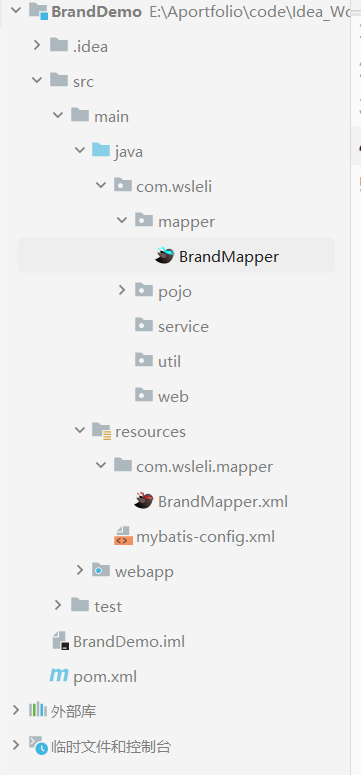
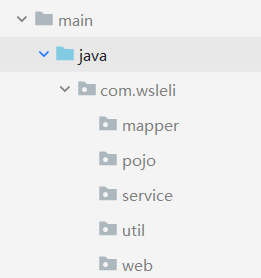
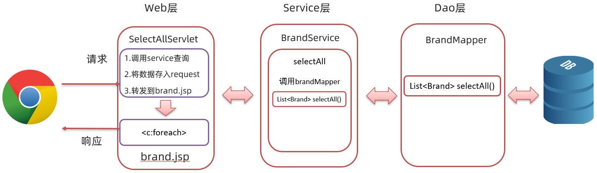
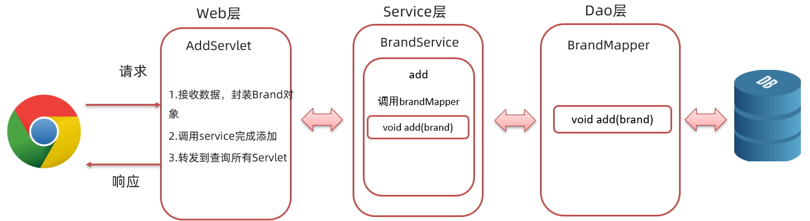
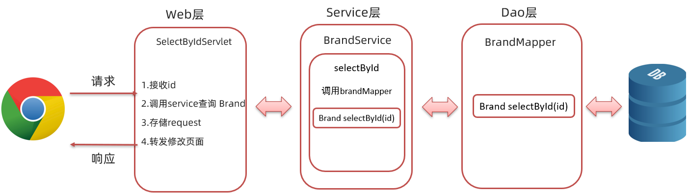
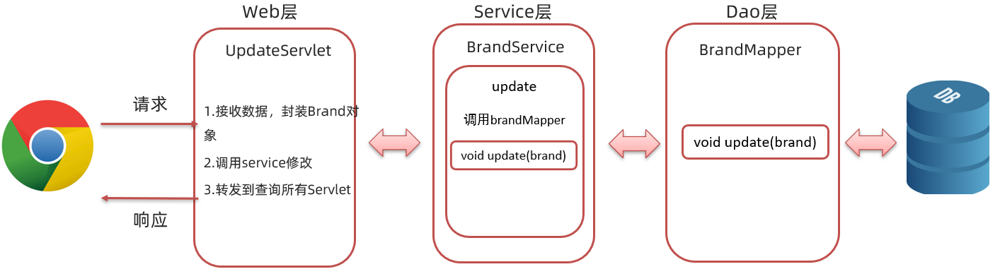

# 环境准备

**项目框架**



环境准备工作，我们分以下步骤实现：

* 创建新的模块 brand_demo，引入坐标

* 创建三层架构的包结构

* 数据库表 tb_brand

* 实体类 Brand

* MyBatis 基础环境

  * Mybatis-config.xml

  * BrandMapper.xml

  * BrandMapper接口

## 1.创建工程

创建新的模块 BrandDemo，引入坐标。

* 需要操作数据库。mysql的驱动包
* 要使用mybatis框架。mybaits的依赖包
* web项目需要用到servlet和jsp。servlet和jsp的依赖包
* 需要使用 jstl 进行数据展示。jstl的依赖包

```xml
<?xml version="1.0" encoding="UTF-8"?>
<project xmlns="http://maven.apache.org/POM/4.0.0"
         xmlns:xsi="http://www.w3.org/2001/XMLSchema-instance"
         xsi:schemaLocation="http://maven.apache.org/POM/4.0.0 http://maven.apache.org/xsd/maven-4.0.0.xsd">
    <modelVersion>4.0.0</modelVersion>

    <groupId>org.example</groupId>
    <artifactId>BrandDemo</artifactId>
    <version>1.0-SNAPSHOT</version>
    <packaging>war</packaging>


    <properties>
        <maven.compiler.source>8</maven.compiler.source>
        <maven.compiler.target>8</maven.compiler.target>
        <project.build.sourceEncoding>UTF-8</project.build.sourceEncoding>
    </properties>

    <dependencies>
        <!-- mybatis -->
        <dependency>
            <groupId>org.mybatis</groupId>
            <artifactId>mybatis</artifactId>
            <version>3.5.5</version>
        </dependency>

        <!--mysql-->
        <dependency>
            <groupId>mysql</groupId>
            <artifactId>mysql-connector-java</artifactId>
            <version>8.0.32</version>
        </dependency>

        <!--servlet-->
        <dependency>
            <groupId>javax.servlet</groupId>
            <artifactId>javax.servlet-api</artifactId>
            <version>3.1.0</version>
            <scope>provided</scope>
        </dependency>

        <!--jsp-->
        <dependency>
            <groupId>javax.servlet.jsp</groupId>
            <artifactId>jsp-api</artifactId>
            <version>2.2</version>
            <scope>provided</scope>
        </dependency>

        <!--jstl-->
        <dependency>
            <groupId>jstl</groupId>
            <artifactId>jstl</artifactId>
            <version>1.2</version>
        </dependency>
        <dependency>
            <groupId>taglibs</groupId>
            <artifactId>standard</artifactId>
            <version>1.1.2</version>
        </dependency>
    </dependencies>

    <build>
        <plugins>
            <plugin>
                <groupId>org.apache.tomcat.maven</groupId>
                <artifactId>tomcat7-maven-plugin</artifactId>
                <version>2.2</version>
            </plugin>
        </plugins>
    </build>
</project>
```

## 2.创建三层架构的包结构



## 3.准备数据库数据

## 4.创建实体类

## 5.准备mybatis环境

定义核心配置文件 `Mybatis-config.xml` ，并将该文件放置在 `resources` 下

```xml
<?xml version="1.0" encoding="UTF-8" ?>
<!DOCTYPE configuration
        PUBLIC "-//mybatis.org//DTD Config 3.0//EN"
        "http://mybatis.org/dtd/mybatis-3-config.dtd">
<configuration>
    <!--起别名-->
    <typeAliases>
        <package name="com.wsleli.pojo"/>
    </typeAliases>

    <environments default="development">
        <environment id="development">
            <transactionManager type="JDBC"/>
            <dataSource type="POOLED">
                <property name="driver" value="com.mysql.jdbc.Driver"/>
                <property name="url" value="jdbc:mysql:///wsleli?useSSL=false&amp;useServerPrepStmts=true"/>
                <property name="username" value="root"/>
                <property name="password" value="zhenyouquhh213"/>
            </dataSource>
        </environment>
    </environments>
    <mappers>
        <!--扫描mapper-->
        <package name="com.wsleli.mapper"/>
    </mappers>
</configuration>
```

在 `resources` 下创建放置映射配置文件的目录结构 `com/wsleli/mapper`，并在该目录下创建映射配置文件 `BrandMapper.xml`

```xml
<?xml version="1.0" encoding="UTF-8" ?>
<!DOCTYPE mapper
        PUBLIC "-//mybatis.org//DTD Mapper 3.0//EN"
        "http://mybatis.org/dtd/mybatis-3-mapper.dtd">
<mapper namespace="com.wsleli.mapper.BrandMapper">

</mapper>
```

> 创建mapper接口就不会报红了

# 需求

## 查询所有



### 编写BrandMapper

在 `mapper` 包下创建创建 `BrandMapper` 接口，在接口中定义 `selectAll()` 方法

```java
/**
  * 查询所有
  * @return
  */
@Select("select * from tb_brand")
List<Brand> selectAll();
```

### 编写工具类

在 `com.itheima` 包下创建 `utils` 包，并在该包下创建名为 `SqlSessionFactoryUtils` 工具类

```java
public class SqlSessionFactoryUtils {

    private static SqlSessionFactory sqlSessionFactory;

    static {
        //静态代码块会随着类的加载而自动执行，且只执行一次
        try {
            String resource = "mybatis-config.xml";
            InputStream inputStream = Resources.getResourceAsStream(resource);
            sqlSessionFactory = new SqlSessionFactoryBuilder().build(inputStream);
        } catch (IOException e) {
            e.printStackTrace();
        }
    }

    public static SqlSessionFactory getSqlSessionFactory(){
        return sqlSessionFactory;
    }
}
```

编写BrandService

在 `service` 包下创建 `BrandService` 类

```java
public class BrandService {
    SqlSessionFactory factory = SqlSessionFactoryUtils.getSqlSessionFactory();

    /**
     * 查询所有
     * @return
     */
    public List<Brand> selectAll(){
        //调用BrandMapper.selectAll()

        //2. 获取SqlSession
        SqlSession sqlSession = factory.openSession();
        //3. 获取BrandMapper
        BrandMapper mapper = sqlSession.getMapper(BrandMapper.class);

        //4. 调用方法
        List<Brand> brands = mapper.selectAll();

        sqlSession.close();

        return brands;
    }
}
```

### 创建一个index.html

默认跳转页面，翻遍访问servlet

```html
<!DOCTYPE html>
<html lang="en">
<head>
    <meta charset="UTF-8">
    <title>Title</title>
</head>
<body>
<a href="/BrandDemo/selectServlet">查询所有</a>
</body>
</html>
```

### 编写SelectAllServlet

在 `web` 包下创建名为 `SelectAllServlet` 的 `servlet`，该 `servlet` 的逻辑如下：

* 调用 `BrandService` 的 `selectAll()` 方法进行业务逻辑处理，并接收返回的结果
* 将上一步返回的结果存储到 `request` 域对象中
* 跳转到 `brand.jsp` 页面进行数据的展示

具体的代码如下：

```java
@WebServlet("/selectAllServlet")
public class SelectAllServlet extends HttpServlet {
    private  BrandService service = new BrandService();

    @Override
    protected void doGet(HttpServletRequest request, HttpServletResponse response) throws ServletException, IOException {

        //1. 调用BrandService完成查询
        List<Brand> brands = service.selectAll();
        //2. 存入request域中
        request.setAttribute("brands",brands);
        //3. 转发到brand.jsp
        request.getRequestDispatcher("/brand.jsp").forward(request,response);
    }

    @Override
    protected void doPost(HttpServletRequest request, HttpServletResponse response) throws ServletException, IOException {
        this.doGet(request, response);
    }
}
```

### 编写brand.jsp页面

将资料 `资料\2. 品牌增删改查案例\静态页面` 下的 `brand.html` 页面拷贝到项目的 `webapp` 目录下，并将该页面改成 `brand.jsp` 页面，而 `brand.jsp` 页面在表格中使用 `JSTL` 和 `EL表达式` 从request域对象中获取名为 `brands` 的集合数据并展示出来。页面内容如下：

```jsp
<%@ page contentType="text/html;charset=UTF-8" isELIgnored="false" language="java" %>
<%@ taglib prefix="c" uri="http://java.sun.com/jsp/jstl/core" %>

<!DOCTYPE html>
<html lang="en">
<head>
    <meta charset="UTF-8">
    <title>Title</title>
</head>
<body>
<hr>
<table border="1" cellspacing="0" width="80%">
    <tr>
        <th>序号</th>
        <th>品牌名称</th>
        <th>企业名称</th>
        <th>排序</th>
        <th>品牌介绍</th>
        <th>状态</th>
        <th>操作</th>
    </tr>

    <c:forEach items="${brands}" var="brand" varStatus="status">
        <tr align="center">
                <%--<td>${brand.id}</td>--%>
            <td>${status.count}</td>
            <td>${brand.brandName}</td>
            <td>${brand.companyName}</td>
            <td>${brand.ordered}</td>
            <td>${brand.description}</td>
            <c:if test="${brand.status == 1}">
                <td>启用</td>
            </c:if>
            <c:if test="${brand.status != 1}">
                <td>禁用</td>
            </c:if>
            <td><a href="/BrandDemo/selectByIdServlet?id=${brand.id}">修改</a> <a href="#">删除</a></td>
        </tr>
    </c:forEach>
</table>
</body>
</html>
```

### 测试

启动服务器，并在浏览器输入 `http://localhost:8080/brand-demo/index.html`，看到如下 `查询所有` 的超链接，点击该链接就可以查询出所有的品牌数据

因为查询到的字段名和实体类对象的属性名没有一一对应，有的数据看不到。在映射配置文件中使用 `resultMap` 标签定义映射关系。映射配置文件内容如下：

```xml
<?xml version="1.0" encoding="UTF-8" ?>
<!DOCTYPE mapper
        PUBLIC "-//mybatis.org//DTD Mapper 3.0//EN"
        "http://mybatis.org/dtd/mybatis-3-mapper.dtd">
<mapper namespace="com.wsleli.mapper.BrandMapper">
    <resultMap id="brandResultMap" type="brand">
        <result column="brand_name" property="brandName"></result>
        <result column="company_name" property="companyName"></result>
    </resultMap>
</mapper>
```

并且在 `BrandMapper` 接口中的 `selectAll()` 上使用 `@ResuleMap` 注解指定使用该映射

```java
/**
 * 查询所有
 *
 * @return
 */
@Select("select * from tb_brand")
@ResultMap("brandResultMap")
List<Brand> selectAll();
```

重启服务器，再次访问就能看到数据了

## 添加



### 编写BrandMapper方法

在 `BrandMapper` 接口，在接口中定义 `add(Brand brand)` 方法

```java
@Insert("insert into tb_brand values(null,#{brandName},#{companyName},#{ordered},#{description},#{status})")
void add(Brand brand);
```

### 编写BrandService方法

在 `BrandService` 类中定义添加品牌数据方法 `add(Brand brand)`

```java
 	/**
     * 添加
     * @param brand
     */
    public void add(Brand brand){

        //2. 获取SqlSession
        SqlSession sqlSession = factory.openSession();
        //3. 获取BrandMapper
        BrandMapper mapper = sqlSession.getMapper(BrandMapper.class);

        //4. 调用方法
        mapper.add(brand);

        //提交事务
        sqlSession.commit();
        //释放资源
        sqlSession.close();
    }
```

### 改进brand.jsp页面

我们需要在该页面表格的上面添加 `新增` 按钮

```html
<input type="button" value="新增" id="add"><br>
```

并给该按钮绑定单击事件，当点击了该按钮需要跳转到 `brand.jsp` 添加品牌数据的页面

```html
<script>
    document.getElementById("add").onclick = function () {
        location.href = "/BrandDemo/addBrand.jsp";
    }
</script>
```

> **注意：**该 `script` 标签建议放在 `body` 结束标签前面。

### 编写addBrand.jsp页面

从资料 `资料\2. 品牌增删改查案例\静态页面` 中将 `addBrand.html` 页面拷贝到项目的 `webapp` 下，并改成 `addBrand.jsp` 动态页面

```jsp
<%@ page contentType="text/html;charset=UTF-8" isELIgnored="false" language="java" %>
<!DOCTYPE html>
<html lang="en">

<head>
    <meta charset="UTF-8">a
    <title>添加品牌</title>
</head>
<body>
<h3>添加品牌</h3>
<form action="/BrandDemo/addServlet" method="post">
    品牌名称：<input name="brandName"><br>
    企业名称：<input name="companyName"><br>
    排序：<input name="ordered"><br>
    描述信息：<textarea rows="5" cols="20" name="description"></textarea><br>
    状态：
    <input type="radio" name="status" value="0">禁用
    <input type="radio" name="status" value="1">启用<br>

    <input type="submit" value="提交">
</form>
</body>
</html>
```

### 编写servlet

在 `web` 包下创建 `AddServlet` 的 `servlet`，该 `servlet` 的逻辑如下:

* 设置处理post请求乱码的字符集
* 接收客户端提交的数据
* 将接收到的数据封装到 `Brand` 对象中
* 调用 `BrandService` 的`add()` 方法进行添加的业务逻辑处理
* 跳转到 `selectAllServlet` 资源重新查询数据

具体的代码如下：

```java
package com.wsleli.web;

import com.wsleli.pojo.Brand;
import com.wsleli.service.BrandService;

import javax.servlet.*;
import javax.servlet.http.*;
import javax.servlet.annotation.*;
import java.io.IOException;

@WebServlet("/addServlet")
public class AddServlet extends HttpServlet {
    private BrandService service = new BrandService();

    @Override
    protected void doGet(HttpServletRequest request, HttpServletResponse response) throws ServletException, IOException {
        //处理POST请求的乱码问题
        request.setCharacterEncoding("utf-8");

        //1. 接收表单提交的数据，封装为一个Brand对象
        String brandName = request.getParameter("brandName");
        String companyName = request.getParameter("companyName");
        String ordered = request.getParameter("ordered");
        String description = request.getParameter("description");
        String status = request.getParameter("status");

        // 封装为一个Brand对象
        Brand brand = new Brand();
        brand.setBrandName(brandName);
        brand.setCompanyName(companyName);
        brand.setOrdered(Integer.parseInt(ordered));
        brand.setDescription(description);
        brand.setStatus(Integer.parseInt(status));

        //2. 调用service 完成添加
        service.add(brand);

        //3. 转发到查询所有Servlet
        request.getRequestDispatcher("/selectAllServlet").forward(request, response);
    }

    @Override
    protected void doPost(HttpServletRequest request, HttpServletResponse response) throws ServletException, IOException {
        this.doGet(request, response);
    }
}
```

### 测试

 点击 `brand.jsp` 页面的 `新增` 按钮，会跳转到 `addBrand.jsp`页面

## 修改 

### 回显数据



#### 编写BrandMapper方法

在 `BrandMapper` 接口，在接口中定义 `selectById(int id)` 方法

```java
	/**
     * 根据id查询
     * @param id
     * @return
     */
    @Select("select * from tb_brand where id = #{id}")
    @ResultMap("brandResultMap")
    Brand selectById(int id);
```

#### 编写BrandService方法

在 `BrandService` 类中定义根据id查询数据方法 `selectById(int id)` 

```java
    /**
     * 根据id查询
     * @return
     */
    public Brand selectById(int id){
        //调用BrandMapper.selectAll()
        //2. 获取SqlSession
        SqlSession sqlSession = factory.openSession();
        //3. 获取BrandMapper
        BrandMapper mapper = sqlSession.getMapper(BrandMapper.class);
        //4. 调用方法
        Brand brand = mapper.selectById(id);
        sqlSession.close();
        return brand;
    }
```

#### 编写SelectByIdServlet

在 `web` 包下创建 `SelectByIdServlet` 的 `servlet`，该 `servlet` 的逻辑如下:

* 获取请求数据 `id`
* 调用 `BrandService` 的 `selectById()` 方法进行数据查询的业务逻辑
* 将查询到的数据存储到 request 域对象中
* 跳转到 `update.jsp` 页面进行数据真实

具体代码如下：

```java
@WebServlet("/selectByIdServlet")
public class SelectByIdServlet extends HttpServlet {
    private  BrandService service = new BrandService();

    @Override
    protected void doGet(HttpServletRequest request, HttpServletResponse response) throws ServletException, IOException {
        //1. 接收id
        String id = request.getParameter("id");
        //2. 调用service查询
        Brand brand = service.selectById(Integer.parseInt(id));
        //3. 存储到request中
        request.setAttribute("brand",brand);
        //4. 转发到update.jsp
        request.getRequestDispatcher("/update.jsp").forward(request,response);
    }

    @Override
    protected void doPost(HttpServletRequest request, HttpServletResponse response) throws ServletException, IOException {
        this.doGet(request, response);
    }
}
```

#### 编写update.jsp页面

拷贝 `addBrand.jsp` 页面，改名为 `update.jsp` 并做出以下修改：

* `title` 标签内容改为 `修改品牌`

* `form` 标签的 `action` 属性值改为 `/BrandDemo/updateServlet`

* `input` 标签要进行数据回显，需要设置 `value` 属性

  ```jsp
  品牌名称：<input name="brandName" value="${brand.brandName}"><br>
  企业名称：<input name="companyName" value="${brand.companyName}"><br>
  排序：<input name="ordered" value="${brand.ordered}"><br>
  ```

* `textarea` 标签要进行数据回显，需要在标签体中使用 `EL表达式`

  ```jsp
  描述信息：<textarea rows="5" cols="20" name="description">${brand.description} </textarea><br>
  ```

* 单选框使用 `if` 标签需要判断 `brand.status` 的值是 1 还是 0 在指定的单选框上使用 `checked` 属性，表示被选中状态

  ```jsp
  <%@ taglib prefix="c" uri="http://java.sun.com/jsp/jstl/core" %><%--添加标签库--%>
  状态：
  <c:if test="${brand.status == 0}">
      <input type="radio" name="status" value="0" checked>禁用
      <input type="radio" name="status" value="1">启用<br>
  </c:if>
  
  <c:if test="${brand.status == 1}">
      <input type="radio" name="status" value="0" >禁用
      <input type="radio" name="status" value="1" checked>启用<br>
  </c:if>
  ```

综上，`update.jsp` 代码如下：

```jsp
<%@ page contentType="text/html;charset=UTF-8" language="java" %>
<%--添加标签库--%>
<%@ taglib prefix="c" uri="http://java.sun.com/jsp/jstl/core" %>
<!DOCTYPE html>
<html lang="en">
<head>
    <meta charset="UTF-8">
    <title>修改品牌</title>
</head>
<body>
<h3>修改品牌</h3>
<form action="/brand-demo/updateServlet" method="post">

    品牌名称：<input name="brandName" value="${brand.brandName}"><br>
    企业名称：<input name="companyName" value="${brand.companyName}"><br>
    排序：<input name="ordered" value="${brand.ordered}"><br>
    描述信息：<textarea rows="5" cols="20" name="description">${brand.description} </textarea><br>
    状态：
    <c:if test="${brand.status == 0}">
        <input type="radio" name="status" value="0" checked>禁用
        <input type="radio" name="status" value="1">启用<br>
    </c:if>

    <c:if test="${brand.status == 1}">
        <input type="radio" name="status" value="0" >禁用
        <input type="radio" name="status" value="1" checked>启用<br>
    </c:if>

    <input type="submit" value="提交">
</form>
</body>
</html>
```

### 修改数据



#### 编写BrandMapper方法

在 `BrandMapper` 接口，在接口中定义 `update(Brand brand)` 方法

```java
/**
  * 修改
  * @param brand
  */
@Update("update tb_brand set brand_name = #{brandName},company_name = #{companyName},ordered = #{ordered},description = #{description},status = #{status} where id = #{id}")
void update(Brand brand);
```

#### 编写BrandService方法

在 `BrandService` 类中定义根据id查询数据方法 `update(Brand brand)` 

```java
	/**
     * 修改
     * @param brand
     */
    public void update(Brand brand){
        //2. 获取SqlSession
        SqlSession sqlSession = factory.openSession();
        //3. 获取BrandMapper
        BrandMapper mapper = sqlSession.getMapper(BrandMapper.class);
        //4. 调用方法
        mapper.update(brand);
        //提交事务
        sqlSession.commit();
        //释放资源
        sqlSession.close();
    }
```

#### 编写UpdateServlet

在 `web` 包下创建 `AddServlet` 的 `servlet`，该 `servlet` 的逻辑如下:

* 设置处理post请求乱码的字符集
* 接收客户端提交的数据
* 将接收到的数据封装到 `Brand` 对象中
* 调用 `BrandService` 的`update()` 方法进行添加的业务逻辑处理
* 跳转到 `selectAllServlet` 资源重新查询数据

具体的代码如下：

```java
@WebServlet("/updateServlet")
public class UpdateServlet extends HttpServlet {
    private BrandService service = new BrandService();

    @Override
    protected void doGet(HttpServletRequest request, HttpServletResponse response) throws ServletException, IOException {

        //处理POST请求的乱码问题
        request.setCharacterEncoding("utf-8");
        //1. 接收表单提交的数据，封装为一个Brand对象
        String id = request.getParameter("id");
        String brandName = request.getParameter("brandName");
        String companyName = request.getParameter("companyName");
        String ordered = request.getParameter("ordered");
        String description = request.getParameter("description");
        String status = request.getParameter("status");

        //封装为一个Brand对象
        Brand brand = new Brand();
        brand.setId(Integer.parseInt(id));
        brand.setBrandName(brandName);
        brand.setCompanyName(companyName);
        brand.setOrdered(Integer.parseInt(ordered));
        brand.setDescription(description);
        brand.setStatus(Integer.parseInt(status));

        //2. 调用service 完成修改
        service.update(brand);

        //3. 转发到查询所有Servlet
        request.getRequestDispatcher("/selectAllServlet").forward(request,response);
    }

    @Override
    protected void doPost(HttpServletRequest request, HttpServletResponse response) throws ServletException, IOException {
        this.doGet(request, response);
    }
}
```

**存在问题：update.jsp 页面提交数据时是没有携带主键数据的，而后台修改数据需要根据主键进行修改。**

针对这个问题，我们不希望页面将主键id展示给用户看，但是又希望在提交数据时能将主键id提交到后端。此时我们就想到了在学习 HTML 时学习的隐藏域，在 `update.jsp` 页面的表单中添加如下代码：

```jsp
<%--隐藏域，提交id--%>
<input type="hidden" name="id" value="${brand.id}">
```

`update.jsp` 页面的最终代码如下：

```jsp
<%@ page contentType="text/html;charset=UTF-8" isELIgnored="false" language="java" %>
<%@ taglib prefix="c" uri="http://java.sun.com/jsp/jstl/core" %>
<!DOCTYPE html>
<html lang="en">

<head>
    <meta charset="UTF-8">
    <title>修改品牌</title>
</head>
<body>
<h3>修改品牌</h3>
<form action="/BrandDemo/updateServlet" method="post">
    <%--隐藏域，提交id--%>
    <input type="hidden" name="id" value="${brand.id}">
        
    品牌名称：<input name="brandName" value="${brand.brandName}"><br>
    企业名称：<input name="companyName" value="${brand.companyName}"><br>
    排序：<input name="ordered" value="${brand.ordered}"><br>
    描述信息：<textarea rows="5" cols="20" name="description">${brand.description} </textarea><br>
    状态：
    <c:if test="${brand.status == 0}">
        <input type="radio" name="status" value="0" checked>禁用
        <input type="radio" name="status" value="1">启用<br>
    </c:if>

    <c:if test="${brand.status == 1}">
        <input type="radio" name="status" value="0">禁用
        <input type="radio" name="status" value="1" checked>启用<br>
    </c:if>

    <input type="submit" value="提交">
</form>
</body>
</html>
```

## 删除

### 编写BrandMapper方法

在 `BrandMapper` 接口，在接口中定义 `delete(int id)` 方法

```java
    /**
     * 删除
     *
     * @param id
     */
    @Delete("delete from tb_brand where id=#{id}")
    void deleteByid(int id);
```

### 编写BrandService方法

在 `BrandService` 类中定义添加品牌数据方法 `delete(int id)`

```java
    /**
     * 删除
     *
     * @param brand
     */
    public void deleteByid(int id) {
        //2. 获取SqlSession
        SqlSession sqlSession = factory.openSession();
        //3. 获取BrandMapper
        BrandMapper mapper = sqlSession.getMapper(BrandMapper.class);
        //4. 调用方法
        mapper.deleteByid(id);
        //提交事务
        sqlSession.commit();
        //释放资源
        sqlSession.close();
    }
```

### 改进brand.jsp页面

在删除按钮那加一个超链接，跳转到`deleteByIdServlet`

```xml
<td><a href="/BrandDemo/selectByIdServlet?id=${brand.id}">修改</a>
    <a href="/BrandDemo/deleteByIdServlet?id=${brand.id}">删除</a>
</td>
```

### 编写DeleteByIdServlet

在 `web` 包下创建 `DeleteByIdServlet` 的 `servlet`，该 `servlet` 的逻辑如下:

* 获取请求数据 `id`
* 调用 `BrandService` 的 `deleteById()` 方法进行数据删除的业务逻辑
* 跳转到 `selectAllServlet` 资源重新查询数据

具体代码如下：

```java
package com.wsleli.web;

import com.wsleli.service.BrandService;

import javax.servlet.ServletException;
import javax.servlet.annotation.WebServlet;
import javax.servlet.http.HttpServlet;
import javax.servlet.http.HttpServletRequest;
import javax.servlet.http.HttpServletResponse;
import java.io.IOException;

@WebServlet("/deleteByIdServlet")
public class DeleteByIdServlet extends HttpServlet {
    private BrandService service = new BrandService();

    @Override
    protected void doGet(HttpServletRequest request, HttpServletResponse response) throws ServletException, IOException {
        //1. 接收id
        String id = request.getParameter("id");
        //2. 调用service删除
        service.deleteByid(Integer.parseInt(id));
        //3. 转发到查询所有Servlet
        request.getRequestDispatcher("/selectAllServlet").forward(request, response);
    }

    @Override
    protected void doPost(HttpServletRequest request, HttpServletResponse response) throws ServletException, IOException {
        this.doGet(request, response);
    }
}
```

### 测试

 点击 `brand.jsp` 页面的 `删除` 按钮，会删除数据