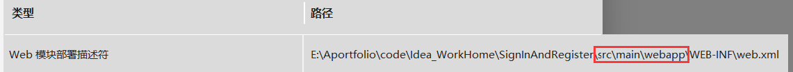
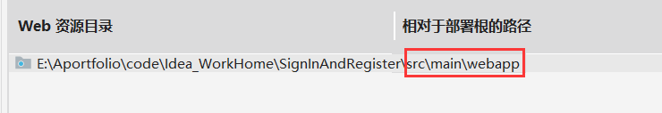
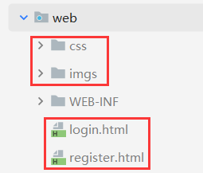
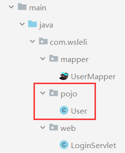
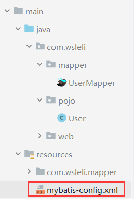
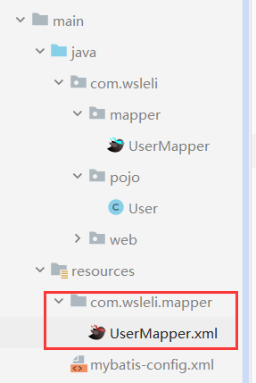
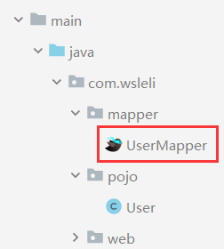
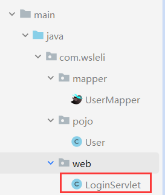

# 涉及到的知识点

mybatis、mysql、maven、mapper、webapp、pom、tomcat、servlet

# 准备环境

1. 复制资料中的静态页面到项目的webapp目录下

   创建Maven后，在项目结构中添加webapp项目（添加到main中），以下是要修改的地方

   部署目录：

   

   资源目录：

   

   

2. 创建wsleli数据库，创建tb_user表，创建User实体类

   

   ```java
   package com.wsleli.pojo;
   
   public class User {
   
       private Integer id;
       private String username;
       private String password;
   
       public Integer getId() {
           return id;
       }
   
       public void setId(Integer id) {
           this.id = id;
       }
   
       public String getUsername() {
           return username;
       }
   
       public void setUsername(String username) {
           this.username = username;
       }
   
       public String getPassword() {
           return password;
       }
   
       public void setPassword(String password) {
           this.password = password;
       }
   
       @Override
       public String toString() {
           return "User{" +
                   "id=" + id +
                   ", username='" + username + '\'' +
                   ", password='" + password + '\'' +
                   '}';
       }
   }
   ```

3. 导入MyBatis坐标，MySQL驱动坐标，Servlet坐标A，Tomcat插件(pom.xml)（记得打war包）

   ```xml
   <?xml version="1.0" encoding="UTF-8"?>
   <project xmlns="http://maven.apache.org/POM/4.0.0"
            xmlns:xsi="http://www.w3.org/2001/XMLSchema-instance"
            xsi:schemaLocation="http://maven.apache.org/POM/4.0.0 http://maven.apache.org/xsd/maven-4.0.0.xsd">
       <modelVersion>4.0.0</modelVersion>
   
       <groupId>org.example</groupId>
       <artifactId>SignInAndRegister</artifactId>
       <version>1.0-SNAPSHOT</version>
       <packaging>war</packaging><!--打包方式-->
   
       <dependencies>
           <dependency>
               <groupId>org.mybatis</groupId>
               <artifactId>mybatis</artifactId>
               <version>3.5.5</version>
           </dependency>
           
   		<!--版本太低会有问题-->
           <dependency>
               <groupId>mysql</groupId>
               <artifactId>mysql-connector-java</artifactId>
               <version>8.0.32</version>
           </dependency>
   
           <dependency>
               <groupId>javax.servlet</groupId>
               <artifactId>javax.servlet-api</artifactId>
               <version>4.0.1</version>
               <scope>provided</scope>
           </dependency>
       </dependencies>
   
   
       <build>
           <plugins>
               <!--tomcat插件-->
               <plugin>
                   <groupId>org.apache.tomcat.maven</groupId>
                   <artifactId>tomcat7-maven-plugin</artifactId>
                   <version>2.2</version>
                   <configuration>
                       <port>8080</port><!--改端口号-->
                       <!--<path>/</path>--><!--改项目路径-->
                   </configuration>
               </plugin>
           </plugins>
       </build>
   
   </project>
   ```
   
4. 创建mybatis-config.xml核心配置文件，UserMapper.xml映射文件，UserMapper接口

   - mybatis-config.xml

     

     ```xml
     <?xml version="1.0" encoding="UTF-8" ?>
     <!DOCTYPE configuration
             PUBLIC "-//mybatis.org//DTD Config 3.0//EN"
             "http://mybatis.org/dtd/mybatis-3-config.dtd">
     <configuration>
         <!--起别名-->
         <typeAliases>
             <package name="com.wsleli.pojo"/>
         </typeAliases>
     
         <environments default="development">
             <environment id="development">
                 <transactionManager type="JDBC"/>
                 <dataSource type="POOLED">
                     <property name="driver" value="com.mysql.jdbc.Driver"/>
                     <property name="url" value="jdbc:mysql:///wsleli?useSSL=false&amp;useServerPrepStmts=true"/>
                     <property name="username" value="root"/>
                     <property name="password" value="zhenyouquhh213"/>
                 </dataSource>
             </environment>
         </environments>
         <mappers>
             <!--扫描mapper-->
             <package name="com.wsleli.mapper"/>
         </mappers>
     </configuration>
     ```

   - UserMapper.xml

     

     ```xml
     <?xml version="1.0" encoding="UTF-8" ?>
     <!DOCTYPE mapper
             PUBLIC "-//mybatis.org//DTD Mapper 3.0//EN"
             "http://mybatis.org/dtd/mybatis-3-mapper.dtd">
     <mapper namespace="com.wsleli.mapper.UserMapper">
     
     </mapper>
     ```

   - UserMapper

     

     ```java
     package com.wsleli.mapper;
     
     public interface UserMapper {
     }
     ```

# 用户登录

## 需求分析

1. 用户在登录页面输入用户名和密码，提交请求给LoginServlet
2. 在LoginServlet中接收请求和数据[用户名和密码]
3. 在LoginServlt中通过Mybatis实现调用UserMapper来根据用户名和密码查询数据库表
4. 将查询的结果封装到User对象中进行返回
5. 在LoginServlet中判断返回的User对象是否为null
6. 如果为nul，说明根据用户名和密码没有查询到用户，则登录失败，返回"登录失败"数据给前端
7. 如果不为null,则说明用户存在并且密码正确，则登录成功，返回"登录成功"数据给前端

## 代码实现

1. 在UserMapper接口中提供一个根据用户名和密码查询用户对象的方法

   ```java
   /**
    * 根据用户名和密码查询用户对象
    *
    * @param username
    * @param password
    * @return
    */
   @Select("select * from tb_user where username = #{username} and password = #{password}")
   User select(@Param("username") String username, @Param("password") String password);
   ```

2. 修改loign.html

   ```html
   <!DOCTYPE html>
   <html lang="en">
   
   <head>
       <meta charset="UTF-8">
       <title>login</title>
       <link href="css/login.css" rel="stylesheet">
   </head>
   
   <body>
   <div id="loginDiv">
       <!--
           设置action地址
               1.浏览器使用:需要加虚拟目录(项目访问路径)
               2.静态页面不能使用动态路径
           设置method为post请求
       -->
       <form action="/SignInAndRegister/loginServlet" method="post" id="form">
           <h1 id="loginMsg">LOGIN IN</h1>
           <p>Username:<input id="username" name="username" type="text"></p>
   
           <p>Password:<input id="password" name="password" type="password"></p>
   
           <div id="subDiv">
               <input type="submit" class="button" value="login up">
               <input type="reset" class="button" value="reset">&nbsp;&nbsp;&nbsp;
               <a href="register.html">没有账号？点击注册</a>
           </div>
       </form>
   </div>
   
   </body>
   </html>
   ```

3. 编写LoginServlet

   

   ```java
   package com.wsleli.web;
   
   import com.wsleli.mapper.UserMapper;
   import com.wsleli.pojo.User;
   import org.apache.ibatis.io.Resources;
   import org.apache.ibatis.session.SqlSession;
   import org.apache.ibatis.session.SqlSessionFactory;
   import org.apache.ibatis.session.SqlSessionFactoryBuilder;
   
   import javax.servlet.*;
   import javax.servlet.http.*;
   import javax.servlet.annotation.*;
   import java.io.IOException;
   import java.io.InputStream;
   import java.io.PrintWriter;
   
   @WebServlet("/loginServlet")
   public class LoginServlet extends HttpServlet {
       @Override
       protected void doGet(HttpServletRequest request, HttpServletResponse response) throws ServletException, IOException {
           //1. 接收用户名和密码
           String username = request.getParameter("username");
           String password = request.getParameter("password");
   
           //2. 调用MyBatis完成查询
           //2.1 获取SqlSessionFactory对象
           String resource = "mybatis-config.xml";
           InputStream inputStream = Resources.getResourceAsStream(resource);
           SqlSessionFactory sqlSessionFactory = new SqlSessionFactoryBuilder().build(inputStream);
           //2.2 获取SqlSession对象
           SqlSession sqlSession = sqlSessionFactory.openSession();
           //2.3 获取Mapper
           UserMapper userMapper = sqlSession.getMapper(UserMapper.class);
           //2.4 调用方法
           User user = userMapper.select(username, password);
           //2.5 释放资源
           sqlSession.close();
   
           // 获取字符输出流，并设置content type
           response.setContentType("text/html;charset=utf-8");
           PrintWriter writer = response.getWriter();
           //3. 判断user是否为null
           if (user != null) {
               // 登陆成功
               writer.write("登陆成功");
           } else {
               // 登陆失败
               writer.write("登陆失败");
           }
       }
   
       @Override
       protected void doPost(HttpServletRequest request, HttpServletResponse response) throws ServletException, IOException {
           this.doGet(request, response);
       }
   }
   ```

4. 启动服务器测试（输入url）

   ```http
   http://localhost:8080/SignInAndRegister/login.html
   ```

# 用户注册

## 需求分析

1. 用户在注册页面输入用户名和密码，提交请求给RegisterServlet
2. 在RegisterServlet中接收请求和数据[用户名和密码]
3. 在RegisterServlet中通过Mybatis实现调用UserMapper来根据用户名查询数据库表
4. 将查询的结果封装到User对象中进行返回
5. 在RegisterServlet中判断返回的User对象是否为null
6. 如果为nul，说明根据用户名可用，则调用UserMapper来实现添加用户
7. 如果不为null,则说明用户不可以，返回"用户名已存在"数据给前端

## 代码编写

1. 编写UserMapper提供根据用户名查询用户数据方法和添加用户方法

   /**+回车可以快速写JavaDoc注释

   ```java
   /**
    * 根据用户名查询用户对象
    *
    * @param username
    * @return
    */
   @Select("select * from tb_user where username = #{username}")
   User selectByUsername(String username);
   
   /**
    * 添加用户
    *
    * @param user
    */
   @Insert("insert into tb_user values(null,#{username},#{password})")
   void add(User user);
   ```

2. 修改register.html

   ```html
   <!DOCTYPE html>
   <html lang="en">
   <head>
       <meta charset="UTF-8">
       <title>欢迎注册</title>
       <link href="css/register.css" rel="stylesheet">
   </head>
   <body>
   
   <div class="form-div">
       <div class="reg-content">
           <h1>欢迎注册</h1>
           <span>已有帐号？</span> <a href="login.html">登录</a>
       </div>
       <!--
       设置action地址
       设置method为post请求
       -->
       <form id="reg-form" action="/SignInAndRegister/registerServlet" method="post">
   
           <table>
   
               <tr>
                   <td>用户名</td>
                   <td class="inputs">
                       <input name="username" type="text" id="username">
                       <br>
                       <span id="username_err" class="err_msg" style="display: none">用户名不太受欢迎</span>
                   </td>
   
               </tr>
   
               <tr>
                   <td>密码</td>
                   <td class="inputs">
                       <input name="password" type="password" id="password">
                       <br>
                       <span id="password_err" class="err_msg" style="display: none">密码格式有误</span>
                   </td>
               </tr>
   
   
           </table>
   
           <div class="buttons">
               <input value="注 册" type="submit" id="reg_btn">
           </div>
           <br class="clear">
       </form>
   
   </div>
   </body>
   </html>
   ```

3. 创建RegisterServlet类

   ```java
   package com.wsleli.web;
   
   import com.wsleli.mapper.UserMapper;
   import com.wsleli.pojo.User;
   import org.apache.ibatis.io.Resources;
   import org.apache.ibatis.session.SqlSession;
   import org.apache.ibatis.session.SqlSessionFactory;
   import org.apache.ibatis.session.SqlSessionFactoryBuilder;
   
   import javax.servlet.*;
   import javax.servlet.http.*;
   import javax.servlet.annotation.*;
   import java.io.IOException;
   import java.io.InputStream;
   
   @WebServlet("/registerServlet")
   public class RegisterServlet extends HttpServlet {
       @Override
       protected void doGet(HttpServletRequest request, HttpServletResponse response) throws ServletException, IOException {
           //1. 接收用户数据
           String username = request.getParameter("username");
           String password = request.getParameter("password");
   
           //封装用户对象
           User user = new User();
           user.setUsername(username);
           user.setPassword(password);
   
           //2. 调用mapper 根据用户名查询用户对象
           //2.1 获取SqlSessionFactory对象
           String resource = "mybatis-config.xml";
           InputStream inputStream = Resources.getResourceAsStream(resource);
           SqlSessionFactory sqlSessionFactory = new SqlSessionFactoryBuilder().build(inputStream);
           //2.2 获取SqlSession对象
           SqlSession sqlSession = sqlSessionFactory.openSession();
           //2.3 获取Mapper
           UserMapper userMapper = sqlSession.getMapper(UserMapper.class);
   
           //2.4 调用方法
           User u = userMapper.selectByUsername(username);
   
           //3. 判断用户对象释放为null
           if (u == null) {
               // 用户名不存在，添加用户
               userMapper.add(user);
   
               // 提交事务
               sqlSession.commit();
               // 释放资源
               sqlSession.close();
           } else {
               // 用户名存在，给出提示信息
               response.setContentType("text/html;charset=utf-8");
               response.getWriter().write("用户名已存在");
           }
       }
   
       @Override
       protected void doPost(HttpServletRequest request, HttpServletResponse response) throws ServletException, IOException {
           this.doGet(request, response);
       }
   }
   ```

4. 启动服务器进行测试

# SqlSessionFactory工具类抽取

## 重复代码

```java
String resource = "mybatis-config.xml";
InputStream inputStream = Resources.getResourceAsStream(resource);
SqlSessionFactory sqlSessionFactory = new SqlSessionFactoryBuilder().build(inputStream);
```

## 优化后

```java
SqlSessionFactory sqlSessionFactory =SqlSessionFactoryUtils.getSqlSessionFactory();
```

## 优化工具类

```java
package com.wsleli.util;

import org.apache.ibatis.io.Resources;
import org.apache.ibatis.session.SqlSessionFactory;
import org.apache.ibatis.session.SqlSessionFactoryBuilder;

import java.io.IOException;
import java.io.InputStream;

public class SqlSessionFactoryUtils {
    private static SqlSessionFactory sqlSessionFactory;

    static {
        //静态代码块会随着类的加载而自动执行，且只执行一次
        try {
            String resource = "mybatis-config.xml";
            InputStream inputStream = Resources.getResourceAsStream(resource);
            sqlSessionFactory = new SqlSessionFactoryBuilder().build(inputStream);
        } catch (IOException e) {
            e.printStackTrace();
        }
    }

    public static SqlSessionFactory getSqlSessionFactory() {
        return sqlSessionFactory;
    }
}
```

## 测试类

```java
package com.wsleli.web;

import com.wsleli.mapper.UserMapper;
import com.wsleli.pojo.User;
import com.wsleli.util.SqlSessionFactoryUtils;
import org.apache.ibatis.io.Resources;
import org.apache.ibatis.session.SqlSession;
import org.apache.ibatis.session.SqlSessionFactory;
import org.apache.ibatis.session.SqlSessionFactoryBuilder;

import javax.servlet.*;
import javax.servlet.http.*;
import javax.servlet.annotation.*;
import java.io.IOException;
import java.io.InputStream;
import java.io.PrintWriter;

@WebServlet("/loginServlet")
public class LoginServlet extends HttpServlet {
    @Override
    protected void doGet(HttpServletRequest request, HttpServletResponse response) throws ServletException, IOException {
        //1. 接收用户名和密码
        String username = request.getParameter("username");
        String password = request.getParameter("password");

        //2. 调用MyBatis完成查询
        //2.1 获取SqlSessionFactory对象
        /*String resource = "mybatis-config.xml";
        InputStream inputStream = Resources.getResourceAsStream(resource);
        SqlSessionFactory sqlSessionFactory = new SqlSessionFactoryBuilder().build(inputStream);*/

        SqlSessionFactory sqlSessionFactory = SqlSessionFactoryUtils.getSqlSessionFactory();
        //2.2 获取SqlSession对象
        SqlSession sqlSession = sqlSessionFactory.openSession();
        //2.3 获取Mapper
        UserMapper userMapper = sqlSession.getMapper(UserMapper.class);
        //2.4 调用方法
        User user = userMapper.select(username, password);
        //2.5 释放资源
        sqlSession.close();

        // 获取字符输出流，并设置content type
        response.setContentType("text/html;charset=utf-8");
        PrintWriter writer = response.getWriter();
        //3. 判断user是否为null
        if (user != null) {
            // 登陆成功
            writer.write("登陆成功");
        } else {
            // 登陆失败
            writer.write("登陆失败");
        }
    }

    @Override
    protected void doPost(HttpServletRequest request, HttpServletResponse response) throws ServletException, IOException {
        this.doGet(request, response);
    }
}
```

```java
package com.wsleli.web;

import com.wsleli.mapper.UserMapper;
import com.wsleli.pojo.User;
import com.wsleli.util.SqlSessionFactoryUtils;
import org.apache.ibatis.io.Resources;
import org.apache.ibatis.session.SqlSession;
import org.apache.ibatis.session.SqlSessionFactory;
import org.apache.ibatis.session.SqlSessionFactoryBuilder;

import javax.servlet.*;
import javax.servlet.http.*;
import javax.servlet.annotation.*;
import java.io.IOException;
import java.io.InputStream;

@WebServlet("/registerServlet")
public class RegisterServlet extends HttpServlet {
    @Override
    protected void doGet(HttpServletRequest request, HttpServletResponse response) throws ServletException, IOException {
        //1. 接收用户数据
        String username = request.getParameter("username");
        String password = request.getParameter("password");

        //封装用户对象
        User user = new User();
        user.setUsername(username);
        user.setPassword(password);

        //2. 调用mapper 根据用户名查询用户对象
        //2.1 获取SqlSessionFactory对象
        /*String resource = "mybatis-config.xml";
        InputStream inputStream = Resources.getResourceAsStream(resource);
        SqlSessionFactory sqlSessionFactory = new SqlSessionFactoryBuilder().build(inputStream);*/

        SqlSessionFactory sqlSessionFactory = SqlSessionFactoryUtils.getSqlSessionFactory();
        //2.2 获取SqlSession对象
        SqlSession sqlSession = sqlSessionFactory.openSession();
        //2.3 获取Mapper
        UserMapper userMapper = sqlSession.getMapper(UserMapper.class);

        //2.4 调用方法
        User u = userMapper.selectByUsername(username);

        //3. 判断用户对象释放为null
        if (u == null) {
            // 用户名不存在，添加用户
            userMapper.add(user);

            // 提交事务
            sqlSession.commit();
            // 释放资源
            sqlSession.close();
        } else {
            // 用户名存在，给出提示信息
            response.setContentType("text/html;charset=utf-8");
            response.getWriter().write("用户名已存在");
        }
    }

    @Override
    protected void doPost(HttpServletRequest request, HttpServletResponse response) throws ServletException, IOException {
        this.doGet(request, response);
    }
}
```

