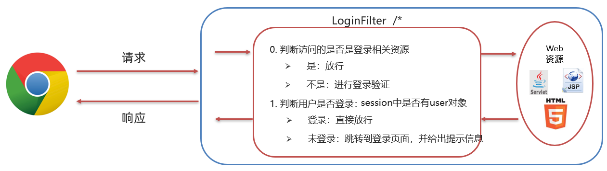

# 需求

访问服务器资源时，需要先进行登录验证，如果没有登录，则自动跳转到登录页面

# 分析

我们要实现该功能是在每一个资源里加入登陆状态校验的代码吗？显然是不需要的，只需要写一个 `Filter` ，在该过滤器中进行登陆状态校验即可。而在该 `Filter` 中逻辑如下：



# 代码实现

## 创建Filter

在 `SignInAndRegister` 工程创建 `com.wsleli.web.filter`  包，在该下创建名为 `LoginFilter` 的过滤器

```java
@WebFilter("/*")
public class LoginFilter implements Filter {
    @Override
    public void doFilter(ServletRequest request, ServletResponse response, FilterChain chain) throws ServletException, IOException {
      
    }

    public void init(FilterConfig config) throws ServletException {
    }

    public void destroy() {
    }
}
```

## 编写逻辑代码

在 `doFilter()` 方法中编写登陆状态校验的逻辑代码。

我们首先需要从 `session` 对象中获取用户信息，但是 `ServletRequest` 类型的 requset 对象没有获取 session 对象的方法，所以此时需要将 request对象强转成 `HttpServletRequest` 对象。

```java
HttpServletRequest req = (HttpServletRequest) request;
```

然后完成以下逻辑

* 获取Session对象
* 从Session对象中获取名为 `user` 的数据
* 判断获取到的数据是否是 null
  * 如果不是，说明已经登陆，放行
  * 如果是，说明尚未登陆，将提示信息存储到域对象中并跳转到登陆页面

代码如下：

```java
@WebFilter("/*")
public class LoginFilter implements Filter {
    @Override
    public void doFilter(ServletRequest request, ServletResponse response, FilterChain chain) throws ServletException, IOException {
        HttpServletRequest req = (HttpServletRequest) request;
   
        //1. 判断session中是否有user
        HttpSession session = req.getSession();
        Object user = session.getAttribute("user");

        //2. 判断user是否为null
        if(user != null){
            // 登录过了
            //放行
            chain.doFilter(request, response);
        }else {
            // 没有登陆，存储提示信息，跳转到登录页面

            req.setAttribute("login_msg","您尚未登陆！");
            req.getRequestDispatcher("/login.jsp").forward(req,response);
        }
    }

    public void init(FilterConfig config) throws ServletException {
    }

    public void destroy() {
    }
}
```

## 测试并抛出问题

在浏览器上输入 `http://localhost:8080/SignInAndRegister/` ，可以看到如下页面效果


## 问题分析及解决

因为登陆页面需要 `css/login.css` 这个文件进行样式的渲染，下图是登陆页面引入的css文件图解


而在请求这个css资源时被过滤器拦截，就相当于没有加载到样式文件导致的。解决这个问题，只需要对所以的登陆相关的资源进行放行即可。还有一种情况就是当我没有用户信息时需要进行注册，而注册时也希望被过滤器放行。

综上，需要在判断session中是否包含用户信息之前，应该加上对登陆及注册相关资源放行的逻辑处理

```java
//判断访问资源路径是否和登录注册相关
//1,在数组中存储登陆和注册相关的资源路径
String[] urls = {"/login.jsp","/imgs/","/css/","/loginServlet","/register.jsp","/registerServlet","/checkCodeServlet"};
//2,获取当前访问的资源路径
String url = req.getRequestURL().toString(); 

//3,遍历数组，获取到每一个需要放行的资源路径
for (String u : urls) {
    //4,判断当前访问的资源路径字符串是否包含要放行的的资源路径字符串
    /*
    	比如当前访问的资源路径是  /brand-demo/login.jsp
    	而字符串 /brand-demo/login.jsp 包含了  字符串 /login.jsp ，所以这个字符串就需要放行
    */
    if(url.contains(u)){
        //找到了，放行
        chain.doFilter(request, response);
        //break;
        return;
    }
}
```

##  过滤器完整代码

```java
package com.wsleli.web.filter;

import javax.servlet.*;
import javax.servlet.annotation.*;
import javax.servlet.http.HttpServletRequest;
import javax.servlet.http.HttpSession;
import java.io.IOException;

/**
 * 登录验证的过滤器
 */
@WebFilter("/*")
public class LoginFilter implements Filter {
    @Override
    public void doFilter(ServletRequest request, ServletResponse response, FilterChain chain) throws ServletException, IOException {
        HttpServletRequest req = (HttpServletRequest) request;
        //判断访问资源路径是否和登录注册相关
        //1,在数组中存储登陆和注册相关的资源路径
        String[] urls = {"/login.jsp", "/imgs/", "/css/", "/loginServlet", "/register.jsp", "/registerServlet", "/checkCodeServlet"};
        //2,获取当前访问的资源路径
        String url = req.getRequestURL().toString();

        //3,遍历数组，获取到每一个需要放行的资源路径
        for (String u : urls) {
            //4,判断当前访问的资源路径字符串是否包含要放行的的资源路径字符串
            /*
                比如当前访问的资源路径是  /SignInAndRegister/login.jsp
                而字符串 /SignInAndRegister/login.jsp 包含了  字符串 /login.jsp ，所以这个字符串就需要放行
            */
            if (url.contains(u)) {
                //找到了，放行
                chain.doFilter(request, response);
                //break;只能跳出循环，不适用
                return;
            }
        }

        //1. 判断session中是否有user
        HttpSession session = req.getSession();
        Object user = session.getAttribute("user");

        //2. 判断user是否为null
        if (user != null) {
            // 登录过了
            //放行
            chain.doFilter(request, response);
        } else {
            // 没有登陆，存储提示信息，跳转到登录页面
            req.setAttribute("login_msg", "您尚未登陆！");
            req.getRequestDispatcher("/login.jsp").forward(req, response);
        }
    }

    public void init(FilterConfig config) throws ServletException {
    }

    public void destroy() {
    }
}
```
