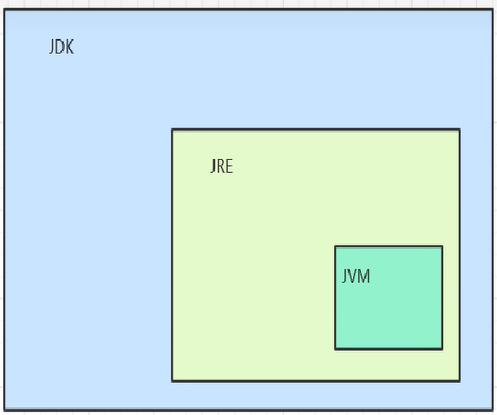

# 初识Java

## 初始代码：

```java
public class test_1 {
	public static void main(String[] args) {
		System.out.println("hello!");
	}
}
```

注：除定义语句外，执行代码要写在方法中（目前写在main方法中）

## 终端指令：

- dir-----查看当前目录文件
- cd-----跳转根目录
- -d-----设置路径参数

## java中断程序测试步骤：

1. 创建后缀为 “.java” 的文件，用记事本打开，写入代码
2. 终端输入指令 “javac 文件名.java” 或 “javac -d Java源程序目录 Java执行程序全路径” 编译程序
3. 终端输入指令 “java 文件名” 或 “java -classpath 具体类所在目录 要执行的类”运行程序 

## 配置环境变量的目的：

​	配置环境变量就是让操作系统直接识别到bin目录下的命令

## JDK

​	java developement kit:java开发工具包

### 作用：

​	提供java项目的开发工具、环境-开发人员

### 包含文件：

#### bin

​	编译，解释等调试java程序的命令( bin)

##### javac

​	将java源文件编译成.class文件（字节码文件）

​	只关注java语法

##### java:

​	执行字节码文件

##### jar

​	打包命令

##### javadoc

​	生成文档命令

#### jre

​	java runtime environment:java运行时环境

​	运行.class文件的环境

​	java:解释运行.class文件-在JVM上

##### jvm

​	java virtural machine :java 虚拟机

​	运行.class文件-最终解释给当前操作系统

## java跨平台特性:

​	一次编译，处处运行

​	1.源程序编译后是字节码文件(.class）,而不是当前系统可执行的可执行文件（例如windos下的exe文件）

​	2.执行.class文件的是JVM,只要运行java程序的环境中有匹配的JVM就可以正常

## JDK、JRE、JVM三者关系



# eclipse快捷键

1. Ctrl + 1（快速修复）
2. Ctrl +D（删除当前行)·
3. Ctrl + Alt + ↓(复制当前行到下一行)）
4. Alt+ ↓（从当前行下移一行）。
5. Alt +/代码提示。
6. Alt+Shift+R重命名非常好用。
7. Ctrl +Q定位到最后编辑的地方。
8. Ctrl + Shift + 0自动导入包。
9. Ctrl+/ 注释当前行,再按则取消注释
10. Ctrl+shift+/多行注释
11. Ctrl+K快速查找选定的单词。
12. Ctrl + Shift +F自动缩进格式化。
12. 光标定位使用类：Alt+/
12. 导入所有包:Ctrl+Shift+O

# Java知识点

## 输入语法：

```java
Scanner sc = new Scanner(System.in);
int num = sc.nextInt();
```

将输入的东西存在一个地方，然后赋值给创建的变量进行使用

## 输出语法：

```java
System.out.println("***"+"***");
```

## 系统语法：

```java
System.exit(0);//正常退出系统，程序正常执行结束退出
System.exit(1);//是非正常退出系统，就是说无论程序正在执行与否，都退出
```

## 注解

@

# 八种数据类型：

## 整数

### byte:

1个字节 -128 -127

### short:

2个字节 -32768 -32767

### int:

4个字节 -2147483648-2147483647

### long:

8个字节 -9223372036854775808 - 9223372036854775807

## 浮点数

### float:

4个字节，单精度

### double:

8个字节，双精度

注：在java里面，没小数点的默认是int,有小数点的默认是 double;

## 字符

### char

2个字节

每个字符对应一个ASCII码值 A:65 a:97

字符类型和整型之间可以相互转换

### String

字符串类型可用

数组名.length:数组的属性，表示数组的长度，数组元素的个数

## 布尔

boolean true false

1个位 0 1

做判断操作时的结果值，Java中做判断操作必须是boolean类型

## 总结


# 关键字

| abstract   | assert       | boolean    | break      | byte   |
| ---------- | ------------ | ---------- | ---------- | ------ |
| case       | catch        | char       | class      | const  |
| continue   | default      | do         | double     | else   |
| enum       | extends      | final      | finally    | float  |
| for        | goto         | if         | implements | import |
| instanceof | int          | [interface | long       | native |
| new        | package      | private    | protected  | public |
| return     | strictfp     | short      | static     | super  |
| switch     | synchronized | this       | throw      | throws |
| transient  | try          | void       | volatile   | while  |

| **关键字**   | **含义**                                                     |
| ------------ | ------------------------------------------------------------ |
| abstract     | 表明类或者成员方法具有抽象属性                               |
| assert       | 断言，用来进行程序调试                                       |
| boolean      | 基本数据类型之一，声明布尔类型的关键字                       |
| break        | 提前跳出一个块                                               |
| byte         | 基本数据类型之一，字节类型                                   |
| case         | 用在switch语句之中，表示其中的一个分支                       |
| catch        | 用在异常处理中，用来捕捉异常                                 |
| char         | 基本数据类型之一，字符类型                                   |
| class        | 声明一个类                                                   |
| const        | 保留关键字，没有具体含义                                     |
| continue     | 回到一个块的开始处                                           |
| default      | 默认，例如，用在switch语句中，表明一个默认的分支。Java8 中也作用于声明接口函数的默认实现 |
| do           | 用在do-while循环结构中                                       |
| double       | 基本数据类型之一，双精度浮点数类型                           |
| else         | 用在条件语句中，表明当条件不成立时的分支                     |
| enum         | 枚举                                                         |
| extends      | 表明一个类型是另一个类型的子类型。对于类，可以是另一个类或者抽象类；对于接口，可以是另一个接口 |
| final        | 用来说明最终属性，表明一个类不能派生出子类，或者成员方法不能被覆盖，或者成员域的值不能被改变，用来定义常量 |
| finally      | 用于处理异常情况，用来声明一个基本肯定会被执行到的语句块     |
| float        | 基本数据类型之一，单精度浮点数类型                           |
| for          | 一种循环结构的引导词                                         |
| goto         | 保留关键字，没有具体含义                                     |
| if           | 条件语句的引导词                                             |
| implements   | 表明一个类实现了给定的接口                                   |
| import       | 表明要访问指定的类或包                                       |
| instanceof   | 用来测试一个对象是否是指定类型的实例对象                     |
| int          | 基本数据类型之一，整数类型                                   |
| interface    | 接口                                                         |
| long         | 基本数据类型之一，长整数类型                                 |
| native       | 用来声明一个方法是由与计算机相关的语言（如C/C++/FORTRAN语言）实现的 |
| new          | 用来创建新实例对象                                           |
| package      | 包                                                           |
| private      | 一种访问控制方式：私用模式                                   |
| protected    | 一种访问控制方式：保护模式                                   |
| public       | 一种访问控制方式：共用模式                                   |
| return       | 从成员方法中返回数据                                         |
| short        | 基本数据类型之一,短整数类型                                  |
| static       | 表明具有静态属性                                             |
| strictfp     | 用来声明FP_strict（单精度或双精度浮点数）表达式遵循IEEE 754算术规范 |
| super        | 表明当前对象的父类型的引用或者父类型的构造方法               |
| switch       | 分支语句结构的引导词                                         |
| synchronized | 表明一段代码需要同步执行                                     |
| this         | 指向当前实例对象的引用                                       |
| throw        | 抛出一个异常                                                 |
| throws       | 声明在当前定义的成员方法中所有需要抛出的异常                 |
| transient    | 声明不用序列化的成员域                                       |
| try          | 尝试一个可能抛出异常的程序块                                 |
| void         | 声明当前成员方法没有返回值                                   |
| volatile     | 表明两个或者多个变量必须同步地发生变化                       |
| while        | 用在循环结构中                                               |

## 注：

​		goto,const是保留字-目前没有特定用途但不能当做普通标识符

​		true,false,null属于常量，不是关键字

# 运算符

## 算术运算符

### +

​		数学运算:求和

​		字符串连接符:字符串和数值数据

### /

​		都是整数表示取整

​		有实数表示正常除

### %

​		结果与被除数一致

## 结合性

- 通常是自左向右
- 赋值运算是自右向左
- 单目运算符自右向左

# 数组

## 数组的创建和初始化

### 方式一：

​		通过new的方式分配空间

```java
int[] num = new int[10];
num[0] = 1;
num[1] = 2;
```

#### 初始数值：

- 如果是数值类型会赋初值为0
- 如果是引用类型（如字符串）会赋初值null
- 如果是boolean类型会赋初值为false

### 方式二：

​		声明数组的时候对数组进行初始化数组的长度就是初始化数据个数，按照数组存储单元的顺序赋值

```java
int[] num = {1,2,3,4,5};
```

### 冒泡重点

​		外循环n-1，内循环n-i-1

### 选择排序重点

​		外循环n-1，内循环n

# 方法

## 语法

修饰符 返回值类型 方法名(参数类型 形式参数1，参数类型 形式参数2){
		程序代码
		return返回值;

}

# 类和对象

## 命名法

- 类名-----大骆驼命名法
- 类成员、变量名、方法名-----小骆驼命名法

## 创建对象

```java
类型名 对象名 = new 构造方法名();//构造方法名就是类型名
```

> 类默认有无参构造方法，若要添加有参构造方法，则会覆盖无参构造方法，需要添加一个无参构造方法

> this指当前被创建对象

> 构造方法没有返回值（向计算机申请存储空间），构造方法名和类名相同

## 方法重载的概念

​		允许一个类中出现同名方法，方法的参数不同

- 参数的个数
- 参数的类型
- 参数的顺序

## toString方法

- 主要做测试用
- toString方法是当打印对象时自动将对象转化成字符串形式，打印对象时会自动调用

# 面向对象

## 封装

1. 将属性，方法封装成一个类
2. 隐藏内部实现细节，提供外部访问接口
2. 把相关类封装到一个包内

### 实现：

- 属性私有化

- 提供公共的访问方法

## 继承和多态

​		继承可以使得子类具有父类的属性和方法或者重新定义、追加属性和方法

​		调用同名的方法执行的操作不同即为多态

### 继承特征

- 子类继承父类的非私有成员
- 不继承构造方法
- 子类可重写父类的方法，重新定义方法体
- 子类可追加属性和方法

> 可用子类定义父类，反之不行；此种定义方式不可使用子类有，父类没有的方法以及成员属性
>
> 子类不可将父类继承过来的方法私有化，会有冲突

> 子类不继承构造方法，但是会调用父类的构造方法
>
> 子类不继承父类的私有成员，构造方法开辟内存空间需要通过父类实现
>
> 如果不使用super()显式调用则会默认调用父类的无参构造

### 实现多态

- 重写(Override)。

  - 重写特征
    - 发生在具有继承关系的两个类中
    - 要求方法名相同，参数相同，实现不同
    - 重写是重写的实现方法
- 重载（Overload）

  - 重载特征

    - 发生在同一个类中
    - 方法名相同，参数不同构造方法重载

      - 参数的个数
      - 参数的类型

      - 参数的顺序（同类型不可用）
    - 成员方法重载
- 接口
  - 不同的实现类有不同的实现方法


### super

- 可以调用父类的构造方法

  ```java
  super();//无参
  super(参数);//有参
  ```

- 可以调用父类的成员方法

  ```java
  super.方法名;
  ```

### 上转型

​		父类接口接收子类对象，实现接口的类不要扩展方法

​		父类类型接收子类对象不提解耦，是因为子类允许扩展父类的方法

​		目的：解耦（用实现接口的方法）

```java
父类 变量名 = new 子类();
```

> 上转型对象不能调用子类中增加的方法
>
> 上转型对象调用的方法是根据new的谁的对象来调用

> Java中允许多重继承（有层级关系）
>
> 但不允许多继承(多个类，有多个父类)
>
> 一个父类能有多个子类，一个子类不能由多个父类

> 所有类的父类都是Object

## 抽象类(abstract）

作用：

- 仅供子类继承并实现抽象方法
- 做项目的顶层设计

特征：

- 有抽象方法的类一定是抽象类
- 抽象类允许没有抽象方法
- 抽象类不能实例化( new对象)-----不能修改抽象类里面的信息（顶层设计不要随意改动）

> 当某个方法不能给出具体实现时，需要对该方法添加abstract标志
>
> 当类中有abstract方法时，该类必须是abstract类
>
> 如果子类没实现抽象方法，则子类也要设置为抽象类

## 接口（interface)

目的：

- 做项目的顶层设计，通常来制定标准和规范
- 实现类实现接口必须实现接口的所有方法

特征：

- 所有方法都是抽象的
- 方法默认是public abstract类型
  - 抽象方法只能供子类实现
  - 子类必须能够访问到
- 属性默认是public static final类型 （常量）

> 当某个类所有的方法都是抽象方法时，该类可转成接口
>
> 解决了Java类单一继承问题，接口可以多继承-----可以让接口进行组合

### 解耦

​		运用上转型思想，用一个父类方法可调用多个子类方法

### 继承与实现

​		接口继承接口，类继承类，类实现接口

# 包

## JDK中常用的包


> java.lang包是java设计的基础包，默认导入

## 命名规范

​		一个唯一包名的前缀总是全部小写的ASCII字母并且是一个顶级域名，通常是com、edu、gov、mil、net、org，或是1981年ISO 3166标准所指定的标识国家的英文双字符代码。包名的后续部分根据不同机构各自内部的命名规范而不尽相同。这类命名规范可能以特定目录名的组成来区分部门（department）、项目（project）、机器（machine）、或注册名（login names）。

如：com.公司名.项目名.项目分包

- com.apple.quicktime.v2
- com.meituan.shop.service

# Java中的修饰符

## 访问修饰符

- private
- public
- protected

| 修饰类型  | 同一个类 | 同一个包内的类 | 不同包内的子类 | 不同包并且不是子类 |
| --------- | -------- | -------------- | -------------- | ------------------ |
| private   | 是       | 否             | 否             | 否                 |
| 默认      | 是       | 是             | 否             | 否                 |
| protected | 是       | 是             | 是             | 否                 |
| public    | 是       | 是             | 是             | 是                 |

> protected在不同包类的子类只能新定义子类访问protected，而不能新定义父类来访问

## 非访问修饰符

### static

> 静态属性或方法属于类属性或类方法，即为整个类所有，不单独为某个对象使用
>
> 静态变量单独占据一个存储空间，为所有对象共享——属于整个类

- 修饰方法

  1. 可以直接访问静态属性和静态方法
  2. 若要访问非静态方法和数据，需要创建对象后访问
  3. 不能使用 super 或 this 关键字
     - static是属于整个类的，不为某个对象所有
     - 凡是某个对象的方法（非静态方法）都可以访问静态
     - 静态不能直接访问属于某个对象信息

- 修饰属性

  - 静态或非静态方法都可以直接访问

- 静态块

  ```java
  {}//非静态初始化块
  static{}//静态初始化块
  //写在类里面
  ```

  - 类加载后就执行，在构造方法之前

  - 多个静态块的加载顺序依据书写顺序，详细执行顺序：
    1. 静态初始化块或静态属性（按书写顺序）
    2. 非静态初始化块
    3. 构造方法

#### 单例模式

- 饿汉式

  - 是立即加载的方式，无论是否会用到这个对象，都会加载。

    ```java
    public class Boss {
        //1私有静态属性
        private static Boss boss = new Boss();
        //2构造方法私有化，不让创建新对象
        private Boss() {}
        //3提供公共静态接口
        public static Boss getInstance() {
            return boss;
        }
    }
    ```

- 懒汉式

  - 是延迟加载的方式，只有使用的时候才会加载。

    ```java
    public class Boss2 {
        //1私有静态属性
        private static Boss2 boss;
        //2构造方法私有化，不让创建新对象
        private Boss2() {}
        //3提供公共静态接口
        public static Boss2 getInstance() {
            if(null == boss) {
                boss = new Boss2();
            }
            return boss;
        }
    }
    ```

> **null==值和 值==null本质上是没有区别的**
>
> **如果写法值==null，可能会因为程序员的疏忽导致程序报空指针，所以这种写法会有一定风险。**
>
> **而写成null==值，因为疏忽写成null=值也没有事，程序会自动报错，找出问题所在。**

### final

- 定义属性：常量值

  ```java
  public static final LENGTH = 12;
  ```

- 定义方法：子类不能重写方法

- 定义类：该类不能被继承

### abstract

- 定义类
  - 抽象类不能被实例化，即不能new对象
  - 供子类继承
- 定义方法
  - 没有方法体
  - 构造方法和static 方法不能是抽象的
- 注意
  - 有抽象方法的类一定是抽象类
  - 抽象类不一定有抽象方法

# 常用API

## 字符串相关类

### String

#### 常用API

| API                                                   | 作用                                                         |
| ----------------------------------------------------- | ------------------------------------------------------------ |
| public char charAt(int index)                         | 获得字符串指定索引处的字符                                   |
| public int indexOf(String str)                        | 返回子字符串在此字符串中首次出现的位置，如果没有返回-1，从0开始 |
| public int lastIndexOf(String str)                    | 返回子字符串在此字符串中最右边出现的位置，如果没有返回-1     |
| public boolean startsWith(String prefix)              | 测试此字符串是否以指定的前缀开始                             |
| public String substring(int beginIndex, int endIndex) | 返回一个新字符串，它是此字符串的一个子字符串。该子字符串从指定的beginIndex处开始，直到索引endIndex -1处的字符，截取出生日期字符串。 |
| public String[]split(String regex)                    | 根据给定正则表达式的匹配拆分此字符串。                       |
| public String trim()                                  | 返回字符串的副本，忽略前导空白和尾部空白。打印trim()之前和之后的字符串长度。 |
| public boolean matches(String regex)                  | 判断字符串是否匹配指定的正则表达式——数据格式验证,            |

#### 正则表达式概述

- [1,2,3] :1,2,3中任意1个进行匹配
- [0-9] :0-9之间的任意一个数字
- [^0-5] :不在0-5区间的数字
- [0-9]* :匹配0次或多次
- [0-9]+ :匹配1次或多次
- [0-9]? :匹配0次或1次
- [0-9]{6} :必须匹配6次
- [a-zA-Z0-9]6,20} :字母，数字匹配6-20次
- [1-9]{3,} :至少匹配3次
- | :或操作匹配

> ^:匹配开始
>
> $:匹配结束
>
> []:字符集中任意一个
>
> {n,m}:至少匹配n次，至多匹配m次

#### String对象两种创建方式

```java
String  str1_1 ="苹果";//在常量空间直接赋值

String str2_1 = new String("苹果");//每new一个，就会创建一个新空间，再从常量空间赋值
```

##### 区别

###### ==和equals

- ==：内存中的值比较
  - 基本类型比较的是数据值
  - 引用类型比较的是地址值
- equals：Object类的比较方法
  - String类重写了Object类的equals方法，逐个字符进行比较
  - 注意自定义的类没有重写equals方法，在使用equals方法时实际比较的是地址，和==相同

#### 注意：

String 类型的不可变性

​		java中String声明是final类型，说明String不可继承，String里面核心存储值的value是一个char[]数组也使用了final修饰，说明value的引用地址是不改变。

​		每次重新赋值就会重新开辟新的空间

例：

```java
String b = "aaa";
String a = "aaa";
a = a + "";
System.out.println(a.equals(b));//ture
System.out.println(a == b);//false
```

### StringBuilder

> 字符串缓冲类，该类创建的对象，其内容具有可更改性

| API                                                | 说明                                                         |
| :------------------------------------------------- | :----------------------------------------------------------- |
| public StringBuilder append(String str)            | 将指定的字符串追加到此字符序列。<br/>Stringeuilder builder = new StringBuilder();<br/>builder.append("hello"'); <br/>builder.append(" everyone”); |
| public StringBuilder delete(int start,int end)     | 移除此序列的子字符串中的字符<br/>StringBuilder builder = new StringBuilder("hello everyone!"); <br/>builder.delete(6,11); |
| public StringBuilder insert(int offset,String str) | 将字符串插入此字符序列。<br/>StringBuilder builder = new StringBuilder("hello everyone!"); <br/>builder.insert(6,"every"); |
| public String substring(int start,int end)         | 截取返回一个新的 String，它包含此序列当前所包含字符的子序列<br/>功能同String对象 |
| public StringBuilder reverse()                     | 将此字符序列用其反转形式取代。<br/>StringBuilder builder = new StringBuilder("hello everyone!" );<br/>builder.reverse(); |
| public int length()                                | 返回此字符序列长度，功能同String对象                         |
| public String toString()                           | 返回此序列中数据的字符串表示形式。                           |

### StringBuffer

> 提供与StringBuilder相同的功能
>
> 线程安全类-----安全，同步

## 封装类

| 基本数据类型 | 封装类    |
| ------------ | --------- |
| boolean      | Boolean   |
| byte         | Byte      |
| short        | Short     |
| int          | Integer   |
| long         | Long      |
| char         | Character |
| float        | Float     |
| double       | Double    |

### 目的：

- 扩展对基本类型的应用
- **数据类型间的转换**
  - 通常从界面获取的数据是字符串类型，在给特定属性赋值时需要进行类型转换
    - 之所以获取的是字符串类型，是为了用**正则表达式**验证格式
    - 实际的应用时，需要转换到实际应用的类型


### 1.字符串数字与基本类型转换

1. 字符串数字-基本类型：

   ```java
   int x = Integer.parseInt(s);
   ```

2. 基本类型-字符串：

   ```java
   int x=10;
   ```

   ```java
   String sx = x+"";//数值类型+""自动转成字符串
   
   Integer it = x;//自动装箱，JDK1.5后
   String sx = it.toString();
   
   String sx1 = String.valueOf(x);
   ```

### 2.字符串数字与封装类转换

1. 字符串数字-封装类

   ```java
   Integer it = new Integer("10");
   ```

   > 字符串必须为数字格式

2. 封装类-字符串数字

   ```java
   String s = it.toString();
   ```

### 3.基本类型与封装类转换

1. 基本-封装

   ```java
   Integer iage = new Integer(20);
   ```

2. 封装类-基本类型

   ```java
   int age = iage.intValue();
   ```

3. 自动拆装箱（jdk5后）

   ```java
   Integer iage = 20; 
   int age = new Integer(20);
   ```

> 其他基本类型类似上述操作

### 关于基本数据类型与包装数据类型的使用标准如下∶

1. 【强制】所有的POJO类属性必须使用包装数据类型。
2. 【强制】RPC方法的返回值和参数必须使用包装数据类型。
3. 【推荐】所有的局部变量使用基本数据类型。

## 日期相关类

### 日期时间类

#### 获取日期时间

- java.util.Date

  - 年月日时分秒
  - 获取当前时间

  ```java
  java.util.Date  date1 = new java.util.Date();
  ```

- java.sql.Date

  - 只存储年月日
  - 当前日期：1970年1月1日以来的毫秒值

  ```java
  Date date2 = new Date(long times);
  ```

- java.sql.Timestamp

  - 年月日时分秒（纳秒）
  - 当前日期：1970年1月1日以来的毫秒值

  ```java
  Timestamp  date3 = new Timestamp(long times);
  ```

#### 日期类型之间转换

```java
日期类型 目标对象 = new 日期类型(其他日期对象.getTime());
```

```java
//例：
Date date1 = new Date();
System.out.println(date1);

java.sql.Date date2 = new java.sql.Date(date1.getTime());
System.out.println(date2);

Timestamp date3 = new Timestamp(date1.getTime());
System.out.println(date3);
```

```java
//当前日期时间的毫秒数获取
System.currentTimeMillis();
```

#### 字符串转成日期类型

> 需求：界面上填写的出生日期，默认是字符串类型

- 日期字符串——日期（java.sql.Date）

  > - java.sql.Date  birthday = java.sql.Date.valueOf("日期字符串");
  >
  > - 日期字符串的格式有特定要求：yyyy-[m]m-[d]d
  >
  > - 日期转字符串：toString();

- 日期时间字符串——日期（java.sql.Timestamp）

  > - java.sql.Timestamp  inputTime = java.sql.Timestamp.valueOf("日期时间字符串");
  >
  > - 日期时间字符串格式要求：yyyy-[m]m-[d]d hh:mm:ss[.f...]
  > - 日期转字符串：toString();

- 日期时间字符串——日期(java.util.Date)

  > - SimpleDateFormat   sdf = new SimpleDateFormat("yyyy-MM-dd HH:mm:ss");
  > - 日期——字符串: sdf.format(Date):将日期转成指定格式的字符串
  > - 字符串——日期:sdf.parse(String)：将日期字符串转成日期类型
  >   - 异常处理
  >   - 保证格式串和日期字符串匹配

#### 设置指定的日期时间

> 已过时
>
> 1.通过Calendar设置
>
> 2.jdk8新增日期设置

### 日历类：Calendar

#### 获取日历中的日期时间对象

```java
Calendar calendar = Calendar.getInstance();

int year = calendar.get(Calendar.YEAR);
System.out.println(year);

int month = calendar.get(Calendar.MONTH) + 1;//月份从0开始
System.out.println(month);

int day = calendar.get(Calendar.DAY_OF_MONTH);
System.out.println(day);

int week = calendar.get(Calendar.DAY_OF_WEEK) - 1;//星期从周日开始
System.out.println(week);
```

#### 设置指定日期

```java
set(int year, int month, int date);
//注意月份从0开始
```

#### 转换

- Calendar —— Date

  ```java
  Calendar calendar = Calendar.getInstance();
  Date  date1 = calendar.getTime();
  ```

- Date —— Calendar

  ```java
  Calendar calendar = Calendar.getInstance();
  Calendar  newCalendar = calendar.setTime(Date对象);
  ```

### JDK8新增日期

- 日期：LocalDate
  - 年月日
- 时间：LocalTime
  - 时分秒
- 日期时间：LocalDateTime
  - 年月日 时分秒
- 时间戳：Instant
- 转换类：DateTimeFormatter

#### 主要应用（LocalDate为例）

##### 获取

```java
//获取日期时间
LocalDate date = LocalDate.now();
int year = date.getYear();
int month = date.getMonth().getValue();
int day = date.getDayOfMonth();
int weekDay = date.getDayOfWeek().getValue();

System.out.println("年：" + year);
System.out.println("月：" + month);
System.out.println("日：" + day);
System.out.println("星期：" + weekDay);
```

##### 设置

```java
LocalDate birthday = LocalDate.of(2011,11,11);

System.out.println(birthday);
```

##### 转换

```java
String str1 = "2020-01-11";
LocalDate localDate1 = LocalDate.parse(str1);
System.out.println(localDate1);

String str2 = "2020/01/11";
DateTimeFormatter formatter = DateTimeFormatter.ofPattern("yyyy/MM/dd");
LocalDate localDate2 = LocalDate.parse(str2, formatter);
System.out.println(localDate2);
```

##### 日期运算

```java
LocalDate birthday = LocalDate.of(2011,11,11);
System.out.println("birthday:"+birthday);

LocalDate b1 = birthday.plusYears(1);//下一年
System.out.println("b1"+b1);

LocalDate b2 = birthday.minusMonths(2);//2月前
System.out.println("b2:"+b2);

LocalDate b3 = birthday.plusDays(7);//7天后
System.out.println("b3:"+b3);
```

> 注意LocalDate对象的不可变性，类比String

##### 比较

```java
LocalDate date1 = LocalDate.parse("2020-02-11");
LocalDate date2 = LocalDate.parse("2020-04-11");

System.out.println(date2.isAfter(date1));
System.out.println(date2.isBefore(date1));
System.out.println(date2.isEqual(date1));
```

## 数学相关类

### Math

> 数学运算
>
> 指数、对数、平方根法、三角函数等

> 属性和方法全部是static类型
>
> 使用类名直接调用
>
> 类名.属性
>
> 类名.方法

### BigDecimal

#### 小数的精确运算，可指定小数点后的位数

> 加减乘除

```java
BigDecimal num1 = new BigDecimal("3.14");
BigDecimal num2 = new BigDecimal("2.15");
BigDecimal result =  null;

//加add
result = num1.add(num2);
System.out.println(result);

//减subtract
result = num1.subtract(num2);
System.out.println(result);

//乘multiply
result = num1.multiply(num2);
System.out.println(result);

//除divide,不能整除的情况下设置精度
result = num1.divide(num2,2,BigDecimal.ROUND_HALF_UP);
System.out.println(result);
```

#### 精度设置

> 对象.setScale(小数位数, BigDecimal.ROUND_HALF_UP)
>
> 结果设置精度

```java
//乘 
result = num1.multiply(num2);
System.out.println(result.setScale(2, BigDecimal.ROUND_HALF_UP));
```

### Random

> 随机数生成器类

```java
Random rd = new Random();

int  num = rd.nextInt(10);//0-9之间的随机数
```

## Object类

> 所有类的父类

**方法分析**

- getClass()

> 返回该Object运行时类
>
> 反射

- hashCode()

> 不同的对象默认对应hashCode值是不同的，和equals相关，调用equals方法相同，hashCode值要相同

- equals(Object obj)

> Object类的方法比较的是对象

```java
public boolean equals(object obj) {
	return (this ==obj)
};
```

> 自定义类要比较对象内容需要重写equals

- toString()

> 返回对象的字符串表示形式

# 集合框架

> 集合是利用了泛型来实现的

## 集合框架接口总述

### Collection

#### 主要继承关系


#### 主要特征


### Map

#### 主要继承关系


#### 主要特征


## List接口及其实现类应用

### 接口实现和继承


### List接口常用方法


### ArrayList

> List 接口的大小可变数组的实现。实现了所有可选列表操作，并允许包括 null 在内的所有元素。
>
> 底层实现是数组

**使用语法**

```java
ArrayList<类名> 集合名 = new ArrayList<类名>();

//添加，内容需要与类成员数量一致
集合名.add(内容);

//删除（序号同数组类似）
集合名.remove(索引);

//获得对象
集合名.get(索引);

//用数组的形式打印字符串
System.out.println(Arrays.toString(集合名.toArray()));
```

> 类中需要重写toString方法

#### 遍历方法：

1. 索引遍历

2. 迭代器遍历

   ```java
   //1、获取迭代器
   Iterator<类型名> 迭代器名 = 集合名.iterator();
   //2、通过循环迭代
   //hasNext():判断是否存在下一个元素
   while(迭代器名.hasNext()){
   //如果存在，则调用next实现迭代
   //创建新对象获取并输出
       类型名 变量名 = 迭代器名.next();
   	System.out.println(变量名);
   }
   ```

3. 增强for语法

   ```java
   for(类型名 变量名 : 集合名) {
       System.out.println(变量名);
   }
   ```

4. forEach语法

   ```java
   集合名.forEach(变量名 -> {
       System.out.println(变量名);
   });
   ```

### LinkedList

> LinkedList其底层实现是链表
>
> 适用于常增删的操作的

### Vector

> Vector的功能和ArrayList一样
>
> Vector线程安全

### 小结


## Set接口及其实现类应用

### 接口实现和继承


### Set接口常用方法


### HashSet

> - 哈希表和数组实现
> - 特征
>   - 不保证元素的顺序
>   - 允许元素为null
>   - 元素不允许重复
>     - 前提是元素必须重写hashCode和equals方法

**使用语法**

```java
HashSet<类名> 集合名 = new HashSet<类名>();

//添加，内容需要与类成员数量一致
集合名.add(内容);

//删除
for(类型名 变量名 : 集合名) {
    if(变量名.getName().equals(内容)) {
        集合名.remove(变量名);
        break;
    }
}

集合名.remove(指定元素);

//用数组的形式打印字符串
System.out.println(Arrays.toString(集合名.toArray()));
```

> 不能索引遍历
>
> 存储到Set集合中的数据规定需要重写equals和hashCode方法

### LinkedHashSet

> - 哈希表和链表实现
> - 特征
>   - 按存入数据的顺序对应各节点顺序
>   - 允许元素为null

### TreeSet

> - 树结构实现
> - 特征
>   - 可实现元素排序存储
>     - 自然顺序
>       - 0-9
>       - a-z
>     - 元素特定的比较器（实现Comparable接口）
>   - 不允许元素为null

### 小结

| 实现类        | 底层实现   | 特点                                                         |
| ------------- | ---------- | ------------------------------------------------------------ |
| HashSet       | 数组实现   | 根据Hash值计算元素下标                                       |
| LinkedHashSet | 链表实现   | 链表结构，元素添加顺序和存储顺序一致                         |
| TreeSet       | 树结构实现 | 按元素的自然顺序排序或特定的比较器（实现Comparable接口）排序 |

## Map接口及其实现类应用

### 接口实现和继承


### Map接口常用方法


### HashMap

> - 哈希表和数组实现
> - 特征
>   - 不保证顺序
>   - 允许null值和null键
>   - 重复键会被覆盖，值可以重复
>     - 通常使用String作为键（String重写了hashCode和equals方法，保证相同的键是同一个）
>   - 非线性安全

**使用语法**

```java
HashMap<键类型,值类型> 集合名 = new HashMap<键类型,值类型>();

//添加
集合名.put(键名,值名);

//遍历
//1.
集合名.forEach((键变量名,值变量名) -> {
    System.out.println(键变量名+值变量名);
});
//2.
set<键类型> 键集合变量名 = 集合名.keySet();
//根据键获取值
for(键类型 键变量名 : 键集合变量名) {
    system.out .print1n(键变量名+" ----- "+集合名.get(键变量名));
}
//3.
//通过EntrySet遍历映射——取出整个映射关系(键值对集合)
Set<Map.Entry<键类型,值类型>> 键值对集合 = 集合名.entrySet();
for(Map.Entry<键类型,值类型> 键值对集合变量名 : 键值对集合) {
    System.out.println(键值对集合变量名.getKey( )+"-----"+键值对集合变量名.getValue());
}
```

### LinkedHashMap

> - 哈希表和链表实现
> - 特征
>   - 元素添加顺序和存储顺序相同
>   - 允许null值和null键
>   - 重复键会被覆盖，值可以重复

### TreeMap

> - 树结构实现
> - 特征
>   - 可实现元素排序存储
>     - 自然顺序
>       - 0-9
>       - a-z
>     - 元素特定的比较器（实现Comparable接口）
>   - 允许null值和null键
>   - 重复键会被覆盖，值可以重复

### HashTable

> - 哈希表和数组实现
> - 特征
>   - 不允许有null键或null值
>   - 线性安全
>   - 用法和HashMap相同

### 小结


# 异常处理

## JAVA异常类层次结构


> 说明：
>
> ​		Error类对象由Java虚拟机生成并抛出；程序无法捕获
>
> ​		Exception类对象由应用程序处理或抛出。

## 异常说明

> - Exception（不做处理，需要避免）
>   - RunntimeException
>     - ArithmeticException（数学异常）
>     - NullPointerException（空指针异常）
>     - NumberFormatException（格式转换异常）
>     - ArrayIndexOutOfBoundsException （数组越界异常）
>     - 运行时异常，未检查异常
>       - 代码没有经过检查
>       - 如果进行检查，在写程序过程中可以避免的异常
>   - 直接子类（无法避免，必须处理）
>     - ClassNotFoundException
>     - IOException
>     - SQLException
>     - 已检查异常
>       - 即使进行了代码检查也不可避免产生的异常
>       - 无法避免，必须处理

## 异常处理机制

​		对“已检查异常”的处理

**定义抛出异常方法**

```java
修饰符 返回值类型 方法名（形式参数）throws 异常类{
    方法体；
}
```

**处理异常的方式**

> 调用抛出异常的方法，必须在本方法中Add Throws继续抛出异常或者try-catch语句处理

### Add Throws继续抛出异常

​		调用方法继续使用throws关键字抛出异常

> java允许以该种方式处理异常，最终抛给虚拟机处理，虚拟机发现异常后会终止程序运行
>
> 实际应用中也会使用这种方式，通常是向上抛到某一执行层统一处理

### try-catch处理

​		在当前场景下直接处理

```java
try{
   // 要监控错误的代码块
} catch (Exception e) {
    // 异常处理程序
} finally{
    //必须执行的语句
}
```

> 处理异常后，不影响程序其他部分的运行
>
> 当有多个异常要捕获时，需要写多个catch语句，其中一个捕获异常后，后面的其他catch不再进行捕获
>
> 注意捕获多个异常时，异常父类要放在后面

> 1.e.printStackTrace()是打印异常栈信息
>
> 2.throw new RuntimeException(e)是把异常包在一个运行时异常中抛出
>
> 第一句话感觉实际开发意义不大，很少有人会去看控制台打印。
>
> 第二种是把异常继续抛出，要么由上层方法解决，要么终止程序进行，应用范围比较广

- **try**
  - 执行可能会产生异常的代码
- **catch**
  - 捕获异常并进行处理
  - 异常类方法
    - public void printStackTrace(); 
      - printStackTrace()方法没有返回值，它的功能是完成一个打印操作，在当前的标准输出上打印输出当前异常对象的堆栈使用轨迹，也即程序先后调用执行了哪些对象或类的哪些方法，使得运行过程中产生了这个异常对象。
      - **e.printStackTrace();**
    - public String getMessage(); 
      - getMessage()方法返回描述当前异常类的消息字符串。不打印异常轨迹
      - System.out.println(**e.getMessage()**);
    - public String  toString(); 
      - toString()方法返回描述当前异常类的消息的字符串，一般由三部分组成：**此对象实际类的名称、冒号和空格、此对象getMessage()方法的结果**。
      - System.out.println(**e.toString()**);

- **finally**
  - finally语句是try-catch语句的一个补充，在try-catch语句块后可以加一个finally语句块
  - finally语句块无论程序执行时是否发生异常，最终都会被执行

### try —catch —finally说明

> - try后必须有catch 或finally
> - 一般规则：要监控的程序语句包含在 try 块内，catch 块中的代码用于捕获和处理异常。在方法返回之前必须执行的代码应放置在 finally 块中
> - 即使try代码块或者catch代码块中使用了return语句退出当前方法，finally都要执行
> - finally不能被执行的唯一情况是：在被保护代码块中执行了System.exit(0);
> - 捕获异常后不影响其他程序

## 自定义异常

**例：**创建文件时文件名不符合要求时抛出异常

```java
public class FileNameException extends Exception {

    public FileNameException() {
        super();
    }

    //指定信息
    public FileNameException(String message) {
        super(message);
    }

    // 指定信息和原因
    public FileNameException(String message, Throwable cause) {
        super(message, cause);
    }
}
```

```java
public class TestFile {
    public static void main(String[] args) {
        String fileName = "xxx.jpg";
        uploadFile(fileName);
    }

    private static void uploadFile(String fileName) {
        String extension = fileName.substring(fileName.lastIndexOf(".") + 1);
        if (!extension.equals("jpg")) {
            try {
                throw new FileNameException("文件扩展名必须是.jpg");
            } catch (FileNameException e) {
                System.out.println(e.getMessage());
                e.printStackTrace();
                return;
            }
        }
        System.out.println("程序还走吗？");
        File file = new File(fileName);
        if (!file.exists()) {
            try {
                file.createNewFile();
            } catch (IOException e) {
                e.printStackTrace();
            }
        }
    }
}
```

### 总结

- 自定义异常类要继承Exception类或其子类
- 自定义异常类的构造方法需要访问父类的构造方法以便打印响应的异常信息
- 自定义异常通常是在一定条件下手动抛出（throw）
  - 继续throws
  - try-catch处理

## 总结throws和throw关键字

### throws

- throws在方法头部声明，抛出异常类

- 应用

```java
修饰符  返回值类型  方法名（形式参数）throws 异常类{
方法体；
   }
```

- 说明
  - 对方法调用者进行显式说明，在调用该方法时需要处理哪些异常

### throw

- throw在方法体中声明，抛出异常类对象
- 应用

```java
if (!extension.equals("jpg")) {
   try {
    //手动抛出自定义异常对象
    throw new FileNameException("文件扩展名必须是.jpg");
   } catch (FileNameException e) {
    System.out.println(e.getMessage());
    e.printStackTrace();
    return;
   }
```

- 说明
  - 通常在某个条件下抛出异常类对象

# IO流

## 应用步骤

​		创建流、读写、关闭流

## 字节流

> 抽象类
>
> - InputStream
> - OutputStream

> - 文件字节流
>   - FileInputStream和FileOutputStream
>     - 实现从指定的文件中"读取"字节和将字节"写入"指定的文件
> - 字节缓冲流
>   - BufferedInputStream和BufferedOutputStream
>     - 字节缓冲流实现文件复制

### 写文件

​		在FileOutputStream价格参数true，可在文件中的末尾追加内容，不加则会覆盖

```java
package com.school.test;

import java.io.FileOutputStream;
import java.io.IOException;

public class Demo_One {
    public static void main(String[] args) {
        //使用输出流写入文件
        try {
            //1.创建输出流
            FileOutputStream fout = new FileOutputStream("e:\\temp.txt",true);//准备写入文件的数据
            String str = "good morning!";
            //转成字节
            byte[] buf = str.getBytes();
            //2.写入文件
            fout.write(buf);
            //3.关闭流
            fout.close();
        } catch (IOException e) {
            e.printStackTrace();
        }
    }
}
```

### 读文件

```java
package com.wsleli.test;

import java.io.FileInputStream;
import java.io.IOException;

public class test01 {
    public static void main(String[] args) {
        try {
            //创建文件输入流
            FileInputStream fin = new FileInputStream("e:\\temp.txt");
            //创建字节数组，用于接收从文件中读取的字节（字节缓冲区）
            byte buf[] = new byte[1024];
            //读取流中数据到数组中，并返回数组长度
            int length = fin.read(buf);
            //关闭输入流
            fin.close();
            // 将字节转化成字符串，并接收字节转化的字符串
            String instr = new String(buf, 0, length);
            System.out.println(instr);
        } catch (IOException ex) {
            ex.printStackTrace();
        }
    }
}
```

### 文件复制

复制机制

1. 循环的目的是不清楚源文件大小
2. 循环读写过程中不关闭流，会持续对文件进行读写

```java
package com.school.test;

import java.io.FileInputStream;
import java.io.FileOutputStream;

public class Demo_One {
    public static void main(String[] args) {
        try {
            //1.创建输入输出流
            FileInputStream fin = new FileInputStream("C:\\Users\\Wsleli Wiliams\\Pictures\\Saved Pictures\\第一次满深渊.png");
            FileOutputStream fout = new FileOutputStream("E:\\666.png");
            //2.循环读写
            //准备字节缓冲区
            byte[] buff = new byte[1024];
            int length = 0;
            //read在循环中会自动往后面继续读取
            while ((length = fin.read(buff)) != -1) {
                fout.write(buff, 0, length);
            }
            //3.关闭流
            fin.close();
            fout.close();
        } catch (Exception e) {
            e.printStackTrace();
        }
    }
}
```

### 字节缓冲流

BufferedInputStream和BufferedOutputStream

字节缓冲流实现文件复制（对于大文件更快）

```java
package com.school.test;

import java.io.*;

public class Demo_One {
    public static void main(String[] args) {
        try {
            //1.创建输入输出流
            FileInputStream fin = new FileInputStream("C:\\Users\\Wsleli Wiliams\\Pictures\\Saved Pictures\\第一次满深渊.png");
            FileOutputStream fout = new FileOutputStream("E:\\666.png");
            //根据字节流创建缓冲流
            BufferedInputStream bufin = new BufferedInputStream(fin);
            BufferedOutputStream bufout = new BufferedOutputStream(fout);
            //2.循环读写
            int length = 0;
            while ((length = bufin.read()) != -1) {
                bufout.write(length);
            }
            //关闭流
            bufin.close();
            bufout.close();
        } catch (Exception e) {
            e.printStackTrace();
        }
    }
}
```

> 特征：以字节为单位进行读写——8位

## 字符流

> - 抽象类
>   - Reader
>   - Writer
> - 文件字符流
>   - FileReader和FileWriter
> - 字符缓冲流
>   - BufferedReader

> 如果输出的是int型数据会转换成ASCII码表对应的字符，想要输出int型数据，需要转换成String型

### 写

```java
try {
    // 1 创建文件字符输出流
    FileWriter fw = new FileWriter("e:\\temp2.txt");// 创建文件字符流对象
    // 准备写入文件的字符
    int id = 1;
    String name = "酸梅汤";
    String category = "饮料";
    int store = 100;
    String descriptioon = "营养健康";
    //转换类型，输出记得改成 fw.write(s_id);
    //String s_id = id+""; 或 String s_id = Integer.toString(id);
    // 2 写文件-把字符串数据写到输出流对象对应的文件中
    fw.write(id);
    fw.write(name);
    fw.write(category);
    fw.write(store);
    fw.write(descriptioon);
    // 3 关闭流
    fw.close();
} catch (IOException ex) {
    ex.printStackTrace();
}
```

### 读

```java
try {
    // 1 创建文件字符输入流
    FileReader fr = new FileReader("e:\\temp2.txt");// 创建文件字符流对象
    // 准备字符数组，接收读取的数据
    char[] buf = new char[1000];
    // 2读取文件内容到buf,返回实际数据的长度
    int length = fr.read(buf);
    // 3关闭流
    fr.close();
    // 将字符数组转成字符串
    String readStr = new String(buf, 0, length);
    System.out.println(readStr);
} catch (IOException ex) {
    ex.printStackTrace();
}
```

> 特征
>
> 以字符为单位进行读写——2个字节
>
> 可以读写字符数组char[]
>
> 可以读写字符串String
>
> 可以读写整数
>
> 其他不可读写，因为不能转化为字符

### 字符缓冲流

> 都可读写

#### 写

```java
 try {
    //1.创建文件输出流
    FileWriter fw = new FileWriter("e:\\temp2.txt");
    //创建缓冲流
    PrintWriter pw = new PrintWriter(fw);
    int id = 1;
    String name = "酸梅汤";
    String category = "饮料";
    double price = 6.5;
    int store = 100;
    String description = "营养健康";
    //2.通过缓冲流写文件
    pw.print(id);
    pw.print(name);
    pw.print(category);
    pw.print(price);
    pw.print(store);
    pw.print(description);
    //3.关闭流
    pw.close();
} catch (Exception e) {
    throw new RuntimeException(e);
}
```

#### 读

```java
try {
    //1.创建文件输入流
    FileReader fr = new FileReader("e:\\temp2.txt");
    //创建缓冲流
    BufferedReader br = new BufferedReader(fr);
    //2.读文件
    String line = br.readLine();
    //3.关闭流
    br.close();
    System.out.println(line);
} catch (Exception e) {
    e.printStackTrace();
}
```

#### 读写多个实体对象

> 用flush()清空PrintWriter缓冲区，才能使数据全部写入文件；用close()也可以直接关闭，但又有数据丢失的可能
>
> FileWriter写csv会乱码

```java
package com.school.test;

import java.io.*;
import java.util.ArrayList;

public class Demo_One {
    public static void main(String[] args) {
        //写文件
        writerDate();
        //读文件
        readDate();
    }

    //写文件
    private static void writerDate() {
        //准备数据
        ArrayList<Product> pList = new ArrayList<Product>();
        pList.add(new Product(1, "快乐水", 3.0, "饮料"));
        pList.add(new Product(2, "养乐多", 4.0, "饮料"));
        pList.add(new Product(3, "蟹黄堡", 19.59, "面包"));
        //写文件
        try {
            //1.创建文件输出流
            FileWriter fw = new FileWriter("e://temp.txt");
            //创建缓冲流
            PrintWriter pw = new PrintWriter(fw);
            //2.通过行写文件
            for (Product p : pList) {
                pw.println(p);//遍历集合按行写入文件
            }
            //3.关闭流
            pw.flush();//清空缓冲区
            pw.close();//关闭缓冲区
            fw.close();//关闭输出流
        } catch (Exception e) {
            throw new RuntimeException(e);
        }
    }

    private static void readDate() {
        ArrayList<Product> pList = new ArrayList<Product>();
        try {
            //1.创建文件输出流
            FileReader fr = new FileReader("e://temp.txt");
            BufferedReader br = new BufferedReader(fr);
            //2.循环读文件
            while (true) {
                //读取一行信息
                String line = br.readLine();//按行读取缓冲流的信息，都到最后一行为空行时，返回null，并停止读取，非最后一行出现空行会显示格式错误
                if (line == null) {
                    break;
                }
                //把读回的行转成对象，存到集合中
                String[] buf = line.split(",");//去除字符串的指定字符，分别分割放入数组
                int id = Integer.parseInt(buf[0]);//字符串转整形，字符串中的字符必须全部为十进制数字，但第一个字符可以是表示负值的ASCII减号'-'或表示正值的 ASCII加号'+'
                String name = buf[1];
                Double type = Double.parseDouble(buf[2]);//字符串转双精度
                String price = buf[3];
                //组合对象
                Product p1 = new Product(id, name, type, price);
                //把对象存入集合
                pList.add(p1);
            }
            //关闭流
            br.close();//关闭缓冲区
            fr.close();//关闭输出流
            for (Product p1 : pList) {
                System.out.println(p1);
            }
        } catch (IOException e) {
            throw new RuntimeException(e);
        }
    }
}
```

## File类

> File类被定义为“文件和目录路径名的抽象表示形式”，这是因为File类既可以表示“文件”也可以表示“目录”，他们都通过对应的路径来描述
>
> 通过构造函数创建一个File类对象，则该对象就是指定文件的引用，可以通过该对象对文件操作。
>
> 可查看文件的属性及其他包含的信息

```java
//例：
File f = new File("e:\\product.csv");
//创建一个File类对象f,可通过f对product.csv进行操作
```

> 如果指定的文件不存在，即不存在e:\product.csv,需要通过createNewFile方法来创建f.createNewFile();
>
> 注意：
>
> - 读文件操作，文件必须存在，否则会出现FileNotFoundException
> - 写文件操作，文件可以不存在，系统会自动创建指定文件名的文件

### 其他API

```java
package com.school.test;

import java.io.File;
import java.io.IOException;
import java.util.Arrays;
import java.util.Date;

public class Demo_Two {
    public static void main(String[] args) {
        File f = new File("e:\\");
        if (!f.exists()) {
            try {
                f.createNewFile();
            } catch (IOException ex) {
                ex.printStackTrace();
            }
        }
        System.out.println("是文件吗:" + f.isFile());
        System.out.println("是目录吗:" + f.isDirectory());
        //查看目录中的文件列表
        System.out.println(Arrays.toString(f.list()));
        System.out.println(f.getParent());//获得父级目录
        System.out.println("名称:" + f.getName());
        System.out.println("路径: " + f.getPath());
        System.out.println("绝对路径: " + f.getAbsolutePath());
        System.out.println("最后修改时间:" + new Date(f.lastModified()));
        System.out.println("文件大小:" + f.length() + "字节");
        System.out.println("文件可读吗：" + f.canRead());
        System.out.println("文件可写吗：" + f.canWrite());
    }
}
```

> File类中没有提供对文件的读写操作，如果要实现对文件的读写，需要通过流来进行操作

# 多线程

## 多线程基本实现

- 继承Thread类

  1. 设计线程的操作

     - ```java
       class MyThread extends Thread {
           //重写run方法
           public void run() {
               //线程任务，一般写循环
               try {
                   Thread.sleep(10);//休眠，单位ms
               } catch (InterruptedException e) {
                   throw new RuntimeException(e);
               }
           }
       }
       ```

  2. 创建并启动线程

     - ```java
       MyThread thread = new MyThread();//创建线程对象
       thread.start();//启动线程
       ```

- 实现Runnable接口

  1. 设计线程任务

     - ```java
       class ThreadTask implements Runnable {
           // 重写run方法 
           public void run() {
               //线程任务，一般写循环
               try {
                   Thread.sleep(10);//休眠，单位ms
               } catch (InterruptedException e) {
                   throw new RuntimeException(e);
               }
           }
       }
       ```

  2. 创建并启动线程

     - ```java
       ThreadTask task = new ThreadTask();//创建线程任务对象
       Thread thread = new Thread(task);//创建线程对象
       thread.start();//启动线程
       ```

### 注意

1. Thread类本身就实现了Runnable接口
2. 自定义线程实现Runnable接口可以避免Java的单继承问题
3. 实现Runnable接口的方式，更加的符合面向对象解耦思想，线程分为两部分，一部分线程对象，一部分线程任务
4. 最终创建线程对象必须使用Thread或其子类，启动线程用的是Thread类的start()方法

## 共享数据的多线程设计

**实现：**

​		继承Thread，共享数据的方式是使用静态属性

​		实现Runnable，共享方式是使用同一个线程任务对象

**例**：多窗口售票系统，多个窗口销售同一票源

```java
package com.school.pojo;

public class TicketWindow /*extends Thread*/implements Runnable {
    private /*static*/ int tickets = 100;

    @Override
    public void run() {
        while (true) {
            if (tickets > 0) {
                System.out.println(Thread.currentThread().getName() + "出售第" + tickets-- + "张票");
            }else {
                break;
            }
            //模拟售票过程-休眠一段时间
            try {
                Thread.sleep(10);
            } catch (InterruptedException e) {
                e.printStackTrace();
            }
        }
    }
}
```

```java
package com.school.test;

import com.school.pojo.TicketWindow;

public class test {
    public static void main(String[] args) {
        //创建4个窗口
        /*TicketWindow window1 = new TicketWindow();
        TicketWindow window2 = new TicketWindow();
        TicketWindow window3 = new TicketWindow();
        TicketWindow window4 = new TicketWindow();*/
        //创建线程任务
        TicketWindow task = new TicketWindow();
        //创建线程
        Thread window1 = new Thread(task, "窗口1");
        Thread window2 = new Thread(task, "窗口2");
        Thread window3 = new Thread(task, "窗口3");
        Thread window4 = new Thread(task, "窗口4");
        //启动线程
        window1.start();
        window2.start();
        window3.start();
        window4.start();
    }
}
```

## 线程的同步

### 线程同步方案

#### 同步块

```java
package com.school.pojo;

public class SaleTask implements Runnable {
    private int tickets = 100;
    //创建同步锁
    Object lock = new Object();

    @Override
    public void run() {
        while (true) {
            //同步块，同一时刻只允许一个线程进入（上锁）
            synchronized (lock) {
                if (tickets > 0) {
                    System.out.println(Thread.currentThread().getName() + "出售第" + tickets-- + "张票");
                } else {
                    break;
                }
            }
            //模拟售票过程-休眠一段时间
            try {
                Thread.sleep(10);
            } catch (InterruptedException e) {
                e.printStackTrace();
            }
        }
    }
}
```

#### 同步方法

> 把共享资源的单次操作同步，保证一次操作完整

```java
package com.school.pojo;

public class SaleTask implements Runnable {
    private int tickets = 100;

    @Override
    public void run() {
        while (true) {
            sale();
            if (tickets <= 0) {
                break;
            }
            //模拟售票过程-休眠一段时间
            try {
                Thread.sleep(10);
            } catch (InterruptedException e) {
                e.printStackTrace();
            }
        }
    }
	//线程同步方法
    public synchronized void sale() {
        if (tickets > 0) {
            System.out.println(Thread.currentThread().getName() + "出售第" + tickets-- + "张票");
        }
    }
}
```

#### 调用

```java
package com.school.test;

import com.school.pojo.SaleTask;

public class test {
    public static void main(String[] args) {
        SaleTask task = new SaleTask();
        Thread window1 = new Thread(task, "窗口1");
        Thread window2 = new Thread(task, "窗口2");
        Thread window3 = new Thread(task, "窗口3");
        Thread window4 = new Thread(task, "窗口4");
        //启动线程
        window1.start();
        window2.start();
        window3.start();
        window4.start();
    }
}
```

> 休眠代码不要放在同步块或同步方法中，单独做休眠，防止占用资源过多

### 死锁问题

死锁的关键点

- 两个线程都需要对方占用的锁才能继续执行
- 锁只有一个（static），有一个线程占用了，其他线程就得不到

## 线程间通信

> 相对于不通信多一个变量，用于管理提供者是否提供了票，购买者是否购买了票（提供一张买一张的原则）

**票源**

```java
package com.school.pojo;

/**
 * 特价票源
 */
public class TicketSource {
    //特价票数
    private int tickets;
    private boolean newTicket;

    /**
     * 默契取票
     */
    public int getTickets() {
        this.newTicket = false;
        return tickets;

    }

    /**
     * 模拟提供票源
     */
    public void setTickets(int tickets) {
        this.tickets = tickets;
        this.newTicket = true;
    }

    public boolean hasNewTicket() {
        return this.newTicket;
    }
}
```

**提供者**

```java
package com.school.pojo;

/**
 * 提供票源的线程任务
 */
public class ProvidTicket implements Runnable {
    // 票源-特价票提供者需要向票源中提供票
    private TicketSource source;

    public ProvidTicket(TicketSource source) {
        this.source = source;
    }

    private boolean hasNewTicket;

    /**
     * 线程任务，向线程提供第几张票，并打印出来
     */
    @Override
    public void run() {
        for (int i = 1; i <= 10; i++) {
            synchronized (source) {
                //1.判断和等待
                while (source.hasNewTicket()) {
                    try {
                        //如果购买者没有取出票就等待
                        source.wait();
                    } catch (InterruptedException e) {
                        e.printStackTrace();
                    }
                }
                //2.及时提供
                System.out.println("提供第" + i + "张票");
                source.setTickets(i);//提供票
                //3.通知
                source.notify();
            }
            //4.设置休眠时间
            try {
                Thread.sleep(200);
            } catch (InterruptedException e) {
                e.printStackTrace();
            }
        }
    }
}
```

**抢购者**

```java
package com.school.pojo;

public class BuyTicket implements Runnable {
    // 票源-销售者需要从票源中取票
    private TicketSource source;

    public BuyTicket(TicketSource source) {
        this.source = source;
    }

    @Override
    public void run() {
        while (true) {
            synchronized (source) {
                //1.判断和等待
                while (!source.hasNewTicket()) {
                    try {
                        //如果没有票就等待
                        source.wait();
                    } catch (InterruptedException e) {
                        e.printStackTrace();
                    }
                }
                //2.及时取票
                int no = source.getTickets();//购买票
                System.out.println("购买第" + no + "张票");
                if (no == 10) {
                    break;//购买到第10张退出销售
                }
                //3.通知
                source.notify();
            }
            //4.休眠
            try {
                Thread.sleep(200);
            } catch (InterruptedException e) {
                e.printStackTrace();
            }
        }
    }
}
```

**启动**

```java
package com.school.test;

import com.school.pojo.*;

/**
 * 生产者消费者启动器
 * 管理票源，提供者，销售者
 */
public class Starter {
    public static void main(String[] args) {
        //创建票源(生产者消费者使用同一票源)
        TicketSource source = new TicketSource();
        //创建提供者
        ProvidTicket provid = new ProvidTicket(source);
        //创建销售者
        BuyTicket sale = new BuyTicket(source);
        //创建线程并启动
        Thread pthread = new Thread(provid);
        pthread.start();
        Thread sthread = new Thread(sale);
        sthread.start();
    }
}
```

## 理解线程的生命周期及状态转换

### 线程周期和状态转换图


说明：

sleep()-----睡眠指定时长

join()-----直到指定线程执行完（死亡）

wait()-----等待，同步块以下不继续执行，交换线程，直到不用等待

notify()-----唤醒正在等待对象监视器的单个线程

yield()-----不会阻塞，只是运行态转成就绪状态，需要系统重新调度

