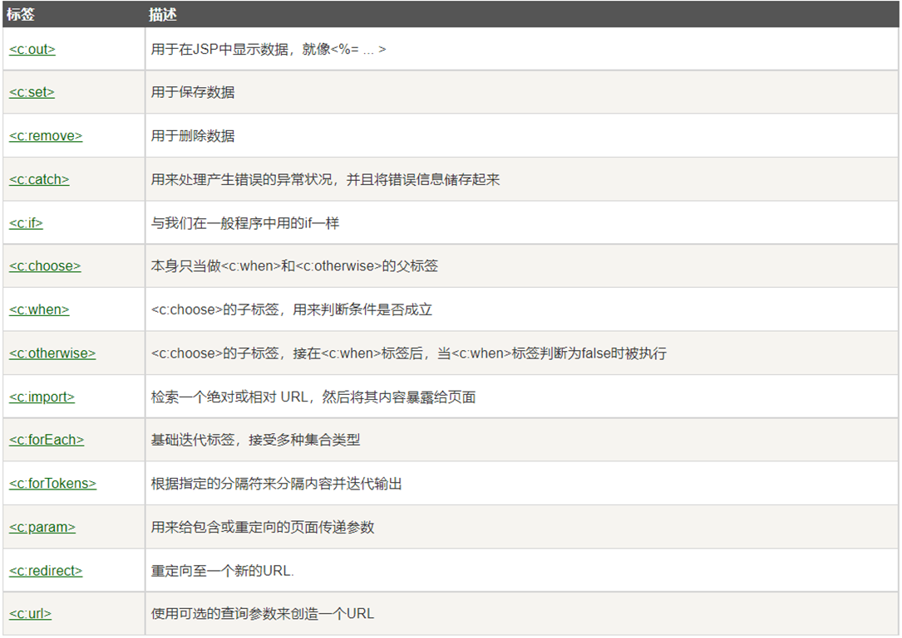
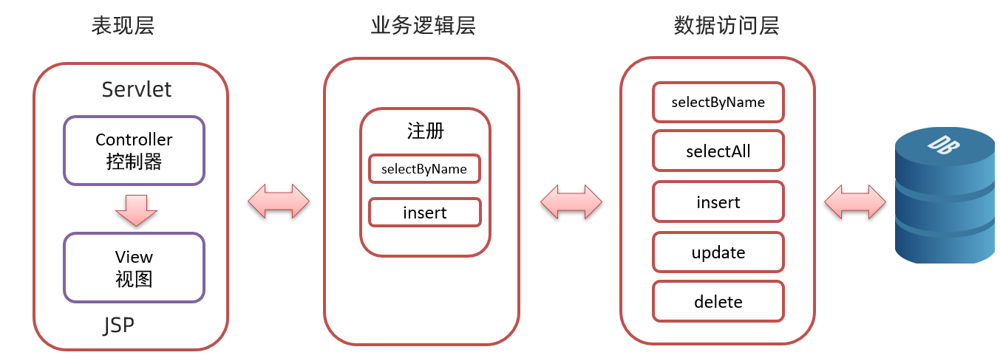
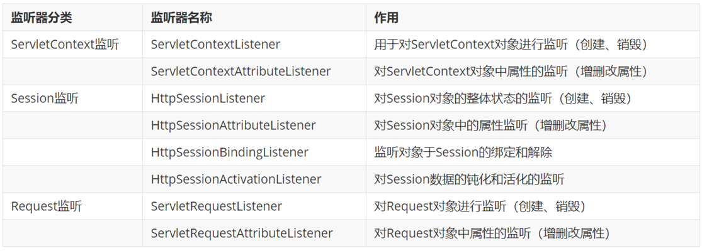

IDEA快捷键

Ctrl+F -----搜索同一词

Ctrl+R-----同词替换

Alt+鼠标左键-----选中并整列编辑

Alt + insert-----添加 getter、setter 方法

Ctrl+Alt+V-----选择并确认返回值变量名

Ctrl+Alt+t-----快速选择环绕方式

Alt+Enter-----语言注入设置

# SQL基础语法

## 注释

- 单行注释：-- 注释内容，要空格 或 #注释内容 ，不用空格(MySQL特有)
- 多行注释：/* 注释 */

## DDL -- 操作数据库

### 1.查询

```mysql
SHOW DATABASES;
```

### 2.创建

#### 创建数据库

```mysql
CREATE DATABASE 数据库名称;
```

#### 创建数据库(判断，如果不存在则创建)

```mysql
CREATE DATABASE IF NOT EXISTS 数据库名称;
```

### 3.删除

#### 删除数据库

```mysql
DROP DATABASE 数据库名称;
```

#### 删除数据库(判断，如果存在则删除)

```mysql
DROP DATABASE IF EXISTS 数据库名称;
```

### 4.使用数据库

#### 查看当前使用的数据库

```mysql
SELECT DATABASE();
```

#### 使用数据库

```mysql
USE 数据库名称;
```

## DDL -- 操作表

### 查询表

#### 1.查询当前数据库下所有表名称

```mysql
SHOW TABLES;
```

#### 2.查询表结构

```mysql
DESC 表名称;
```

### 创建表

```mysql
CREATE TABLE 表名 (
		字段名1 数据类型1,
    	字段名2 数据类型2,
    	...
		字段名n 数据类型n
);
```

### 数据类型

MySQL 支持多种类型，可以分为三类：

#### 1.数值

```mysql
tinyint : 小整数型，占一个字节
int	： 大整数类型，占四个字节
	eg ： age int
double ： 浮点类型
	使用格式： 字段名 double(总长度,小数点后保留的位数)
	eg ： score double(5,2)   
```

#### 2.日期

```mysql
date ： 日期值。只包含年月日
	eg ：birthday date ： 
datetime ： 混合日期和时间值。包含年月日时分秒
```

#### 3.字符串

```mysql
char ： 定长字符串。
	优点：存储性能高
	缺点：浪费空间
	eg ： name char(10)  如果存储的数据字符个数不足10个，也会占10个的空间
varchar ： 变长字符串。
	优点：节约空间
	缺点：存储性能底
	eg ： name varchar(10) 如果存储的数据字符个数不足10个，那就数据字符个数是几就占几个的空间
```

#### 详细分类

|      分类      |   数据类型   |         大小          |             描述              |
| :------------: | :----------: | :-------------------: | :---------------------------: |
|    数值类型    |   TINYINT    |        1 byte         |           小整数值            |
|                |   SMALLINT   |        2 bytes        |           大整数值            |
|                |  MEDIUMINT   |        3 bytes        |           大整数值            |
|                | INT或INTEGER |        4 bytes        |           大整数值            |
|                |    BIGINT    |        8 bytes        |          极大整数值           |
|                |    FLOAT     |        4 bytes        |        单精度浮点数值         |
|                |    DOUBLE    |        8 bytes        |        双精度浮点数值         |
|                |   DECIMAL    |                       |            小数值             |
| 日期和时间类型 |     DATE     |           3           |            日期值             |
|                |     TIME     |           3           |       时间值或持续时间        |
|                |     YEAR     |           1           |            年份值             |
|                |   DATETIME   |           8           |       混合日期和时间值        |
|                |  TIMESTAMP   |           4           |    混合日期和时间值,时间戳    |
|   字符串类型   |     CHAR     |      0-255 bytes      |          定长字符串           |
|                |   VARCHAR    |     0-65535 bytes     |          变长字符串           |
|                |   TINYBLOB   |      0-255 bytes      | 不超过255个字符的二进制字符串 |
|                |   TINYTEXT   |      0-255 bytes      |         短文本字符串          |
|                |     BLOB     |    0-65 535 bytes     |    二进制形式的长文本数据     |
|                |     TEXT     |    0-65 535 bytes     |          长文本数据           |
|                |  MEDIUMBLOB  |   0-16777 215 bytes   |  进制形式的中等长度文本数据   |
|                |  MEDIUMTEXT  |  0-16 777 215 bytes   |       中等长度文本数据        |
|                |   LONGBLOB   | 0-4 294 967 295 bytes |   二进制形式的极大文本数据    |
|                |   LONGTEXT   | 0-4 294 967295 bytes  |         极大文本数据          |

### 删除表

#### 1.删除表

```mysql
DROP TABLE 表名;
```

#### 2.删除表时判断表是否存在

```mysql
DROP TABLE IF EXISTS 表名;
```

### 修改表

#### 1.修改表名

```mysql
ALTER TABLE 表名 RENAME TO 新的表名;
```

#### 2.添加一列

```mysql
ALTER TABLE 表名 ADD 列名 数据类型;
```

#### 3.修改数据类型

```mysql
ALTER TABLE 表名 MODIFY 列名 新数据类型;
```

#### 4.修改列名和数据类型

```mysql
ALTER TABLE 表名 CHANGE 列名 新列名 新数据类型;
```

#### 5.删除列

```mysql
ALTER TABLE 表名 DROP 列名;
```

## DML

### 添加数据

#### 1.给指定列添加数据

```mysql
INSERT INTO 表名(列名1,列名2,..) VALUES (值1,值2,...);
```

#### 2.给全部列添加数据

```mysql
INSERT INTO 表名 VALUES (值1,值2,..);
```

#### 3.批量添加数据

```mysql
INSERT INTO 表名 (列名1,列名2,...) VALUES(值1,值2,...),(值1,值2,...),(值1,值2,...)...;
INSERT INTO 表名 VALUES (值1,值2,...),(值1,值2,...),(值1,值2,...)...;
```

### 修改数据

#### 修改表数据

```mysql
UPDATE 表名 SET 列名1 = 值1,列名2 = 值2,...[WHERE 条件];
```

### 删除数据

#### 删除表数据

```mysql
DELETE FROM 表名 [WHERE 条件] ;
```

## DQL

### 查询语法

```mysql
SELECT
	字段列表
FROM
	表名列表
WHERE
	条件列表
GROUP BY
	分组字段
HAVING
	分组后条件
ORDER BY
	排序字段
LIMIT
	分页限定
```

#### 基础查询

##### 1.查询多个字段

```mysql
SELECT 字段列表 FROM 表名;
SELECT *FROM 表名; -- 查询所有数据
```

##### 2.去除重复记录

```mysql
SELECT DISTINCT 字段列表 FROM 表名;
```

##### 3.起别名

```mysql
AS: AS 也可以省略
```

#### 条件查询

##### 1.条件查询语法

```mysql
SELECT 字段列表 FROM 表名 WHERE 条件列表;
```

##### 2.条件

| 符号                | 功能                                 |
| ------------------- | ------------------------------------ |
| >                   | 大于                                 |
| <                   | 小于                                 |
| >=                  | 大于等于                             |
| <=                  | 小于等于                             |
| =                   | 等于                                 |
| <> 或 !=            | 不等于                               |
| BETWEEN ... AND ... | 在某个范围内（都包含）               |
| IN(...)             | 多选一                               |
| LIKE 占位符         | 模糊查询 _单个任意字符 %多个任意字符 |
| IS NULL             | 是NULL                               |
| IS NOT NULL         | 不是NULL                             |
| AND 或 &&           | 并且                                 |
| OR 或\|\|           | 或者                                 |
| NOT 或 !            | 非，不是                             |

#### 排序查询

##### 排序查询语法

```mysql
SELECT 字段列表 FROM 表名 ORDER BY 排序字段名1 [排序方式1],排序字段名2 [排序方式2] …;
```

上述语句中的排序方式有两种，分别是：

* ASC ： 升序排列 **（默认值）**
* DESC ： 降序排列

#### 聚合函数

##### 1.聚合函数分类

| 函数名      | 功能                             |
| ----------- | -------------------------------- |
| count(列名) | 统计数量（一般选用不为null的列） |
| max(列名)   | 最大值                           |
| min(列名)   | 最小值                           |
| sum(列名)   | 求和                             |
| avg(列名)   | 平均值                           |

##### 2.聚合函数语法

```mysql
SELECT 聚合函数名(列名) FROM 表;
```

> 注意：null 值不参与所有聚合函数运算

#### 分组查询

##### 语法

```mysql
SELECT 字段列表 FROM 表名 [WHERE 分组前条件限定] GROUP BY 分组字段名 [HAVING 分组后条件过滤];
```

> 注意：分组之后，查询的字段为聚合函数和分组字段，查询其他字段无任何意义

##### where 和 having 区别：

* 执行时机不一样：where 是分组之前进行限定，不满足where条件，则不参与分组，而having是分组之后对结果进行过滤。

* 可判断的条件不一样：where 不能对聚合函数进行判断，having 可以。

> 执行顺序: where >聚合函数> having

#### 分页查询

##### 语法

```mysql
SELECT 字段列表 FROM 表名 LIMIT  起始索引 , 查询条目数;
```

> 注意： 上述语句中的起始索引是从0开始

##### 起始索引计算公式：

```mysql
起始索引 = (当前页码 - 1) * 每页显示的条数
```

> Tips:
>
> - 分页查询limit是MySQL数据库的方言
> - Oracle分页查询使用rownumber
> - SQL Server分页查询使用top

# 约束

## 分类

| 约束名称 | 描述                                                         | 关键字      |
| -------- | ------------------------------------------------------------ | ----------- |
| 非空约束 | 保证列中所有的数据不能有null值                               | NOT NULL    |
| 唯一约束 | 保证列中所有数据各不相同                                     | UNIQUE      |
| 主键约束 | 主键是一行数据的唯一标识，要求非空且唯一                     | PRIMARY KEY |
| 检查约束 | 保证列中的值满足某一条件                                     | CHECK       |
| 默认约束 | 保存数据时，未指定值则采用默认值                             | DEFAULT     |
| 外键约束 | 外键用来让两个表的数据之间建立链接，保证数据的一致性和完整性 | FOREIGN KEY |

> Tips: MySQL不支持检查约束

### 非空约束

* 概念

  非空约束用于保证列中所有数据不能有NULL值

* 语法

  - 添加约束

  ```sql
  -- 创建表时添加非空约束
  CREATE TABLE 表名(
     列名 数据类型 NOT NULL,
     …
  ); 
  
  ```

  ```sql
  -- 建完表后添加非空约束
  ALTER TABLE 表名 MODIFY 字段名 数据类型 NOT NULL;
  ```

  * 删除约束

    ```sql
    ALTER TABLE 表名 MODIFY 字段名 数据类型;
    ```

### 唯一约束

* 概念

  唯一约束用于保证列中所有数据各不相同

* 语法

  * 添加约束

    ```sql
    -- 创建表时添加唯一约束
    CREATE TABLE 表名(
       列名 数据类型 UNIQUE [AUTO_INCREMENT],
       -- AUTO_INCREMENT: 当不指定值时自动增长
       …
    ); 
    CREATE TABLE 表名(
       列名 数据类型,
       …
       [CONSTRAINT] [约束名称] UNIQUE(列名)
    ); 
    ```

    ```sql
    -- 建完表后添加唯一约束
    ALTER TABLE 表名 MODIFY 字段名 数据类型 UNIQUE;
    ```

  * 删除约束

    ```sql
    ALTER TABLE 表名 DROP INDEX 字段名;
    ```

### 主键约束

* 概念

  主键是一行数据的唯一标识，要求非空且唯一

  一张表只能有一个主键

* 语法

  * 添加约束

    ```sql
    -- 创建表时添加主键约束
    CREATE TABLE 表名(
       列名 数据类型 PRIMARY KEY [AUTO_INCREMENT],
       …
    ); 
    CREATE TABLE 表名(
       列名 数据类型,
       [CONSTRAINT] [约束名称] PRIMARY KEY(列名)
    ); 
    
    ```

    ```sql
    -- 建完表后添加主键约束
    ALTER TABLE 表名 ADD PRIMARY KEY(字段名);
    ```

  * 删除约束

    ```sql
    ALTER TABLE 表名 DROP PRIMARY KEY;
    ```

### 默认约束

* 概念

  保存数据时，未指定值则采用默认值

* 语法

  * 添加约束

    ```sql
    -- 创建表时添加默认约束
    CREATE TABLE 表名(
       列名 数据类型 DEFAULT 默认值,
       …
    ); 
    ```

    ```sql
    -- 建完表后添加默认约束
    ALTER TABLE 表名 ALTER 列名 SET DEFAULT 默认值;
    ```

  * 删除约束

    ```sql
    ALTER TABLE 表名 ALTER 列名 DROP DEFAULT;
    ```

### 外键约束

####  语法

* 添加外键约束

```sql
-- 创建表时添加外键约束
CREATE TABLE 表名(
   列名 数据类型,
   …
   [CONSTRAINT] [外键名称] FOREIGN KEY(外键列名) REFERENCES 主表(主表列名) 
); 
```

```sql
-- 建完表后添加外键约束
ALTER TABLE 表名 ADD CONSTRAINT 外键名称 FOREIGN KEY (外键字段名称) REFERENCES 主表名称(主表列名称);
```

* 删除外键约束

```sql
ALTER TABLE 表名 DROP FOREIGN KEY 外键名称;
```

# 数据库设计

## 表关系

- #### 一对多（多对一）

  - 实现方式：在**多**的一方建立**外键**，指向一的一方的主键

- #### 多对多

  - 实现方式：建立第三张**中间表**，中间表至少包含**两个外键**，分别**关联两方主键**

- #### 一对一:

  - 一对一关系多用于表拆分，将一个实体中经常使用的字段放一张表，不经常使用的字段放另一张表，用于提升查询性能

  - 实现方式:在任意一方加入外键，关联另一方主键，并且设置外键为**唯一(UNIQUE)**

# 多表查询

## 内连接查询

* 语法

```sql
-- 隐式内连接
SELECT 字段列表 FROM 表1,表2… WHERE 条件;

-- 显式内连接
SELECT 字段列表 FROM 表1 [INNER] JOIN 表2 ON 条件;
```

> 内连接相当于查询 A B 交集数据

## 外连接查询

* 语法

  ```sql
  -- 左外连接
  SELECT 字段列表 FROM 表1 LEFT [OUTER] JOIN 表2 ON 条件;
  
  -- 右外连接
  SELECT 字段列表 FROM 表1 RIGHT [OUTER] JOIN 表2 ON 条件;
  ```

  > 左外连接：相当于查询A表所有数据和交集部分数据
  >
  > 右外连接：相当于查询B表所有数据和交集部分数据

## 子查询

子查询根据查询结果不同，作用不同:

- 单行单列：作为条件值，使用 = != > < 等进行条件判断

```sql
SELECT 字段列表 FROM 表 WHERE 字段名 = (子查询);
```

- 多行单列：作为条件值，使用in等关键字进行条件判断

```sql
SELECT 字段列表 FROM 表 WHERE 字段名 in (子查询);
```

- 多行多列：作为虚拟表

```sql
SELECT 字段列表 FROM (子查询) WHERE 条件;
```

# 事务

##  语法

* 开启事务

  ```sql
  START TRANSACTION;
  或者  
  BEGIN;
  ```

* 提交事务

  ```sql
  commit;
  ```

* 回滚事务

  ```sql
  rollback;
  ```


- 查看/设置事务提交方式

```sql
SELECT @@autocommit;

SET @@autocommit=0;

//0为手动，1为自动
```

## 事务的四大特征

* 原子性（Atomicity）: 事务是不可分割的最小操作单位，要么同时成功，要么同时失败

* 一致性（Consistency） :事务完成时，必须使所有的数据都保持一致状态

* 隔离性（Isolation） :多个事务之间，操作的可见性

* 持久性（Durability） :事务一旦提交或回滚，它对数据库中的数据的改变就是永久的

# JDBC

* 注册驱动

  ```sql
  Class.forName("com.mysql.jdbc.Driver");
  ```

* 获取连接

  ```sql
  String url = "jdbc:mysql://ip:端口/数据库名?useSSL=false";
  String username = "用户名" ;
  String password = "密码";
  Connection conn = DriverManager.getConnection(url, username, password);
  ```

  Java代码需要发送SQL给MySQL服务端，就需要先建立连接

* 定义SQL语句

  ```sql
  String sql =  “update…” ;
  ```

* 获取执行SQL对象

  执行SQL语句需要SQL执行对象，而这个执行对象就是Statement对象

  ```sql
  Statement stmt = conn.createStatement();
  ```

* 执行SQL

  ```sql
  int count = stmt.executeUpdate(sql);//返回受影响的行数
  ```

* 处理返回结果

  ```sql
  //System.out.println(count);
  ```

* 释放资源

  ```sql
  stmt.close();
  conn.close();
  ```

## 初次测试代码

```java
package JDBC;

import java.sql.Connection;
import java.sql.DriverManager;
import java.sql.Statement;

public class JDBCDemo {
    public static void main(String[] args) throws Exception {
        //注册驱动
        Class.forName("com.mysql.jdbc.Driver");
        //获取连接
        String url = "jdbc:mysql://localhost:3306/wsleli?useSSL=false";
        String username = "root";
        String password = "zhenyouquhh213";
        Connection conn = DriverManager.getConnection(url, username, password);
        //定义sql
        String sql = "update account set money=1000 where id = 1";
        //获取sql执行对象
        Statement stmt = conn.createStatement();
        //执行sql
        int count = stmt.executeUpdate(sql);//返回受影响的行数
        //处理结果
        System.out.println(count);
        //释放资源
        stmt.close();
        conn.close();
    }
}
```

## 测试步骤

1. 创建空项目，配置项目环境，添加Java模块
2. 在项目中创建lib目录，拷贝“mysql驱动jar包”到其中
3. 将“mysql驱动jar包”添加库，级别“模块库”
4. 编写程序代码，开始测试

## JDBC API详解

### DriverManager

DriverManager（驱动管理类）作用：

- 注册驱动
- 获取数据库连接

#### 注册驱动

```java
Class.forName("com.mysql.jdbc.Driver");
```

​	查看Driver类源码

```java
static {
	try {
		DriverManager.registerDriver(new Driver());
    } catch (SQLException var1) {
		throw new RuntimeException("Can't register driver!");
	}
}
```

> 提示：
>
> - MySQL 5之后的驱动包，可以省略注册驱动的步骤
>
> - 自动加载jar包中META-INF/services/java.sql.Driver文件中的驱动类

#### 获取数据库连接

| static Connection | getConnection (String url,String user,String password) | 尝试建立与给定数据库URL的连接。 |
| ----------------- | ------------------------------------------------------ | ------------------------------- |

- 参数说明：

  * url ： 连接路径

    > 语法：jdbc:mysql://ip地址(域名):端口号/数据库名称?参数键值对1&参数键值对2…
    >
    > 示例：jdbc:mysql://127.0.0.1:3306/db1
    >
    > ==细节：==
    >
    > * 如果连接的是本机mysql服务器，并且mysql服务默认端口是3306，则url可以简写为：jdbc:mysql:///数据库名称?参数键值对
    >
    > * 配置 useSSL=false 参数，禁用安全连接方式，解决警告提示


  * user ：用户名

  * poassword ：密码

### Connection

Connection（数据库连接对象）作用：

* 获取执行 SQL 的对象
* 管理事务

#### 获取执行对象

* 普通执行SQL对象

  ```java
  Statement createStatement()
  ```

  入门案例中就是通过该方法获取的执行对象。

* 预编译SQL的执行SQL对象：防止SQL注入

  ```java
  PreparedStatement  prepareStatement(sql)
  ```

  通过这种方式获取的 `PreparedStatement` SQL语句执行对象是我们一会重点要进行讲解的，它可以防止SQL注入。

* 执行存储过程的对象

  ```java
  CallableStatement prepareCall(sql)
  ```


#### 事务管理

- MySQL事务管理

```sql
开启事务:BEGIN; / START TRANSACTION;

提交事务:COMMIT;

回滚事务:ROLLBACK;


MySQL默认自动提交事务
```

- JDBC事务管理: Connection接口中定义了3个对应的方法

```java
开启事务: setAutoCommit(boolean autoCommit): true为自动提交事务;false为手动提交事务，即为开启事务

提交事务: commit()

回滚事务: rollback()
```

​		用 try {} catch () {} 处理事务

##### 测试代码：

```java
package JDBC;

import java.sql.Connection;
import java.sql.DriverManager;
import java.sql.Statement;

public class JDBCDemo_02 {
    public static void main(String[] args) throws Exception {
        //1. 注册驱动
        //Class.forName("com.mysql.jdbc.Driver");
        //2. 获取连接：如果连接的是本机mysql并且端口是默认的 3306 可以简化书写
        String url = "jdbc:mysql:///wsleli?useSSL=false";
        String username = "root";
        String password = "zhenyouquhh213";
        Connection conn = DriverManager.getConnection(url, username, password);
        //3. 定义sql
        String sql1 = "update account set money = 3000 where id = 1";
        String sql2 = "update account set money = 3000 where id = 2";
        //4. 获取执行sql的对象 Statement
        Statement stmt = conn.createStatement();

        try {
            // ============开启事务==========
            conn.setAutoCommit(false);
            //5. 执行sql
            int count1 = stmt.executeUpdate(sql1);//受影响的行数
            //6. 处理结果
            System.out.println(count1);
            int i = 3 / 0;
            //5. 执行sql
            int count2 = stmt.executeUpdate(sql2);//受影响的行数
            //6. 处理结果
            System.out.println(count2);
            // ============提交事务==========
            //程序运行到此处，说明没有出现任何问题，则需求提交事务
            conn.commit();
        } catch (Exception e) {
            // ============回滚事务==========
            //程序在出现异常时会执行到这个地方，此时就需要回滚事务
            conn.rollback();
            e.printStackTrace();
        }
        //7. 释放资源
        stmt.close();
        conn.close();
    }
}
```

### Statement

Statement作用:

- 执行SQL语句。

#### 执行SQL语句

```java
int executeUpdate(sql):执行DML、DDL语句
	返回值:(1)DML语句影响的行数(2)DDL语句执行后，执行成功也可能返回0
ResultSet executeQuery(sql):执行DQL语句
	返回值:ResultSet结果集对象
```

### ResultSet

​		ResultSet（结果集对象）作用：

封装了SQL查询语句的结果

```java
ResultSet  executeQuery(sql)：执行DQL 语句，返回 ResultSet 对象
```

- 获取查询结果

  - ```java
    boolean  next()
    //1.将光标从当前位置向前移动一行 
    //2.判断当前行是否为有效行
    //方法返回值说明：
    //	true ：有效航，当前行有数据
    //	false ：无效行，当前行没有数据
    ```

  - ```java
    xxx  getXxx(参数)
    //获取数据
    //	xxx : 数据类型；如： int getInt(参数) ；String getString(参数)
    //参数
    //	int类型的参数：列的编号，从1开始
    //	String类型的参数：列的名称 
    ```

- 使用步骤:

  - 1.游标向下移动一行，并判断该行否有数据: next()
    2.获取数据: getXxx(参数)

  - ```java
    //循环判断游标是否是最后一行末尾
    while(rs.next()){
    	//获取数据
    	rs.getXxx(参数);
    }
    ```

#### 测试代码：

```java
package JDBC;

import java.sql.Connection;
import java.sql.DriverManager;
import java.sql.ResultSet;
import java.sql.Statement;

public class JDBCDemo_02 {
    public static void main(String[] args) throws Exception {
        String url = "jdbc:mysql:///wsleli?useSSL=false";
        String username = "root";
        String password = "zhenyouquhh213";
        Connection conn = DriverManager.getConnection(url, username, password);

        //3. 定义sql
        String sql = "select * from account";

        //4. 获取statement对象
        Statement stmt = conn.createStatement();

        //5. 执行sql
        ResultSet rs = stmt.executeQuery(sql);

        //6. 处理结果， 遍历rs中的所有数据
   /*  // 6.1 光标向下移动一行，并且判断当前行是否有数据
        while (rs.next()){
            //6.2 获取数据  getXxx()
            int id = rs.getInt(1);
            String name = rs.getString(2);
            double money = rs.getDouble(3);

            System.out.println(id);
            System.out.println(name);
            System.out.println(money);

            System.out.println("--------------");

        }*/
        // 6.1 光标向下移动一行，并且判断当前行是否有数据
        while (rs.next()) {
            //6.2 获取数据  getXxx()
            int id = rs.getInt("id");
            String name = rs.getString("name");
            double money = rs.getDouble("money");

            System.out.println(id);
            System.out.println(name);
            System.out.println(money);

            System.out.println("--------------");
        }

        //7. 释放资源
        rs.close();
        stmt.close();
        conn.close();
    }
}
```

### PreparedStatement

> PreparedStatement作用：
>
> * 预编译SQL语句并执行：预防SQL注入问题

#### SQL注入

> SQL注入是通过操作输入来修改事先定义好的SQL语句，用以达到执行代码对服务器进行攻击的方法。

##### 案例：

```java
package JDBC;

import java.sql.Connection;
import java.sql.DriverManager;
import java.sql.ResultSet;
import java.sql.Statement;

public class JDBCDemo {


    public static void main(String[] args) throws Exception {
        //注册驱动
        Class.forName("com.mysql.jdbc.Driver");
        //获取连接
        String url = "jdbc:mysql://localhost:3306/wsleli?useSSL=false";
        String username = "root";
        String password = "zhenyouquhh213";
        Connection conn = DriverManager.getConnection(url, username, password);

        // 接收用户输入 用户名和密码
        String name = "zhayft";
        String pwd = "'or'1'='1";
        String sql = "select * from tb_user where username = '" + name + "' and password = '" + pwd + "'";
        // 获取stmt对象
        Statement stmt = conn.createStatement();
        // 执行sql
        ResultSet rs = stmt.executeQuery(sql);
        // 判断登录是否成功
        if (rs.next()) {
            System.out.println("登录成功~");
        } else {
            System.out.println("登录失败~");
        }

        //释放资源
        rs.close();
        stmt.close();
        conn.close();
    }
}
```

#### 概述

* 获取 PreparedStatement 对象

  ```java
  // SQL语句中的参数值，使用？占位符替代
  String sql = "select * from user where username = ? and password = ?";
  // 通过Connection对象获取，并传入对应的sql语句
  PreparedStatement pstmt = conn.prepareStatement(sql);
  ```

* 设置参数值

  上面的sql语句中参数使用 ? 进行占位，在之前之前肯定要设置这些 ?  的值。

  > PreparedStatement对象：setXxx(参数1，参数2)：给 ? 赋值
  >
  > * Xxx：数据类型 ； 如 setInt (参数1，参数2)
  >
  > * 参数：
  >
  >   * 参数1： ？的位置编号，从1 开始
  >
  >   * 参数2： ？的值

* 执行SQL语句

  > executeUpdate();  执行DDL语句和DML语句
  >
  > executeQuery();  执行DQL语句
  >
  > ==注意：==
  >
  > * 调用这两个方法时不需要传递SQL语句，因为获取SQL语句执行对象时已经对SQL语句进行预编译了。

##### 案例：

```java
package JDBC;

import java.sql.*;

public class JDBCDemo {


    public static void main(String[] args) throws Exception {
        //注册驱动
        Class.forName("com.mysql.jdbc.Driver");
        //获取连接
        String url = "jdbc:mysql://localhost:3306/wsleli?useSSL=false";
        String username = "root";
        String password = "zhenyouquhh213";
        Connection conn = DriverManager.getConnection(url, username, password);

        // 接收用户输入 用户名和密码
        String name = "zhangsan";
        String pwd = "123";
        // 定义sql
        String sql = "select * from tb_user where username = ? and password = ?";
        // 获取pstmt对象
        PreparedStatement pstmt = conn.prepareStatement(sql);
        // 设置？的值
        pstmt.setString(1,name);
        pstmt.setString(2,pwd);
        // 执行sql
        ResultSet rs = pstmt.executeQuery();
        // 判断登录是否成功
        if (rs.next()) {
            System.out.println("登录成功~");
        } else {
            System.out.println("登录失败~");
        }

        //释放资源
        rs.close();
        pstmt.close();
        conn.close();
    }
}
```

#### 开启预编译功能

在代码中编写url时需要加上以下参数。而我们之前根本就没有开启预编译功能，只是解决了SQL注入漏洞。

```java
"useServerPrepStmts=true"
```

# 数据库连接池

## 数据库连接池简介

* 数据库连接池是个容器，负责分配、管理数据库连接(Connection)

* 它允许应用程序重复使用一个现有的数据库连接，而不是再重新建立一个；

* 释放空闲时间超过最大空闲时间的数据库连接来避免因为没有释放数据库连接而引起的数据库连接遗漏
* 好处
  * 资源重用
  * 提升系统响应速度
  * 避免数据库连接遗漏

## 数据库连接池实现

* 标准接口：DataSource

  官方(SUN) 提供的数据库连接池标准接口，由第三方组织实现此接口。该接口提供了获取连接的功能：

  ```java
  Connection getConnection()
  ```

  > 那么以后就不需要通过 `DriverManager` 对象获取 `Connection` 对象，而是通过连接池（DataSource）获取 `Connection` 对象。

* 常见的数据库连接池

  * DBCP
  * C3P0
  * Druid

  我们现在使用更多的是Druid，它的性能比其他两个会好一些。

* Druid（德鲁伊）

  * Druid连接池是阿里巴巴开源的数据库连接池项目 

  * 功能强大，性能优秀，是Java语言最好的数据库连接池之一

## Driud使用

* 导入jar包 druid-1.1.12.jar

* 定义配置文件

  写到src里，后缀properties，编写配置文件如下：

  ```properties
  driverClassName=com.mysql.jdbc.Driver
  url=jdbc:mysql:///wsleli?useSSL=false&useServerPrepStmts=true
  username=root
  password=zhenyouquhh213
  # 初始化连接数量
  initialSize=5
  # 最大连接数
  maxActive=10
  # 最大等待时间
  maxWait=3000
  ```

* 加载配置文件

* 获取数据库连接池对象

* 获取连接

### 测试步骤

1. 创建空项目，配置项目环境，添加Java模块
2. 在项目中创建lib目录，拷贝“druid数据库连接池jar包”到其中
3. 将“druid数据库连接池jar包”添加库，级别“模块库”
4. 编写配置文件
5. 编写程序代码，开始测试

#### 测试代码：

```java
package druid;

import com.alibaba.druid.pool.DruidDataSourceFactory;

import javax.sql.DataSource;
import java.io.FileInputStream;
import java.sql.Connection;
import java.util.Properties;

public class DruidDemo {
    public static void main(String[] args) throws Exception {
        //1.导入jar包
        //2.定义配置文件
        //3. 加载配置文件
        Properties prop = new Properties();
        prop.load(new FileInputStream("JDBC_demo/src/druid.properties"));
        //4. 获取连接池对象
        DataSource dataSource = DruidDataSourceFactory.createDataSource(prop);

        //5. 获取数据库连接 Connection
        Connection connection = dataSource.getConnection();
        System.out.println(connection); //获取到了连接后就可以继续做其他操作了

        //System.out.println(System.getProperty("user.dir"));//获取路径
    }
}
```

# JDBC测试

## 需要考虑的问题

1. SQL语句
2. 参数：是否需要
3. 结果：List集合封装

> 在实体类中,基本数据类型建议使用其对应的包装类型

# Maven

## Maven 常用命令

* compile ：编译
* clean：清理
* test：测试
* package：打包
* install：安装

> **同一生命周期内，执行后边的命令，前边的所有命令会自动执行**


### 常用命令


## IDEA使用Maven

### IDEA配置Maven环境

> 在IDEA设置中找到Maven，设置Maven主路经为本地Maven安装根目录，用户设置文件为本地Maven根目录中的conf/settings.xml，本地仓库会自动同步


### Maven 坐标详解

**Maven 坐标主要组成**

* groupId：定义当前Maven项目隶属组织名称（通常是域名反写，例如：com.itheima）
* artifactId：定义当前Maven项目名称（通常是模块名称，例如 order-service、goods-service）
* version：定义当前项目版本号

例：

```properties
<groupId>com.itheima</groupId>
<artifactId>maven-demo</artifactId>
<version>1.0-SNAPSHOT</version>
```

### IDEA 创建 Maven项目

1. 直接从空项目创建
2. 从配置文件选择Maven创建

> 重点：
>
> ​	组织名称、版本号的选择

### IDEA 导入 Maven项目


### 依赖管理

#### 使用坐标引入jar包

> 驱动包的版本都有快捷键，无需手动

```xml
<dependencies><!--表示多个依赖-->
    <!--导入mysql驱动jar包-->
    <dependency><!--表示单个个依赖-->
        <groupId>mysql</groupId>
        <artifactId>mysql-connector-java</artifactId>
        <version>8.0.32</version>
    </dependency>

    <dependency>
        <groupId>com.alibaba</groupId>
        <artifactId>druid</artifactId>
        <version>1.2.16</version>
    </dependency>
</dependencies>
```

#### 依赖范围

> 通过设置坐标的依赖范围(scope)，可以设置 对应jar包的作用范围：编译环境、测试环境、运行环境。

```xml
<dependency>
    <groupId>junit</groupId>
    <artifactId>junit</artifactId>
    <version>4.13.2</version>
    <scope>test</scope>
</dependency>
```

**scope取值**

| **依赖范围** | 编译classpath | 测试classpath | 运行classpath | 例子              |
| ------------ | ------------- | ------------- | ------------- | ----------------- |
| **compile**  | Y             | Y             | Y             | logback           |
| **test**     | -             | Y             | -             | Junit             |
| **provided** | Y             | Y             | -             | servlet-api       |
| **runtime**  | -             | Y             | Y             | jdbc驱动          |
| **system**   | Y             | Y             | -             | 存储在本地的jar包 |

* compile ：作用于编译环境、测试环境、运行环境。
* test ： 作用于测试环境。典型的就是Junit坐标，以后使用Junit时，都会将scope指定为该值
* provided ：作用于编译环境、测试环境。我们后面会学习 `servlet-api` ，在使用它时，必须将 `scope` 设置为该值，不然运行时就会报错
* runtime  ： 作用于测试环境、运行环境。jdbc驱动一般将 `scope` 设置为该值，当然不设置也没有任何问题 

> 注意：
>
> * 如果引入坐标不指定 `scope` 标签时，默认就是 compile  值。以后大部分jar包都是使用默认值。

# Mybatis（配置文件开发）

## Mybatis项目文件目录


## 基础具体操作

1. 创建user表,添加数据

2. 创建模块，导入依赖坐标（pom.xml）

   ```xml
   <dependencies>
       <!--mybatis依赖-->
       <dependency>
           <groupId>org.mybatis</groupId>
           <artifactId>mybatis</artifactId>
           <version>3.5.5</version>
       </dependency>
   
       <!--mysql驱动-->
       <dependency>
           <groupId>mysql</groupId>
           <artifactId>mysql-connector-java</artifactId>
           <version>8.0.32</version>
       </dependency>
   
       <!--junit单元测试-->
       <dependency>
           <groupId>junit</groupId>
           <artifactId>junit</artifactId>
           <version>4.13.2</version>
           <scope>test</scope>
       </dependency>
   
       <!-- 添加slf4j日志api -->
       <dependency>
           <groupId>org.slf4j</groupId>
           <artifactId>slf4j-api</artifactId>
           <version>1.7.20</version>
       </dependency>
   
       <!-- 添加logback-classic依赖 -->
       <dependency>
           <groupId>ch.qos.logback</groupId>
           <artifactId>logback-classic</artifactId>
           <version>1.2.3</version>
       </dependency>
   
       <!-- 添加logback-core依赖 -->
       <dependency>
           <groupId>ch.qos.logback</groupId>
           <artifactId>logback-core</artifactId>
           <version>1.2.3</version>
       </dependency>
   
   </dependencies>
   ```

3. 编写 MyBatis核心配置文件-->替换连接信息解决硬编码问题（mybatis-config.xml）

   ```xml
   <?xml version="1.0" encoding="UTF-8" ?>
   <!DOCTYPE configuration
           PUBLIC "-//mybatis.org//DTD Config 3.0//EN"
           "https://mybatis.org/dtd/mybatis-3-config.dtd">
   <configuration>
   
       <typeAliases>
           <!--扫描包路径-->
           <package name="com.school.pojo"/>
       </typeAliases>
   
       <!--
           environments:配置数据库连按环境信息。可以配置多个environment，通过default属性切换不同的environment
       -->
       <environments default="development">
           <environment id="development">
               <transactionManager type="JDBC"/>
               <dataSource type="POOLED">
                   <!--数据库 连接信息-->
                   <property name="driver" value="com.mysql.jdbc.Driver"/>
                   <property name="url" value="jdbc:mysql:///wsleli?useSSL=false"/>
                   <property name="username" value="root"/>
                   <property name="password" value="zhenyouquhh213"/>
               </dataSource>
           </environment>
       </environments>
       <mappers>
           <!--加载sql映射文件-->
           <!-- <mapper resource="com/itheima/mapper/UserMapper.xml"/>-->
           <!--Mapper代理方式-->
           <package name="com.school.mapper"/>
       </mappers>
   </configuration>
   ```

4. 编写SQL映射文件-->统一管理sql语句,解决硬编码问题（___Mapper.xml）

   ```xml
   <?xml version="1.0" encoding="UTF-8" ?>
   <!DOCTYPE mapper
           PUBLIC "-//mybatis.org//DTD Mapper 3.0//EN"
           "https://mybatis.org/dtd/mybatis-3-mapper.dtd">
   
   <!--
       namespace:名称空间
   -->
   <mapper namespace="com.school.mapper.BrandMapper">
   
       <!--**********************************************************************
           数据库表的字段名称 和 实体类的属性名称 不一样，则不能自动封装数据
               *起别名：对不一样的列名起别名，让别名和实体类的属性名一样
                   *缺点：每次查询都要定义一次别名
                       *解决方式：定义sql片段
                           *缺点：不灵活
               *resultMap（完成不一致的java属性名和sql列名的映射）：
                   1.定义<resultMap>标签
                   2.在<select>标签中使用 resultMap 属性替换 resultType 属性
       -->
   
       <!--**********************************************************************
           resultMap：
               *对应参数：
                   *id：唯一标识，名字
                   *type：映射的类型
               *里面写对应的标签
                   *id：主键对应的映射
                       *column：对应数据库里的列名
                       *property：对应实体类的属性名
                   *result：一般字段的映射
                       *column：对应数据库里的列名
                       *property：对应实体类的属性名
       -->
       <resultMap id="brandResultMap" type="brand">
           <result column="brand_name" property="brandName"/>
           <result column="company_name" property="companyName"/>
       </resultMap>
       <select id="selectAll" resultMap="brandResultMap">
           select *
           from tb_brand;
       </select>
   
       <!--**********************************************************************
           *封装成sql片段
       -->
       <!--<sql id="brand_column">
           id, brand_name as brandName, company_name as companyName, ordered, description, status
       </sql>
       <select id="selectAll" resultType="brand">
           select
           <include refid="brand_column"/>
           from tb_brand;
       </select>-->
   
       <!--**********************************************************************
           *起别名
       -->
       <!--<select id="selectAll" resultType="brand">
           select id, brand_name as brandName, company_name as companyName, ordered, description, status
           from tb_brand;
       </select>-->
   
       <!--**********************************************************************
           *常规查询
       -->
       <!--<select id="selectAll" resultType="brand">
           select *
           from tb_brand;
       </select>-->
   
       <!--**********************************************************************
           *参数占位符：（没用@Param时，占位符映射的是实体类的名字）
               1.#{}：会将其替换为？（里面的名字随便写）
               2.${}：拼sql，会存在sql注入问题
               3.使用时机：
                   *参数传递的时候：#{}
                   *表名或者列名不固定的情况下:${}（对表名、列名进行动态设置，只能使用${}进行sql拼接，会存在sql注入问题；用@Param注解传参数值来实现）
   
            *参数类型: parameterType：设置参数类型，可以省略（默认传什么类型用什么类型）
            *sql特殊字符的处理：
               1.转义字符：（字符少的时候用）
                   <用：
                       &lt;
               2.CDATA区：（字符多的时候用，输入CD会有提示）
                   <用：
                       <![CDATA[
                           <
                       ]]> #{id};
        -->
       <select id="selectById" parameterType="int" resultMap="brandResultMap">
           select *
           from tb_brand
           where id = #{id};
       </select>
   
   </mapper>
   ```

5. 编码
   1. 定义POJO类（简单Java对象类，实体类）
   
      ```java
      package com.school.pojo;
      
      import org.apache.ibatis.type.Alias;
      
      @Alias("别名")//映射___Mapper.xml中的别名
      public class User {
          private Integer id;
          private String username;
          private String password;
          private String gender;
          private String addr;
          
      	//省略了 setter 和 getter
      }
      
      ```
   
   2. 加载核心配置文件，获取SqlSessionFactory对象（测试类）
   
   3. 获取 SqISession对象。执行SQL语句
   
   4. 释放资源
   
      ```java
      package com.school.test;
      
      import com.school.mapper.BrandMapper;
      import com.school.pojo.Brand;
      import org.apache.ibatis.io.Resources;
      import org.apache.ibatis.session.SqlSession;
      import org.apache.ibatis.session.SqlSessionFactory;
      import org.apache.ibatis.session.SqlSessionFactoryBuilder;
      import org.junit.Test;
      
      import java.io.IOException;
      import java.io.InputStream;
      import java.util.List;
      
      public class MybatisTest {
          @Test//告诉junit此为测试类
          public void testSelectAll() throws IOException {
              //有参数需要定义参数
              //当参数为字符串时，需要模糊查询，此时要做参数处理
              String 变量名 = "***";
              String 变量名 = "%" + 变量名 + "%";
              
              //1.加载mybatis的核心配置文件，获取 SqlSessionFactory
              String resource = "mybatis-config.xml";
              InputStream inputStream = Resources.getResourceAsStream(resource);
              SqlSessionFactory sqlSessionFactory = new SqlSessionFactoryBuilder().build(inputStream);
      
              //2.获取SqlSession对象，用它来执行sql
              SqlSession sqlSession = sqlSessionFactory.openSession();
      
              //3.获取Mapper接口的代理对象
              BrandMapper brandMapper = sqlSession.getMapper(BrandMapper.class);
      
              //4.执行方法
              List<Brand> brands = brandMapper.selectAll();
              System.out.println(brands);
      
              //5.释放资源
              sqlSession.close();
          }
      }
      ```

## Mapper代理开发

1. 定义与SQL映射文件同名的Mapper接口，并且将Mapper接口和SQL映射文件放置在同一目录下（/作为分隔符）

   

2. 设置SQL映射文件的namespace属性为Mapper接口全限定名

   

3. 在Mapper接口中定义方法，方法名就是SQL映射文件中sql语句的id，并保持参数类型和返回值类型一致

   

4. 编码
   1. 通过SqlSession的getMapper方法获取Mapper接口的代理对象
   2. 调用对应方法完成sql的执行

> 如果Mapper接口名称和SQL映射文件名称相同，并在同一目录下，则可以使用包扫描的方式简化SQL映射文件的加载。也就是将核心配置文件的加载映射配置文件的配置修改为

```xml
<mappers>
    <!--加载sql映射文件-->
    <!-- <mapper resource="com/itheima/mapper/UserMapper.xml"/>-->
    <!--Mapper代理方式-->
    <package name="com.school.mapper"/>
</mappers>
```

## 核心配置文件

### 配置约束


### 多环境配置

> 在核心配置文件的 `environments` 标签中其实是可以配置多个 `environment` ，使用 `id` 给每段环境起名，在 `environments` 中使用 `default='环境id'` 来指定使用哪儿段配置。我们一般就配置一个 `environment` 即可。

### 类型别名

​		别名不区分大小写

**逐个指定别名**

```xml
<typeAliases>
  <typeAlias alias="别名" type="路径指定的类"/>
</typeAliases>
```

**扫描包，定义类别名**

- mybatis-config.xml配置文件

```xml
<typeAliases>
    <!--name属性的值是实体类所在包-->
    <package name="包路径"/> 
</typeAliases>
```

- ___Mapper.xml文件配置

```xml
<mapper namespace="com.school.mapper.UserMapper">
    <select id="selectAll" resultType="别名">
        select * from tb_user;
    </select>
</mapper>
```

- 在指定类上加@Alias("别名")

**注意：**

​		配置各个标签时，需要遵守前后顺序

## @Param应用

### 查询

> 只用传一个参数时，可以直接用一个参数调用，大于一个参数时就要用注解

___Mapper.java

```java
List<数据类型> 方法名(@Param("SQL参数占位符名称1") 形参类型 形参名1, @Param("SQL参数占位符名称2") 形参类型 形参名2);
```

> 方法名用于测试文件的调用，SQL参数占位符名称对应___Mapper.xml中的占位符

## 增删改查

### 条件查询

#### 参数接收

1. 散装参数：如果方法中有多个参数，需要使用@Param( "SQL参数占位符名称")

2. 对象参数：对象的属性名称要和参数占位符名称一致

   **用法：**

   ```java
   类型 对象 = new 类型();//new一个新对象
   对象.set参数名1(参数1);
   对象.set参数名2(参数2);
   
   //调用的时候直接传对象就好了
   ```

3. map集合参数：只需要保证SQL中的参数名和map集合的键的名称对应上，即可设置成功

   **用法：**

   ```java
   Map map对象 = new HashMap();
   map对象.put("键名1", 值1);
   map对象.put("键名1", 值1);
   
   //调用的时候直接传Map对象就好了
   ```

> 记得在___Mapper.java把方法中的形参改成对应的形式

#### 动态条件查询

##### 动态多条件查询

- if：条件判断，将sql的条件语句用if标签包裹，判断其作用是否生效

  - test属性：写逻辑表达式

  - 用法：

    - ```xml
      <mapper namespace="com.school.mapper.BrandMapper">
      <select id="selectByCondition" resultMap="brandResultMap">
              select *
              from 表名
              where
              <if test="status!=null">
                  status = #{status}
              </if>
          
              <if test="companyName!=null and companyName!=''">
                  and company_name like #{companyName}
              </if>
          
          </select>
      </mapper>
      ```

  - > 假如第一个条件不生效，会出现首条件多一个and的问题

- 问题解决方式：

  - 恒等式：在所有条件前加一个and，并在首条件处加一个恒等式

    - ```xml
      <mapper namespace="com.school.mapper.BrandMapper">
          <!--
              完成不一致的java属性名和sql列名的映射
          -->
          <resultMap id="brandResultMap" type="brand">
              <result column="brand_name" property="brandName"/>
              <result column="company_name" property="companyName"/>
          </resultMap>
          
      <select id="selectByCondition" resultMap="brandResultMap">
              select *
              from 表名
              where 1 = 1
              <if test="status!=null">
                  and status = #{status}
              </if>
          
              <if test="companyName!=null and companyName!=''">
                  and company_name like #{companyName}
              </if>
          
          </select>
      </mapper>
      ```

  - <where>替换where关键字：用where标签替换掉where关键字，其可以自动处理and（只能判断不加，不能自动加上，所以要写上，让其自动去除）

    - ```xml
      <mapper namespace="com.school.mapper.BrandMapper">
          <!--
              完成不一致的java属性名和sql列名的映射
          -->
          <resultMap id="brandResultMap" type="brand">
              <result column="brand_name" property="brandName"/>
              <result column="company_name" property="companyName"/>
          </resultMap>
          
      <select id="selectByCondition" resultMap="brandResultMap">
              select *
              from 表名
              <where>
                  <if test="status!=null">
                      status = #{status}
                  </if>
      
                  <if test="companyName!=null and companyName!=''">
                      and company_name like #{companyName}
                  </if>
                  
          	</where>
          </select>
      </mapper>
      ```

##### 动态单条件查询

> 选择一个种类的条件进行查询

```xml
<mapper namespace="com.school.mapper.BrandMapper">
    <!--
        完成不一致的java属性名和sql列名的映射
    -->
    <resultMap id="brandResultMap" type="brand">
        <result column="brand_name" property="brandName"/>
        <result column="company_name" property="companyName"/>
    </resultMap>

    <!--
        sql语句
    -->
    <select id="selectByConditionSingle" resultMap="brandResultMap">
        select *
        from tb_brand
        where<!--将where改成where标签可以不写otherwise-->
        <choose><!--相当于Java中的switch-->
            <when test="status!=null"><!--相当于Java中的case-->
                status = #{status}
            </when>
            <when test="companyName!=null and companyName!=''"><!--相当于Java中的case-->
                company_name like #{companyName}
            </when>
            <when test="brandName!=null and brandName!=''"><!--相当于Java中的case-->
                brand_name like #{brandName}
            </when>
            <otherwise><!--相当于Java中的default-->
                1=1
            </otherwise>
        </choose>
    </select>

</mapper>
```

### 添加

> 写sql时，注意占位符映射的是实体类的参数名，而不是传入变量的名字；
>
> 不能写result___，插入的sql语句完成了一一对应的功能
>
> 属性id映射的是方法名

```xml
<insert id="add">
    insert into tb_brand (brand_name, company_name, ordered, description, status)
    values (#{brandName}, #{companyName}, #{ordered}, #{description}, #{status});
</insert>
```

> 写test类时，注意执行程序的时候，开始了事务，切事物的提交设置成了手动（即：关闭了事务的自动提交）
>
> 需要加上提交事务的Java语句

```java
//提交事务
sqlSession.commit();

//也可以在获取SqlSession对象时，把参数设置为true，即为事务自动提交
SqlSession sqlSession = sqlSessionFactory.openSession(true);
```

> openSession()：默认开启事务，进行增删改操作后需要使用sqlSession.commit();手动提交事务
>
> openSession(true)：可以设置为自动提交事务（关闭事务)

#### 返回添加数据的主键

> 其中的id映射的是实体类的属性名
>
> 属性useGeneratedKeys默认为false，要设置为true
>
> 设置好后就可以返回主键了，否则为null
>
> keyProperty属性对应实体类的值，与之相同

```xml
<insert id="add" useGeneratedKeys="true" keyProperty="id">
    insert into tb_brand (brand_name, company_name, ordered, description, status)
    values (#{brandName}, #{companyName}, #{ordered}, #{description}, #{status});
</insert>
```

### 修改

> 修改全部数据同添加数据无二异

#### 修改动态字段

> 用if标签判断是否要修改属性参数
>
> 用set标签代替set，可以自动修改逗号

### 删除

> 删除一个，按id删除常规操作

#### 批量删除

##### foreach标签属性

-  mybatis会将数组参数，封装为一个Map集合（对foreach标签的**collection属性**默认值为数组，必须为array）
  - 默认：键是array ，值是数组
  - 使用@Param注解改变map集合的默认key的名称（collection属性可以写成指定的值，占位符与之同名）

- **separator属性**是设置分隔符的

- **open**和**close属性**是设置foreach开头结尾的符号的

- **item属性**用于接收本次迭代获取到的元素，即，与占位符相同

```xml
<delete id="delById">
    delete
    from tb_brand
    where id in
    <foreach collection="array" item="id" separator="," open="(" close=")">
        #{id}
    </foreach>
    ;
</delete>
```

##  Mybatis参数传递

* 多个参数
* 单个参数：单个参数又可以是如下类型
  * POJO 类型
  * Map 集合类型
  * Collection 集合类型
  * List 集合类型
  * Array 类型
  * 其他类型

### 多个参数

- 参数传递
- 封装成对象传递
- Map集合传递（键名映射占位符名）

​		Mybatis 会将这些参数封装成 Map 集合对象，值就是参数值，而键在没有使用 @Param注解时有以下命名规则：

> sql中的占位符名称可以用以下方法获取，但可读性差
>
> 使用@Param注解时，替换的是Map集合中默认的arg键名，故param键名仍可用

* 以 arg 开头  ：第一个参数就叫 arg0，第二个参数就叫 arg1，以此类推。如：

  > map.put("arg0"，参数值1);
  >
  > map.put("arg1"，参数值2);

* 以 param 开头 ： 第一个参数就叫 param1，第二个参数就叫 param2，依次类推。如：

  > map.put("param1"，参数值1);
  >
  > map.put("param2"，参数值2);

### 单个参数

* POJO 类型

  直接使用。要求 `属性名` 和 `参数占位符名称` 一致

* Map 集合类型

  直接使用。要求 `map集合的键名` 和 `参数占位符名称` 一致

* Collection 集合类型

  Mybatis 会将集合封装到 map 集合中，如下：

  > map.put("arg0"，collection集合);
  >
  > map.put("collection"，collection集合;

  > 可以使用 `@Param` 注解替换map集合中默认的 arg 键名。

* List 集合类型

  Mybatis 会将集合封装到 map 集合中，如下：

  > map.put("arg0"，list集合);
  >
  > map.put("collection"，list集合);
  >
  > map.put("list"，list集合);

  > 可以使用 `@Param` 注解替换map集合中默认的 arg 键名。

* Array 类型

  Mybatis 会将集合封装到 map 集合中，如下：

  > map.put("arg0"，数组);
  >
  > map.put("array"，数组);

  > 可以使用 `@Param` 注解替换map集合中默认的 arg 键名。

* 其他类型

  比如int类型，`参数占位符名称` 叫什么都可以。尽量做到见名知意

# Mybatis（注解开发）

* 查询 ：@Select
* 添加 ：@Insert
* 修改 ：@Update
* 删除 ：@Delete

> 注解是用来替换映射配置文件方式配置的，所以使用了注解，就不需要再映射配置文件中书写对应的 statement

> 注解完成简单功能
>
> 配置文件完成复杂功能

## 实现案例：

> 写在___Mapper.java文件里

```java
@Select(value = "select * from tb_user where id = #{id}")
//@ResultMap("brandResultMap")使用注解开发时的字段名和实体类对象的属性名的映射
public User select(int id);
```

# W3C标准

网页主要由三部分组成

- 结构:HTML
- 表现: CSS
- 行为:JavaScript

# HTML

​		HTML 英文全称是 Hyper Text Markup Language，中文译为“超文本标记语言”，专门用来设计和编辑网页。

> 不区分大小写
>
> HTML文件以.htm或.html为扩展名（一般用.html，可读性更高）
>
> 标签属性值单、双引皆可
>
> 语法松散（最好写全）

## 基本结构：

```html
<!--html5标识-->
<!DOCTYPE html>

<!--定义HTML文档-->
<html lang="en">
    
<!--定义关于文档的信息-->
<head>
    
    <!--页面的字符集-->
    <meta charset="UTF-8">
    
    <!--定义文档的标题-->
    <title>全民制作人</title>
    
</head>
    
<!--定义文档的主体-->
<body>
<font color="red">小黑子</font>
</body>
</html>
```

## 基础标签

| 标签          | 描述                               |
| ------------- | ---------------------------------- |
| \<h1> ~ \<h6> | 定义标题，h1最大，h6最小           |
| \<font>       | 定义文本的字体、字体尺寸、字体颜色 |
| \<b>          | 定义粗体文本                       |
| \<i>          | 定义斜体文本                       |
| \<u>          | 定义文本下划线                     |
| \<center>     | 定义文本居中                       |
| \<p>          | 定义段落                           |
| \<br>         | 定义折行                           |
| \<hr>         | 定义水平线                         |

### 字体标签

font：字体标签

* face 属性：用来设置字体。如 "楷体"、"宋体"等

* color 属性：设置文字颜色。颜色有三种表示方式

  * **英文单词**：red,pink,blue...

    这种方式表示的颜色特别有限，所以一般不用。

  * **rgb(值1,值2,值3)**：值的取值范围：0~255  

    此种方式也就是三原色（红绿蓝）设置方式。 例如： rgb(255,0,0)。

    这种书写起来比较麻烦，一般不用。

  * **#值1值2值3**：值的范围：00~FF

    这种方式是rgb方式的简化写法，以后基本都用此方式。

    值1表示红色的范围，值2表示绿色的范围，值3表示蓝色范围。例如： #ff0000

* size 属性：设置文字大小

代码演示：

```html
<font face="楷体" size="5" color="#ff0000">传智教育</font>
```

## 特殊字符

| HTML原代码 | 显示结果 | 描述                   |
| ---------- | -------- | ---------------------- |
| \&lt;      | <        | 小于号或显示标记       |
| \&gt;      | >        | 大于号或显示标记       |
| \&amp;     | &        | 可用于显示其它特殊字符 |
| \&quot;    | "        | 引号                   |
| \&reg;     | ®        | 已注册                 |
| \&copy;    | ©        | 版权                   |
| \&trade;   | ™        | 商标                   |
| \&nbsp;    |          | 不断行的空白           |

##  图片、音频、视频标签

| 标签     | 描述     |
| -------- | -------- |
| \   | 定义图片 |
| \<audio> | 定义音频 |
| \<video> | 定义视频 |

* img：定义图片

  * src：规定显示图像的 URL（统一资源定位符）

  * height：定义图像的高度

  * width：定义图像的宽度

* audio：定义音频。支持的音频格式：MP3、WAV、OGG 

  * src：规定音频的 URL

  * controls：显示播放控件（播放按钮）

* video：定义视频。支持的音频格式：MP4, WebM、OGG
  * src：规定视频的 URL
  * controls：显示播放控件（播放按钮）

**尺寸单位：**

height属性和width属性有两种设置方式：

* 像素：单位是px
* 百分比。占父标签的百分比。例如宽度设置为 50%，意思就是占它的父标签宽度的一般（50%）

**资源路径：**

- 绝对路径：完整路径

- 相对路径：相对位置关系

  找页面和其他资源的相对路径。

  > ./    表示当前路径
  >
  > ../   表示上一级路径
  >
  > ../../   表示上两级路径

代码演示：

```html

<audio src="路径" controls></audio>
<video src="路径" controls width="宽" height="高"></video>
```

## 超链接标签

| 标签 | 描述                             |
| ---- | -------------------------------- |
| \<a> | 定义超链接，用于链接到另一个资源 |

`a` 标签属性：

* href：指定访问资源的URL 

* target：指定打开资源的方式，有两个属性
  * _self：默认值，在当前页面打开
  * _blank：在空白页面打开

代码演示：

```html
<a href="https://www.itcast.cn" target="_self">点我有惊喜</a>
<a href="https://www.itcast.cn" target="_blank">点我有惊喜</a>
```

## 列表标签

- 有序列表(order list)
- 无序列表(unorder list)

| 标签  | 描述         |
| ----- | ------------ |
| \<ol> | 定义有序列表 |
| \<ul> | 定义无序列表 |
| \<li> | 定义列表项   |

代码演示：

```html
<ol type="A">
    <li>咖啡</li>
    <li>茶</li>
    <li>牛奶</li>
</ol>

<ul type="circle">
    <li>咖啡</li>
    <li>茶</li>
    <li>牛奶</li>
</ul>
```

### 有序列表属性值

有序列表中的 `type` 属性用来指定标记的标号的类型（数字、字母、罗马数字等）

| 值   | 描述                                           |
| :--- | :--------------------------------------------- |
| 1    | 默认值。数字有序列表。（1、2、3、4）           |
| a    | 按字母顺序排列的有序列表，小写。（a、b、c、d） |
| A    | 按字母顺序排列的有序列表，大写。（A、B、C、D） |
| i    | 罗马字母，小写。（i, ii, iii, iv）             |
| I    | 罗马字母，大写。（I, II, III, IV）             |

### 无序列表属性值

无序列表中的 `type` 属性用来指定标记的形状

| 值     | 描述             |
| :----- | :--------------- |
| disc   | 默认值。实心圆。 |
| circle | 空心圆。         |
| square | 实心方块。       |

## 表格标签

| 标签     | 描述           |
| -------- | -------------- |
| \<table> | 定义表格       |
| \<tr>    | 定义行         |
| \<td>    | 定义单元格     |
| \<th>    | 定义表头单元格 |

* table ：定义表格

  * border：规定表格边框的宽度
  * width ：规定表格的宽度
  * cellspacing：规定单元格之间的空白（0为无空白）

* tr ：定义行

  * align：定义表格行的内容对齐方式

* td ：定义单元格

  * > 横跨时，要把多余的删除

  * rowspan:规定单元格可横跨的行数

  * colspan:规定单元格可横跨的列数

* th：定义表头单元格

**代码演示：**

```html
<tr>
    <th>序号</th>
    <th>品牌logo</th>
    <th>品牌名称</th>
    <th>企业名称</th>
</tr>
<tr align="center">
    <td>010</td>
    <td>1</td>
    <td>三只松鼠</td>
    <td>三只松鼠</td>
</tr>

<tr align="center">
    <td>009</td>
    <td>2</td>
    <td>优衣库</td>
    <td>优衣库</td>
</tr>

<tr align="center">
    <td>008</td>
    <td>3</td>
    <td>小米</td>
    <td>小米科技有限公司</td>
</tr>
```

## 布局标签

| 标签    | 描述                                                         |
| ------- | ------------------------------------------------------------ |
| \<div>  | 定义HTML文档中的一个区域部分，经常与CSS一起使用，用来布局网页（块级标签） |
| \<span> | 用于组合行内元素（行级标签）                                 |

> 这两个标签，一般都是和css结合到一块使用来实现页面的布局。
>
> `div`标签 在浏览器上会**有换行**的效果，而 `span` 标签在浏览器上**没有换行**效果。

**代码演示：**

```html
<div>我是div</div>
<div>我是div</div>
<span>我是span</span>
<span>我是span</span>
```

## 表单标签

| 标签        | 描述                                 |
| ----------- | ------------------------------------ |
| \<form>     | 定义表单                             |
| \<input>    | 定义表单项，通过type属性控制输入形式 |
| \<label>    | 为表单项定义标注                     |
| \<select>   | 定义下拉列表                         |
| \<option>   | 定义下拉列表的列表项                 |
| \<textarea> | 定义文本域                           |

### form标签属性

* **action：规定当提交表单时向何处发送表单数据，该属性值就是URL**

  以后会将数据提交到服务端，该属性需要书写服务端的URL。可以书写 `#` ，表示提交到当前页面来看效果。

  要提交数据，`input` 输入框必须设置 `name` 属性。

* **method ：规定用于发送表单数据的方式**

  method取值有如下两种：

  * get：默认值。如果不设置method属性则默认就是该值
    * 请求参数会拼接在URL后边
    * url的长度有限制 4KB
  * post：
    * 浏览器会将数据放到http请求消息体中
    * 请求参数无限制的

**代码演示：**

```html
<form action="#" method="post">
    <input type="text" name="username">
    <input type="submit">
</form>
```

###  表单项标签

> `id` 属性用于标识唯一的元素，而 `name` 属性用于提交表单数据。

- \<input>：表单项，通过type属性控制输入形式

  `input` 标签有个 `type` 属性。 `type` 属性的取值不同，展示的效果也不一样


- \<select>：定义下拉列表，\<option> 定义列表项 
- \<textarea>：文本域

> - 以上标签项的内容要想提交，必须得定义 `name` 属性。
> - 每一个标签都有id属性，id属性值是唯一的标识。
> - 单选框、复选框、下拉列表需要使用 `value` 属性指定提交的值。

**代码演示：**

```html
<form action="#" method="post">
    <input type="hidden" name="id" value="123">
    
	<!--<label>标签可以使点击文字选择文本框,但是要关联文本id属性-->
    <label for="username">用户名：</label>
    <input type="text" name="username" id="username"><br>

    <label for="password">密码：</label>
    <input type="password" name="password" id="password"><br>
    
	<!--
		将name属性设置成同一值，可以实现互斥
		设置一个value属性，可设置提交的值，默认是on
	-->
    性别：
    <input type="radio" name="gender" value="1" id="male"> <label for="male">男</label>
    <input type="radio" name="gender" value="2" id="female"> <label for="female">女</label>
    <br>

    <!--
		复选框name属性设置成同一值，不会互斥
	-->
    爱好：
    <input type="checkbox" name="hobby" value="1"> 旅游
    <input type="checkbox" name="hobby" value="2"> 电影
    <input type="checkbox" name="hobby" value="3"> 游戏
    <br>

    头像：
    <input type="file"><br>
	
    <!--
		不加value，会提交标签里的内容
	-->
    城市:
    <select name="city">
        <option>北京</option>
        <option value="shanghai">上海</option>
        <option>广州</option>
    </select>
    <br>

    <!--
		*cols：设置列
		*rows：设置行
	-->
    个人描述：
    <textarea cols="20" rows="5" name="desc"></textarea>
    <br>
    <br>
    <input type="submit" value="免费注册">
    <input type="reset" value="重置">
    <input type="button" value="一个按钮">
</form>
```

# CSS

​		CSS英文全称：Cascading Style Sheets，汉语意思：层叠样式表，用于控制网页表现。

## CSS导入方式

css 导入方式其实就是 css 代码和 html 代码的结合方式。CSS 导入 HTML有三种方式：

* 内联样式：在标签内部使用style属性，属性值是css属性键值对

  ```html
  <!--
  	style属性可以设置各种属性键值对
  -->
  <div style="color: red">Hello CSS~</div>
  ```

  > 该方式只能作用在这一个标签上，如果其他的标签也想使用同样的样式，那就需要在其他标签上写上相同的样式。复用性太差。
  >
  > html和css代码藕合在一块，不利于后期的维护，也不利于复用

* 内部样式：定义\<style>标签，在标签内部定义css样式

  ```html
  <style type="text/css">
  	div{
  		color: red;
      }
  </style>
  ```

  > 这种方式可以做到在该页面中复用。

* 外部样式：定义link标签，引入外部的css文件

  编写一个css文件。名为：demo.css，内容如下:

  ```css
  div{
  	color: red;
  }
  ```

  在html中引入 css 文件。

  ```html
  <!--
  	link可以引入各种外部资源文件
          *rel：指定解析文件种类
  			例如：stylesheet指定解析css文件
          *href：引入对应文件
  -->
  <link rel="stylesheet"  href="demo.css">
  ```

  > 这种方式可以在多个页面进行复用。其他的页面想使用同样的样式，只需要使用 `link` 标签引入该css文件。

## CSS选择器

> 选择器以范围最小的为准

css 选择器就是选取需设置样式的元素（标签），比如如下css代码：

```css
div {
	color:red;
}
```

如上代码中的 `div` 就是 css 中的选择器。我们只讲下面三种选择器：

* 元素选择器

  格式：

  ```css
  元素名称{color: red;}
  ```

  例子：

  ```
  div {color:red}  /*该代码表示将页面中所有的div标签的内容的颜色设置为红色*/
  ```

* id选择器

  > id有唯一性

  格式：

  ```css
  #id属性值{color: red;}
  ```

  例子：

  html代码如下：

  ```html
  <div id="name">hello css2</div>
  ```

  css代码如下：

  ```css
  #name{color: red;}/*该代码表示将页面中所有的id属性值是 name 的标签的内容的颜色设置为红色*/
  ```

* 类选择器

  格式：

  ```css
  .class属性值{color: red;}
  ```

  例子：

  html代码如下：

  ```html
  <div class="cls">hello css3</div>
  ```

  css代码如下：

  ```css
  .cls{color: red;} /*该代码表示将页面中所有的class属性值是 cls 的标签的内容的颜色设置为红色*/
  ```

## CSS属性

**有关操作查看官方文档：**https://www.w3school.com.cn/cssref/index.asp

# JavaScript

## JavaScript引入方式

JavaScript 引入方式就是 HTML 和 JavaScript 的结合方式。JavaScript引入方式有两种：

* 内部脚本：将 JS代码定义在HTML页面中
* 外部脚本：将 JS代码定义在外部 JS文件中，然后引入到 HTML页面中

### 内部脚本

在 HTML 中，JavaScript 代码必须位于 `<script>` 与 `</script>` 标签之间

**代码如下：**

`alert(数据)` 是 JavaScript 的一个方法，作用是将参数数据以浏览器弹框的形式输出出来。

```html
<!DOCTYPE html>
<html lang="en">
<head>
    <meta charset="UTF-8">
    <title>Title</title>
</head>
<body>

<script>
    alert("hello js1");
</script>
</body>
</html>
```

> * 在 HTML 文档中可以在任意地方，放置任意数量的<script>标签。如下图
>
>   ```html
>   <!DOCTYPE html>
>   <html lang="en">
>   <head>
>       <meta charset="UTF-8">
>       <title>Title</title>
>       <script>
>           alert("hello js1");
>       </script>
>   </head>
>   <body>
>   
>   <script>
>       alert("hello js1");
>   </script>
>   
>   </body>
>   </html>
>   <script>
>       alert("hello js1");
>   </script>
>   ```
>
> * 一般把脚本置于 \<body> 元素的底部（ \<body>标签内），可改善显示速度
>
>   因为浏览器在加载页面的时候会从上往下进行加载并解析。 我们应该让用户看到页面内容，然后再展示动态的效果。

### 外部脚本

**第一步：定义外部 js 文件。如定义名为 demo.js的文件**

demo.js 文件内容如下：

```js
alert("hello js");
```

**第二步：在页面中引入外部的js文件**

在页面使用 `script` 标签中使用 `src` 属性指定 js 文件的 URL 路径。

```html
<!DOCTYPE html>
<html lang="en">
<head>
    <meta charset="UTF-8">
    <title>Title</title>
</head>
<body>

<script src=" js 文件的 URL 路径"></script>
</body>
</html>
```

> * 外部脚本不能包含 `<script>` 标签
>
>   在js文件中直接写 js 代码即可，不要在 js文件 中写 `script` 标签
>
> * `<script>` 标签不能自闭合
>
>   在页面中引入外部js文件时，不能写一半，即，写成 `<script src=" js 文件的 URL 路径" />`

## JavaScript基础语法

### 书写语法

* 区分大小写：与 Java 一样，变量名、函数名以及其他一切东西都是区分大小写的

* 每行结尾的分号可有可无

  如果一行上写多个语句时，必须加分号用来区分多个语句。

* 注释

  * 单行注释：// 注释内容
  * 多行注释：/* 注释内容 */

  > 注意：JavaScript 没有文档注释

* 大括号表示代码块

  和 java 一样 大括号表示代码块。

  ```js
  if (count == 3) { 
     alert(count); 
  } 
  ```

### 输出语句

js 可以通过以下方式进行内容的输出，只不过不同的语句输出到的位置不同

* **使用 window.alert() 写入警告框**
  * window可以省略，可以直接写alert()

- **使用 document.write() 写入 HTML 输出**
- **使用 console.log() 写入浏览器控制台**

```javascript
<script>
    window.alert("hello js");//写入警告框
    document.write("hello js");//写入html页面
    console.log("hello js");//写入浏览器的控制台，可用浏览器开发者工具查看
</script>
```

### 变量

JavaScript 中用 var 关键字（variable 的缩写）来声明变量。格式 `var 变量名 = 数据值;`。

而在JavaScript 是一门弱类型语言，变量==可以存放不同类型的值==；如下在定义变量时赋值为数字数据，还可以将变量的值改为字符串类型的数

```js
var test = 20;
test = "张三";
```

> js 中的变量名命名规则和java语言基本都相同

* 作用域：全局变量

  ```js
  {
      var age = 20;
  }
  alert(age);  // 在代码块中定义的age 变量，在代码块外边还可以使用
  ```

* 变量可以重复定义

  ```js
  {
      var age = 20;
      var age = 30;//JavaScript 会用 30 将之前 age 变量的 20 替换掉
  }
  alert(age); //打印的结果是 30
  ```

ECMAScript 6 新增了 `let `关键字来定义变量。它的用法类似于 `var`，但是所声明的变量，只在 `let` 关键字所在的代码块内有效，且不允许重复声明。

例如：

```js
{
    let age = 20;
}
alert(age); 
```

ECMAScript 6 新增了 const关键字，用来声明一个只读的常量。一旦声明，常量的值就不能改变。

### 数据类型

JavaScript 中提供了两类数据类型：原始类型 和 引用类型。

> 使用 typeof 运算符可以获取数据类型
>
> `alert(typeof age);` 以弹框的形式将 age 变量的数据类型输出

原始数据类型：

* **number**：数字（整数、小数、NaN(Not a Number)）

  ```js
  var age = 20;
  var price = 99.8;
  
  alert(typeof age); // 结果是 ： number
  alert(typeof price);// 结果是 ： number
  ```

  > 注意：NaN是一个特殊的number类型的值

* **string**：字符、字符串，单双引皆可

  ```js
  var ch = 'a';
  var name = '张三'; 
  var addr = "北京";
  
  alert(typeof ch); //结果是  string
  alert(typeof name); //结果是  string
  alert(typeof addr); //结果是  string
  ```

  > 注意：在 js 中 双引号和单引号都表示字符串类型的数据

* **boolean**：布尔。true，false

  ```js
  var flag = true;
  var flag2 = false;
  
  alert(typeof flag); //结果是 boolean
  alert(typeof flag2); //结果是 boolean
  ```

* **null**：对象为空

  ```js
  var obj = null;
  
  alert(typeof obj);//结果是 object
  ```

  > 为什么 typeof 运算符对于 null 值会返回 "Object"。这实际上是 JavaScript 最初实现中的一个错误，然后被 ECMAScript 沿用了。现在，null 被认为是对象的占位符，从而解释了这一矛盾，但从技术上来说，它仍然是原始值。

* **undefined**：当声明的变量未初始化时，该变量的默认值是 undefined

  ```js
  var a ;
  alert(typeof a); //结果是 undefined
  ```

### 运算符

JavaScript 提供了如下的运算符。大部分和 Java语言 都是一样的，不同的是 JS 关系运算符中的 `==` 和 `===`，一会我们只演示这两个的区别，其他运算符将不做演示

* 一元运算符：++，--

* 算术运算符：+，-，*，/，%

* 赋值运算符：=，+=，-=…

* 关系运算符：>，<，>=，<=，!=，==，===…

* 逻辑运算符：&&，||，!

* 三元运算符：条件表达式 ? true_value : false_value 

#### ==和===区别

**概述:**

* ==：

  1. 判断类型是否一样，如果不一样，则进行类型转换

  2. 再去比较其值

* ===：js 中的全等于

  1. 判断类型是否一样，如果不一样，直接返回false
  2. 再去比较其值

### 类型转换

* 其他类型转为number

  * string 转换为 number 类型：按照字符串的字面值，转为数字。如果字面值不是数字，则转为NaN

    ```js
    var str="aaa";
    alert(+str);//返回NaN
    ```

    将 string 转换为 number 有两种方式：

    * 使用 `+` 正号运算符：

      ```js
      var str = +"20";
      alert(str + 1) //21
      ```

    * 使用 `parseInt()` 函数(方法)：

      ```js
      var str = "20";
      alert(parseInt(str) + 1);
      ```

    > 建议使用 `parseInt()` 函数进行转换。

  * boolean 转换为 number 类型：true 转为1，false转为0

    ```js
    var flag = +false;
    alert(flag); // 0
    ```

* 其他类型转为boolean

  * number 类型转换为 boolean 类型：0和NaN转为false，其他的数字转为true
  * string 类型转换为 boolean 类型：空字符串（只有一对引号）转为false，其他的字符串转为true
  * null类型转换为 boolean 类型是 false
  * undefined 转换为 boolean 类型是 false

  **代码如下：**

  ```js
  //var flag = NaN;
  //var flag = 0;
  //var flag = 3;
  //var flag = "";
  //var flag = null;
  var flag = undefined;
  
  if(flag){
      alert("转为true");
  }else {
      alert("转为false");
  }
  ```

**使用场景：**

在 Java 中使用字符串前，一般都会先判断字符串不是null，并且不是空字符才会做其他的一些操作，JavaScript也有类型的操作，代码如下：

```js
var str = "abc";

//健壮性判断
if(str != null && str.length > 0){
    alert("转为true");
}else {
    alert("转为false");
}
```

但是由于 JavaScript 会自动进行类型转换，所以上述的判断可以进行简化，代码如下：

```js
var str = "abc";

//健壮性判断
if(str){
    alert("转为true");
}else {
    alert("转为false");
}
```

###  流程控制语句

JavaScript 中提供了和 Java 一样的流程控制语句，如下

* if 
* switch
* for
* while
* dowhile

#### if 语句

```js
var count = 3;
if (count == 3) {
    alert(count);
}
```

#### switch 语句

```js
var num = 3;
switch (num) {
    case 1:
        alert("星期一");
        break;
    case 2:
        alert("星期二");
        break;
    case 3:
        alert("星期三");
        break;
    case 4:
        alert("星期四");
        break;
    case 5:
        alert("星期五");
        break;
    case 6:
        alert("星期六");
        break;
    case 7:
        alert("星期日");
        break;
    default:
        alert("输入的星期有误");
        break;
}
```

#### for 循环语句

```js
var sum = 0;
for (let i = 1; i <= 100; i++) { //建议for循环小括号中定义的变量使用let，只在局部生效
    sum += i;
}
alert(sum);
```

#### while 循环语句

```js
var sum = 0;
var i = 1;
while (i <= 100) {
    sum += i;
    i++;
}
alert(sum);
```

#### dowhile 循环语句

```js
var sum = 0;
var i = 1;
do {
    sum += i;
    i++;
}
while (i <= 100);
alert(sum);
```

### 函数

函数（就是Java中的方法）是被设计为执行特定任务的代码块；

JavaScript 函数通过 function 关键词进行定义。

#### 定义格式

函数定义格式有两种：

* 方式1

  ```js
  function 函数名(参数1,参数2..){
      要执行的代码
  }
  ```

* 方式2

  ```js
  var 函数名 = function (参数列表){
      要执行的代码
  }
  ```

> * 形式参数不需要类型。因为JavaScript是弱类型语言
>
>   ```js
>   function add(a, b){
>       return a + b;
>   }
>   ```
>
>   上述函数的参数 a 和 b 不需要定义数据类型，因为在每个参数前加上 var 也没有任何意义。
>
> * 返回值也不需要定义类型，可以在函数内部直接使用return返回即可

#### 函数调用

语法：

```js
函数名称(实际参数列表);
```

eg：

```js
let result = add(10,20);
```

> * JS中，函数调用可以传递任意个数参数
>
> * 例如  `let result = add(1,2,3);` 
>
>   它是将数据 1 传递给了变量a，将数据 2 传递给了变量 b，而数据 3 没有变量接收。

## JavaScript常用对象

### Array对象

JavaScript Array对象用于定义数组

#### 定义格式

数组的定义格式有两种：

* 方式1

  ```js
  var 变量名 = new Array(元素列表); 
  ```

  例如：

  ```js
  var arr = new Array(1,2,3); //1,2,3 是存储在数组中的数据（元素）
  ```

* 方式2

  ```js
  var 变量名 = [元素列表];
  ```

  例如：

  ```js
  var arr = [1,2,3]; //1,2,3 是存储在数组中的数据（元素）
  ```

  > 注意：
  >
  > ​		Java中的数组静态初始化使用的是{}定义，而 JavaScript 中使用的是 [] 定义
  >
  > ​		其他类似Java语法

#### 元素访问

访问数组中的元素和 Java 语言的一样，格式如下：

```js
arr[索引] = 值;
```

**代码演示：**

```js
 // 方式一
var arr = new Array(1,2,3);
// alert(arr);

// 方式二
var arr2 = [1,2,3];
//alert(arr2);

// 访问
arr2[0] = 10;
alert(arr2)
```

#### 特点

JavaScript 中的数组相当于 Java 中集合。数组的长度是可以变化的，而 JavaScript 是弱类型，所以可以存储任意的类型的数据。

JavaScript 中没有赋值的话，默认就是 `undefined`。

#### 属性

`length` 属性，该数组可以动态的获取数组的长度。而有这个属性，我们就可以遍历数组了

```js
var arr = [1,2,3];
for (let i = 0; i < arr.length; i++) {
    alert(arr[i]);
}
```

#### 方法

* push 函数：给数组添加元素，也就是在数组的末尾添加元素

  参数表示要添加的元素

  ```js
  // push:添加方法
  var arr5 = [1,2,3];
  arr5.push(10);
  alert(arr5);  //数组的元素是 {1,2,3,10}
  ```

* splice 函数：删除元素

  参数1：索引。表示从哪个索引位置删除

  参数2：个数。表示删除几个元素

  ```js
  // splice:删除元素
  var arr5 = [1,2,3];
  arr5.splice(0,1); //从 0 索引位置开始删除，删除一个元素 
  alert(arr5); // {2,3}
  ```

> 其他详见：https://www.w3school.com.cn/jsref/jsref_obj_array.asp

### String对象

String对象的创建方式有两种

* 方式1：

  ```js
  var 变量名 = new String("字符串"); 
  ```

* 方式2：

  ```js
  var 变量名 = "字符串"; 
  ```

#### 属性：

属性 `length` ，该属性是用于动态的获取字符串的长度

#### 函数：

String对象还有一个函数 `trim()` ，该方法在文档中没有体现，但是所有的浏览器都支持；

它是用来去掉字符串两端的空格。

代码演示：

```js
var str4 = '  abc   ';
alert(1 + str4 + 1);
```

上面代码会输出内容 `1  abc  1`，很明显可以看到 abc 字符串左右两边是有空格的。接下来使用 `trim()` 函数

```js
var str4 = '  abc   ';
alert(1 + str4.trim() + 1);
```

输出的内容是 `1abc1` 。这就是 `trim()` 函数的作用。

> 其他详见：https://www.w3school.com.cn/jsref/jsref_obj_string.asp

###  自定义对象

在 JavaScript 中自定义对象特别简单，下面就是自定义对象的格式：

```js
var 对象名称 = {
    属性名称1:属性值1,
    属性名称2:属性值2,
    ...,
    函数名称:function (形参列表){},
	...
};
```

调用属性的格式：

```js
对象名.属性名
```

调用函数的格式：

```js
对象名.函数名()
```

接下来通过代码演示一下，让大家体验一下 JavaScript 中自定义对象

```js
var person = {
    name: "zhangsan",
    age: 23,
    eat: function () {
        alert("干饭~");
    }
};


alert(person.name);  //zhangsan
alert(person.age); //23

person.eat();  //干饭~
```

## BOM

BOM：Browser Object Model 浏览器对象模型。也就是 JavaScript 将浏览器的各个组成部分封装为对象。

 BOM 中包含了如下对象：

* Window：浏览器窗口对象
* Navigator：浏览器对象
* Screen：屏幕对象
* History：历史记录对象
* Location：地址栏对象

### Window对象

window 对象是 JavaScript 对浏览器的窗口进行封装的对象。

#### 获取window对象

该对象不需要创建直接使用 `window`，其中 `window. ` 可以省略。比如我们之前使用的 `alert()` 函数，其实就是 `window` 对象的函数，在调用是可以写成如下两种

* 显式使用 `window` 对象调用

  ```js
  window.alert("abc");
  ```

* 隐式调用

  ```
  alert("abc")
  ```

#### window对象属性

`window` 对象提供了用于获取其他 BOM 组成对象的属性

想使用 `Location` 对象的话，就可以使用 `window` 对象获取；

写成 `window.location`，而 `window.` 可以省略，简化写成 `location` 来获取 `Location` 对象。

#### window对象函数

`alert("显示的消息")`：显示带有消息和确定按钮的警报框（对话框）。

`confirm("显示的消息")`：显示对话框，其中包含消息以及确定和取消按钮。

`setTimeout(function,毫秒值)` : 在一定的时间间隔后执行一个function，只执行一次

`setInterval(function,毫秒值)` :在一定的时间间隔后执行一个function，循环执行

**confirm代码演示：**

```js
// confirm()，点击确定按钮，返回true，点击取消按钮，返回false
var flag = confirm("确认删除？");

alert(flag);
```

当我们点击 `确定` 按钮，`flag` 变量值记录的就是 `true` ；当我们点击 `取消` 按钮，`flag` 变量值记录的就是 `false`。

**定时器代码演示：**

> 单位ms

```js
setTimeout(function (){
    alert("hehe");
},3000);
```

当我们打开浏览器，3秒后才会弹框输出 `hehe`，并且只会弹出一次。

```js
setInterval(function (){
    alert("hehe");
},2000);
```

当我们打开浏览器，每隔2秒都会弹框输出 `hehe`。

> 其他详见：https://www.w3school.com.cn/jsref/obj_window.asp

### History对象

History 对象是 JavaScript 对历史记录进行封装的对象。

* History 对象的获取

  使用 window.history获取，其中window. 可以省略

* History 对象的函数

  back()：加载历史列表中的上一个 URL（页面）。
  forward()：加载历史列表中的下一个 URL（页面）。

  > 在浏览器左上角
  >
  > 当我们点击向左的箭头，就跳转到前一个访问的页面，这就是 `back()` 函数的作用；
  >
  > 当我们点击向右的箭头，就跳转到下一个访问的页面，这就是 `forward()` 函数的作用。

### Location对象

Location 对象是 JavaScript 对地址栏封装的对象。可以通过操作该对象，跳转到任意页面。

#### 获取Location对象

使用 window.location获取，其中window. 可以省略

#### Location对象属性

Location对象提供了很对属性。以后常用的只有一个属性 `href`

href：设置或返回整个 URL。

**代码演示：**

```js
alert("要跳转了");
location.href = "https://www.baidu.com";
```

在浏览器首先会弹框显示 `要跳转了`，当我们点击了 `确定` 就会跳转到 百度 的首页。

## DOM

### 概述

DOM：Document Object Model 文档对象模型。也就是 JavaScript 将 HTML 文档的各个组成部分封装为对象。

DOM 其实我们并不陌生，之前在学习 XML 就接触过，只不过 XML 文档中的标签需要我们写代码解析，而 HTML 文档是浏览器解析。封装的对象分为

* Document：整个文档对象
* Element：元素对象
* Attribute：属性对象
* Text：文本对象
* Comment：注释对象

如下图，左边是 HTML 文档内容，右边是 DOM 树


**作用：**

JavaScript 通过 DOM， 就能够对 HTML进行操作了

* 改变 HTML 元素的内容
* 改变 HTML 元素的样式（CSS）
* 对 HTML DOM 事件作出反应
* 添加和删除 HTML 元素

**DOM相关概念：**

DOM 是 W3C（万维网联盟）定义了访问 HTML 和 XML 文档的标准。该标准被分为 3 个不同的部分：

1. 核心 DOM：针对任何结构化文档的标准模型。 XML 和 HTML 通用的标准

   * Document：整个文档对象

   * Element：元素对象

   * Attribute：属性对象

   * Text：文本对象

   * Comment：注释对象

2. XML DOM： 针对 XML 文档的标准模型

3. HTML DOM： 针对 HTML 文档的标准模型

   该标准是在核心 DOM 基础上，对 HTML 中的每个标签都封装成了不同的对象

   * 例如：`` 标签在浏览器加载到内存中时会被封装成 `Image` 对象，同时该对象也是 `Element` 对象。
   * 例如：`<input type='button'>` 标签在浏览器加载到内存中时会被封装成 `Button` 对象，同时该对象也是 `Element` 对象。

### 获取 Element对象

HTML 中的 Element 对象可以通过 `Document` 对象获取，而 `Document` 对象是通过 `window` 对象获取。

`Document` 对象中提供了以下获取 `Element` 元素对象的函数

* `getElementById()`：根据id属性值获取，返回单个Element对象
* `getElementsByTagName()`：根据标签名称获取，返回Element对象数组
* `getElementsByName()`：根据name属性值获取，返回Element对象数组
* `getElementsByClassName()`：根据class属性值获取，返回Element对象数组

> 例：
>
> ```html
> <!DOCTYPE html>
> <html lang="en">
> <head>
>     <meta charset="UTF-8">
>     <title>Title</title>
> </head>
> <body>
>      <br>
> 
>     <div class="cls">传智教育</div>   <br>
>     <div class="cls">黑马程序员</div> <br>
> 
>     <input type="checkbox" name="hobby"> 电影
>     <input type="checkbox" name="hobby"> 旅游
>     <input type="checkbox" name="hobby"> 游戏
>     <br>
>     
>     <script>
> 		var img(变量名) = document.getElementById("light(id属性)");
> 		alert(img(变量名));
>     </script>
> </body>
> </html>
> ```
>
> 获取对象后，可以用img来操作获得的对象（属性，函数等等）
>
> 用alert(img);弹出的文本是返回对象的字符串表示形式，类似于数据类型

### HTML Element对象使用

- 修改 `img` 对象的 `src` 属性来改变图片
- `div`对象属性
  -  style：设置元素css样式
  -  innerHTML：设置元素内容
- `input`对象的`checked` 属性值设置复选框的选中状态（true为选中，false为未选中）

> 其他详见：https://www.w3school.com.cn/jsref/dom_obj_image.asp网址相关官方文档

## 事件监听

### 事件绑定

JavaScript 提供了两种事件绑定方式：

* 方式一：通过 HTML标签中的事件属性进行绑定

  如下面代码，有一个按钮元素，我们是在该标签上定义 `事件属性`，在事件属性中绑定函数。`onclick` 就是 `单击事件` 的事件属性。`onclick='on()'` 表示该点击事件绑定了一个名为 `on()` 的函数

  ```html
  <input type="button" onclick='on()’>
  ```

  下面是点击事件绑定的 `on()` 函数

  ```js
  function on(){
  	alert("我被点了");
  }
  ```

  > html和JavaScript代码耦合在一起，不便于后期维护

* 方式二：通过 DOM 元素属性绑定

  如下面代码是按钮标签，在该标签上我们并没有使用 `事件属性`，绑定事件的操作需要在 js 代码中实现

  ```html
  <input type="button" id="btn">
  ```

  下面 js 代码是获取了 `id='btn'` 的元素对象，然后将 `onclick` 作为该对象的属性，并且绑定匿名函数。该函数是在事件触发后自动执行

  ```js
  document.getElementById("btn").onclick = function (){
      alert("我被点了");
  }
  ```

**代码演示：**

```html
<!DOCTYPE html>
<html lang="en">
<head>
    <meta charset="UTF-8">
    <title>Title</title>
</head>
<body>
    <!--方式1：在下面input标签上添加 onclick 属性，并绑定 on() 函数-->
    <input type="button" value="点我" onclick="on()"> <br>
    <input type="button" value="再点我" id="btn">

    <script>
        function on(){
            alert("我被点了");
        }
      	//方式2：获取 id="btn" 元素对象，通过调用 onclick 属性 绑定点击事件
        document.getElementById("btn").onclick = function (){
            alert("我被点了");
        }
    </script>
</body>
</html>
```

### 常见事件

| 事件属性名  | 说明                     |
| ----------- | ------------------------ |
| onclick     | 鼠标单击事件             |
| onblur      | 元素失去焦点             |
| onfocus     | 元素获得焦点             |
| onload      | 某个页面或图像被完成加载 |
| onsubmit    | 当表单提交时触发该事件   |
| onmouseover | 鼠标被移到某元素之上     |
| onmouseout  | 鼠标从某元素移开         |

> 其他详见：https://www.w3school.com.cn/jsref/obj_events.asp
>
> 元素获得或失去焦点---例如：文本是否正在输入中

## 表单验证案例

### html

```html
<!DOCTYPE html>
<html lang="en">
<head>
    <meta charset="UTF-8">
    <title>欢迎注册</title>
    <link href="../css/style.css" rel="stylesheet">
</head>
<body>
<div class="form-div">
    <div class="reg-content">
        <h1>欢迎注册</h1>
        <span>已有帐号？</span> <a href="#">登录</a>
    </div>
    <form id="reg-form" action="#" method="get">
        <table>
            <tr>
                <td>用户名</td>
                <td class="inputs">
                    <input name="username" type="text" id="username">
                    <br>
                    <span id="username_err" class="err_msg" style="display: none">用户名不太受欢迎</span>
                </td>
            </tr>

            <tr>
                <td>密码</td>
                <td class="inputs">
                    <input name="password" type="password" id="password">
                    <br>
                    <span id="password_err" class="err_msg" style="display: none">密码格式有误</span>
                </td>
            </tr>

            <tr>
                <td>手机号</td>
                <td class="inputs"><input name="tel" type="text" id="tel">
                    <br>
                    <span id="tel_err" class="err_msg" style="display: none">手机号格式有误</span>
                </td>
            </tr>
        </table>
        <div class="buttons">
            <input value="注 册" type="submit" id="reg_btn">
        </div>
        <br class="clear">
    </form>

</div>

<script src="../js/verify.js"></script>
</body>
</html>
```

### js

```js
//1. 验证用户名是否符合规则
//1.1 获取用户名的输入框
var usernameInput = document.getElementById("username");

//1.2 绑定onblur事件 失去焦点
usernameInput.onblur = checkUsername;

function checkUsername() {
    //1.3 获取用户输入的用户名
    var username = usernameInput.value.trim();

    //1.4 判断用户名是否符合规则：长度 6~12,单词字符组成
    var reg = /^\w{6,12}$/;
    var flag = reg.test(username);
    //var flag = username.length >= 6 && username.length <= 12;
    if (flag) {
        //符合规则
        document.getElementById("username_err").style.display = 'none';
    } else {
        //不合符规则
        document.getElementById("username_err").style.display = '';
    }
    return flag;
}

//2. 验证密码是否符合规则
//2.1 获取密码的输入框
var passwordInput = document.getElementById("password");

//2.2 绑定onblur事件 失去焦点
passwordInput.onblur = checkPassword;

function checkPassword() {
    //2.3 获取用户输入的密码
    var password = passwordInput.value.trim();

    //2.4 判断密码是否符合规则：长度 6~12
    var reg = /^\w{6,12}$/;
    var flag = reg.test(password);
    //var flag = password.length >= 6 && password.length <= 12;
    if (flag) {
        //符合规则
        document.getElementById("password_err").style.display = 'none';
    } else {
        //不合符规则
        document.getElementById("password_err").style.display = '';
    }
    return flag;
}

//3. 验证手机号是否符合规则
//3.1 获取手机号的输入框
var telInput = document.getElementById("tel");

//3.2 绑定onblur事件 失去焦点
telInput.onblur = checkTel;

function checkTel() {
    //3.3 获取用户输入的手机号
    var tel = telInput.value.trim();

    //3.4 判断手机号是否符合规则：长度 11，数字组成，第一位是1
    var reg = /^[1]\d{10}$/;
    var flag = reg.test(tel);
    // var flag = tel.length == 11;
    if (flag) {
        //符合规则
        document.getElementById("tel_err").style.display = 'none';
    } else {
        //不合符规则
        document.getElementById("tel_err").style.display = '';
    }
    return flag;
}

//4.1 获取表单对象
var regForm = document.getElementById("reg-form");

//4.2 绑定onsubmit 事件
regForm.onsubmit = function () {
    //挨个判断每一个表单项是否都符合要求，如果有一个不合符，则返回false

    var flag = checkUsername() && checkPassword() && checkTel();

    return flag;
}
```

### css

```css
* {
    margin: 0;
    padding: 0;
    list-style-type: none;
}
.reg-content{
    padding: 30px;
    margin: 3px;
}
a, img {
    border: 0;
}

body {
    background-image: url("../imgs/reg_bg_min.jpg") ;
    text-align: center;
}

table {
    border-collapse: collapse;
    border-spacing: 0;
}

td, th {
    padding: 0;
    height: 90px;

}
.inputs{
    vertical-align: top;
}

.clear {
    clear: both;
}

.clear:before, .clear:after {
    content: "";
    display: table;
}

.clear:after {
    clear: both;
}

.form-div {
    background-color: rgba(255, 255, 255, 0.27);
    border-radius: 10px;
    border: 1px solid #aaa;
    width: 424px;
    margin-top: 150px;
    margin-left:1050px;
    padding: 30px 0 20px 0px;
    font-size: 16px;
    box-shadow: inset 0px 0px 10px rgba(255, 255, 255, 0.5), 0px 0px 15px rgba(75, 75, 75, 0.3);
    text-align: left;
}

.form-div input[type="text"], .form-div input[type="password"], .form-div input[type="email"] {
    width: 268px;
    margin: 10px;
    line-height: 20px;
    font-size: 16px;
}

.form-div input[type="checkbox"] {
    margin: 20px 0 20px 10px;
}

.form-div input[type="button"], .form-div input[type="submit"] {
    margin: 10px 20px 0 0;
}

.form-div table {
    margin: 0 auto;
    text-align: right;
    color: rgba(64, 64, 64, 1.00);
}

.form-div table img {
    vertical-align: middle;
    margin: 0 0 5px 0;
}

.footer {
    color: rgba(64, 64, 64, 1.00);
    font-size: 12px;
    margin-top: 30px;
}

.form-div .buttons {
    float: right;
}

input[type="text"], input[type="password"], input[type="email"] {
    border-radius: 8px;
    box-shadow: inset 0 2px 5px #eee;
    padding: 10px;
    border: 1px solid #D4D4D4;
    color: #333333;
    margin-top: 5px;
}

input[type="text"]:focus, input[type="password"]:focus, input[type="email"]:focus {
    border: 1px solid #50afeb;
    outline: none;
}

input[type="button"], input[type="submit"] {
    padding: 7px 15px;
    background-color: #3c6db0;
    text-align: center;
    border-radius: 5px;
    overflow: hidden;
    min-width: 80px;
    border: none;
    color: #FFF;
    box-shadow: 1px 1px 1px rgba(75, 75, 75, 0.3);
}

input[type="button"]:hover, input[type="submit"]:hover {
    background-color: #5a88c8;
}

input[type="button"]:active, input[type="submit"]:active {
    background-color: #5a88c8;
}
.err_msg{
    color: red;
    padding-right: 170px;
}
#password_err,#tel_err{
    padding-right: 195px;
}

#reg_btn{
    margin-right:50px; width: 285px; height: 45px; margin-top:20px;
}
```

## RegExp对象

RegExp 是正则对象。正则对象是判断指定字符串是否符合规则。

### 正则对象使用

#### 创建对象

正则对象有两种创建方式：

* 直接量方式：注意不要加引号

  ```js
  var reg = /正则表达式/;
  ```

* 创建 RegExp 对象

  ```js
  var reg = new RegExp("正则表达式");
  ```

####  函数

`test(str)` ：判断指定字符串是否符合规则，返回 true或 false

> 调用： RegExp 对象.test("字符串");
>
> 有返回值，可用新对象接收

#### 语法

* ^：表示开始

* $：表示结束

* [ ]：代表某个范围内的单个字符，比如： [0-9] 单个数字字符

* .：代表任意单个字符，除了换行和行结束符

* \w：代表单词字符：字母、数字、下划线(\_)，相当于 [A-Za-z0-9\_]

* \d：代表数字字符： 相当于 [0-9]

量词：

* +：至少一个

* *：零个或多个

* ？：零个或一个

* {x}：x个

* {m,}：至少m个

* {m,n}：至少m个，最多n个

# JavaWeb技术栈

- B/S架构：Browser/Server，浏览器/服务器架构模式，它的特点是，客户端只需要浏览器，应用程序的逻辑和数据都存储在服务器端。浏览器只需要请求服务器，获取Web资源，服务器把Web资源发送给浏览器即可
  - 好处：易于维护升级：服务器端升级后，客户端无需任何部署就可以使用到新的版本
- 静态资源：HTML、CSS、JavaScript、图片等。负责页面展现
- 动态资源：Servlet、JSP等。负责逻辑处理
- 数据库：负责存储数据
- HTTP协议：定义通信规则
- Web服务器：负责解析HTTP 协议，解析请求数据，并发送响应数据

# HTTP

## 概述

**概念**

HyperText Transfer Protocol，超文本传输协议，规定了浏览器和服务器之间**数据传输的规则**。

**HTTP协议特点**

* 基于TCP协议： 面向连接，安全

  TCP是一种面向连接的(建立连接之前是需要经过三次握手)、可靠的、基于字节流的传输层通信协议，在数据传输方面更安全。

* 基于请求-响应模型的：一次请求对应一次响应

  请求和响应是一一对应关系

* HTTP协议是无状态协议：对于事物处理没有记忆能力。每次请求-响应都是独立的

  无状态指的是客户端发送HTTP请求给服务端之后，服务端根据请求响应数据，响应完后，不会记录任何信息。这种特性有优点也有缺点：

  * 缺点：多次请求间不能共享数据。Java中使用`会话技术(Cookie、Session)`来解决这个问题
  * 优点：速度快

## 请求数据格式

请求数据分为三部分：

- 请求行
- 请求头
- 请求体


- **请求行**: HTTP请求中的第一行数据，请求行包含三块内容，分别是 GET[请求方式] /[请求URL路径] HTTP/1.1[HTTP协议及版本]

  请求方式有七种,最常用的是GET和POST

- **请求头**: 第二行开始，格式为key: value形式

  请求头中会包含若干个属性，常见的HTTP请求头有:

  - Host：表示请求的主机名

  - User-Agent：浏览器版本,例如Chrome浏览器的标识类似Mozilla/5.0 ...Chrome/79，IE浏览器的标识类似Mozilla/5.0 (Windows NT ...)like Gecko；

  - Accept：表示浏览器能接收的资源类型，如text/\*，image/\*或者*/\*表示所有；

  - Accept-Language：表示浏览器偏好的语言，服务器可以据此返回不同语言的网页；

  - Accept-Encoding：表示浏览器可以支持的压缩类型，例如gzip, deflate等。

- **请求体**:（POST请求特有部分） POST请求的最后一部分，存储请求参数

  

- 如上图红线框的内容就是请求体的内容，请求体和请求头之间是有一个空行隔开。此时浏览器发送的是POST请求，GET和POST两个请求之间的区别:

  * GET请求请求参数在请求行中，没有请求体，POST请求请求参数在请求体中

  * GET请求请求参数大小有限制，POST没有

## 响应数据格式

响应数据分为三部分：

- 响应行
- 响应头
- 响应体


* 响应行：响应数据的第一行,响应行包含三块内容，分别是 HTTP/1.1[HTTP协议及版本] 200[响应状态码] ok[状态码的描述]

* 响应头：第二行开始，格式为key：value形式

  响应头中会包含若干个属性，常见的HTTP响应头有:

  - Content-Type：表示该响应内容的类型，例如text/html，image/jpeg；
  - Content-Length：表示该响应内容的长度（字节数）；
  - Content-Encoding：表示该响应压缩算法，例如gzip；
  - Cache-Control：指示客户端应如何缓存，例如max-age=300表示可以最多缓存300秒

* 响应体： 最后一部分。存放响应数据

  上图中\<html>...\</html>这部分内容就是响应体，它和响应头之间有一个空行隔开。

### 响应状态码

> 主要认识三个状态码
>
> * 200  ok 客户端请求成功
> * 404  Not Found 请求资源不存在
> * 500 Internal Server Error 服务端发生不可预期的错误

#### 1.状态码大类

| 状态码分类 | 说明                                                         |
| ---------- | ------------------------------------------------------------ |
| 1xx        | **响应中**——临时状态码，表示请求已经接受，告诉客户端应该继续请求或者如果它已经完成则忽略它 |
| 2xx        | **成功**——表示请求已经被成功接收，处理已完成                 |
| 3xx        | **重定向**——重定向到其它地方：它让客户端再发起一个请求以完成整个处理。 |
| 4xx        | **客户端错误**——处理发生错误，责任在客户端，如：客户端的请求一个不存在的资源，客户端未被授权，禁止访问等 |
| 5xx        | **服务器端错误**——处理发生错误，责任在服务端，如：服务端抛出异常，路由出错，HTTP版本不支持等 |

状态码大全：https://cloud.tencent.com/developer/chapter/13553 

#### 2.常见的响应状态码

| 状态码 | 英文描述                               | 解释                                                         |
| ------ | -------------------------------------- | ------------------------------------------------------------ |
| 200    | **`OK`**                               | 客户端请求成功，即**处理成功**，这是我们最想看到的状态码     |
| 302    | **`Found`**                            | 指示所请求的资源已移动到由`Location`响应头给定的 URL，浏览器会自动重新访问到这个页面 |
| 304    | **`Not Modified`**                     | 告诉客户端，你请求的资源至上次取得后，服务端并未更改，你直接用你本地缓存吧。隐式重定向 |
| 400    | **`Bad Request`**                      | 客户端请求有**语法错误**，不能被服务器所理解                 |
| 403    | **`Forbidden`**                        | 服务器收到请求，但是**拒绝提供服务**，比如：没有权限访问相关资源 |
| 404    | **`Not Found`**                        | **请求资源不存在**，一般是URL输入有误，或者网站资源被删除了  |
| 428    | **`Precondition Required`**            | **服务器要求有条件的请求**，告诉客户端要想访问该资源，必须携带特定的请求头 |
| 429    | **`Too Many Requests`**                | **太多请求**，可以限制客户端请求某个资源的数量，配合 Retry-After(多长时间后可以请求)响应头一起使用 |
| 431    | **` Request Header Fields Too Large`** | **请求头太大**，服务器不愿意处理请求，因为它的头部字段太大。请求可以在减少请求头域的大小后重新提交。 |
| 405    | **`Method Not Allowed`**               | 请求方式有误，比如应该用GET请求方式的资源，用了POST          |
| 500    | **`Internal Server Error`**            | **服务器发生不可预期的错误**。服务器出异常了，赶紧看日志去吧 |
| 503    | **`Service Unavailable`**              | **服务器尚未准备好处理请求**，服务器刚刚启动，还未初始化好   |
| 511    | **`Network Authentication Required`**  | **客户端需要进行身份验证才能获得网络访问权限**               |

# Tomcat

## 基本使用

**软件的文件作用：**


> 启动的过程中，**控制台有中文乱码**，需要对conf/logging.prooperties做如下修改：
>
> java.util.logging.ConsoleHandler.encoding = <s>UTF-8</s> GBK

> **关闭**
>
> * 直接x掉运行窗口:强制关闭[不建议]
> * bin\shutdown.bat：正常关闭
> * ctrl+c： 正常关闭

> **配置**
>
> **修改端口**
>
> * Tomcat默认的端口是8080，要想修改Tomcat启动的端口号，需要修改 conf/server.xml
>
>   ```xml
>   <Connector port="8080"protocol="HTTP/1.1"
>   		   connectionTimeout="20000"
>   		   redirectPort="8443"/>
>   ```
>
>   > *HTTP协议默认端口号为80，如果将Tomcat端口号改为80，则将来访问Tomcat时，将不用输入端口号。
>
> **启动时可能出现的错误**
>
> * Tomcat的端口号取值范围是0-65535之间任意未被占用的端口，如果设置的端口号被占用，启动的时候就会包如下的错误
>
>   ```
>   Caused by: java.net.BindException:Address already in use: bind
>   ```
>
> * Tomcat启动的时候，启动窗口一闪而过: 需要检查JAVA_HOME环境变量是否正确配置
>
> **部署**
>
> * Tomcat部署项目： 将项目放置到webapps目录下，即部署完成。
> * 一般JavaWeb项目会被打包称`wa`r包，然后将`war`包放到Webapps目录下，Tomcat会自动解压缩war文件

## 创建Maven Web项目

### 目录结构


**使用骨架**

> 具体的步骤包含:
>
> 1.创建Maven项目
>
> 2.选择使用Web项目骨架
>
> 3.输入Maven项目坐标创建项目
>
> 4.确认Maven相关的配置信息后，完成项目创建
>
> 5.删除pom.xml中多余内容
>
> 6.补齐Maven Web项目缺失的目录结构

**不使用骨架**

>具体的步骤包含:
>
>1.创建Maven项目
>
>2.选择不使用Web项目骨架
>
>3.输入Maven项目坐标创建项目
>
>4.在pom.xml设置打包方式为war
>
>5.补齐Maven Web项目缺失webapp的目录结构
>
>6.补齐Maven Web项目缺失WEB-INF/web.xml的目录结构
>
>（在`项目结构`的`facet`中）

## IDEA使用Tomcat

### 集成本地Tomcat

目标: 将刚才本地安装好的Tomcat集成到IDEA中，完成项目部署

1. 打开添加本地Tomcat的面板

2. 指定本地Tomcat的具体路径

3. 修改Tomcat的名称，此步骤可以不改，只是让名字看起来更有意义，HTTP port中的端口也可以进行修改，比如把8080改成80

4. 将开发项目部署项目到Tomcat中

   > 扩展内容： xxx.war和 xxx.war exploded这两种部署项目模式的区别?
   >
   > * war模式是将WEB工程打成war包，把war包发布到Tomcat服务器上
   >
   > * war exploded模式是将WEB工程以当前文件夹的位置关系发布到Tomcat服务器上
   > * war模式部署成功后，Tomcat的webapps目录下会有部署的项目内容
   > * war exploded模式部署成功后，Tomcat的webapps目录下没有，而使用的是项目的target目录下的内容进行部署
   > * 建议大家都选war模式进行部署，更符合项目部署的实际情况

5. 部署成功后，就可以启动项目

6. 启动成功后，可以通过浏览器进行访问测试

7. 项目最终的访问地址，`端口`和`项目名_war`都是可以进行修改的

### Tomcat Maven插件

> 最高支持7版本

1. 在pom.xml中添加Tomcat插件

   ```xml
       <build>
           <plugins>
               <!--
                   tomcat插件
               -->
               <plugin>
                   <groupId>org.apache.tomcat.maven</groupId>
                   <artifactId>tomcat7-maven-plugin</artifactId>
                   <version>2.2</version>
                   <configuration>
                       <port>8080</port><!--改端口号-->
                       <!--
   						*改项目路径
   							*/：指web根目录
   							*/_：模糊匹配，中间的文件不用写
   					-->
                       <path>/</path>
                   </configuration>
               </plugin>
           </plugins>
       </build>
   ```

2. 使用Maven Helper插件快速启动项目，选中项目，右键-->Run Maven --> tomcat7:run

# Servlet

> 重启服务器后，刷新网页无法更新数据，要重新输入网址进入网页

## 具体的实现步骤

1. 创建Web项目，导入Servlet依赖坐标(pom.xml)

   ```xml
   <dependency>
       <groupId>javax.servlet</groupId>
       <artifactId>javax.servlet-api</artifactId>
       <version>3.1.0</version>
       <!--
         此处为什么需要添加该标签?
         provided指的是在编译和测试过程中有效,最后生成的war包时不会加入
         因为Tomcat的lib目录中已经有servlet-api这个jar包，如果在生成war包的时候生效就会和Tomcat中的jar包冲突，导致报错
       -->
       <scope>provided</scope>
   </dependency>
   ```

2. 创建：定义一个类，实现Servlet接口，并重写接口中所有方法，并在service方法中输入一句话

   ```java
   package com.wsleli.web;
   
   import javax.servlet.*;
   import java.io.IOException;
   
   public class ServletDemo1 implements Servlet {
   
   
       public void service(ServletRequest req, ServletResponse res) throws ServletException, IOException {
           System.out.println("嗨嗨嗨~我来啦~");
       }
   
       public String getServletInfo() {
           return null;
       }
   
       public void destroy() {
   
       }
   
       public void init(ServletConfig config) throws ServletException {
   
       }
   
       public ServletConfig getServletConfig() {
           return null;
       }
   
   }
   ```

3. 配置：在类上使用@WebServlet注解，配置该Servlet的访问路径

   ```java
   @WebServlet("/demo1")//将Servlet类映射到应用程序的URL路径上，如4.所示
   ```

4. 访问：启动Tomcat,浏览器中输入URL地址访问该Servlet

   ```
   http://localhost:8080/demo1
   ```

5. 浏览器访问后，在控制台会打印`嗨嗨嗨~我来啦~` ，说明servlet程序已经成功运行。

## 执行流程

* 浏览器发出`http://localhost:8080/web-demo/demo1`请求，从请求中可以解析出三部分内容，分别是`localhost:8080`、`web-demo`、`demo1`
  * 根据`localhost:8080`可以找到要访问的Tomcat Web服务器
  * 根据`web-demo`可以找到部署在Tomcat服务器上的web-demo项目
  * 根据`demo1`可以找到要访问的是项目中的哪个Servlet类，根据@WebServlet后面的值进行匹配
* 找到ServletDemo1这个类后，Tomcat Web服务器就会为ServletDemo1这个类创建一个对象，然后调用对象中的service方法
  * ServletDemo1实现了Servlet接口，所以类中必然会重写service方法供Tomcat Web服务器进行调用
  * service方法中有ServletRequest和ServletResponse两个参数，ServletRequest封装的是请求数据，ServletResponse封装的是响应数据，后期我们可以通过这两个参数实现前后端的数据交互

**小结**

介绍完Servlet的执行流程，需要大家掌握两个问题：

1. Servlet由谁创建?Servlet方法由谁调用?

> Servlet由web服务器创建，Servlet方法由web服务器调用

2. 服务器怎么知道Servlet中一定有service方法?

> 因为我们自定义的Servlet,必须实现Servlet接口并复写其方法，而Servlet接口中有service方法

## 生命周期

* 命周期: 对象的生命周期指一个对象从被创建到被销毁的整个过程。

* Servlet运行在Servlet容器(web服务器)中，其生命周期由容器来管理，分为4个阶段：

  1. **加载和实例化：**默认情况下，当Servlet第一次被访问时，由容器创建Servlet对象

  ```java
  	/*默认情况，Servlet会在第一次访问被容器创建，但是如果创建Servlet比较耗时的话，
  	那么第一个访问的人等待的时间就比较长，用户的体验就比较差，
      那么我们能不能把Servlet的创建放到服务器启动的时候来创建，具体如何来配置?*/
  
  @WebServlet(urlPatterns = "/demo1",loadOnStartup = 1)
  	/*loadOnstartup的取值有两类情况
  	（1）负整数:第一次访问时创建Servlet对象
  	（2）0或正整数:服务器启动时创建Servlet对象，数字越小优先级越高*/
  ```

  2. **初始化：**在Servlet实例化之后，容器将调用Servlet的**init()**方法初始化这个对象，完成一些如加载配置文件、创建连接等初始化的工作。该方法只**调用一次**
  
  3. **请求处理：每次**请求Servlet时，Servlet容器都会调用Servlet的**service()**方法对请求进行处理
  
  4. **服务终止：**当需要释放内存或者容器关闭时，容器就会调用Servlet实例的**destroy()**方法完成资源的释放。在destroy()方法调用之后，容器会释放这个Servlet实例，该实例随后会被Java的垃圾收集器所回收
  
     > 在终端命令行中，先使用`mvn tomcat7:run`启动，然后再使用`ctrl+c`关闭tomcat，让Servlet中的destroy()方法被执行
     >
     > 重启服务器也可以

- 通过案例演示下上述的生命周期

  ```java
  package com.wsleli.web;
  
  import javax.servlet.*;
  import javax.servlet.annotation.WebServlet;
  import java.io.IOException;
  
  @WebServlet(urlPatterns = "/demo2", loadOnStartup = 1)
  public class ServletDemo2 implements Servlet {
      
      /**
       * 初始化方法
       * 1.调用时机：默认情况下，Servlet被第一次访问时，调用
       * * loadOnStartup: 默认为-1，修改为0或者正整数，则会在服务器启动的时候，调用
       * 2.调用次数: 1次
       *
       * @param config
       * @throws ServletException
       */
      public void init(ServletConfig config) throws ServletException {
          System.out.println("init...");
      }
  
      /**
       * 提供服务
       * 1.调用时机:每一次Servlet被访问时，调用
       * 2.调用次数: 多次
       *
       * @param req
       * @param res
       * @throws ServletException
       * @throws IOException
       */
      public void service(ServletRequest req, ServletResponse res) throws ServletException, IOException {
          System.out.println("servlet hello world~");
      }
  
      /**
       * 销毁方法
       * 1.调用时机：内存释放或者服务器关闭的时候，Servlet对象会被销毁，调用
       * 2.调用次数: 1次
       */
      public void destroy() {
          System.out.println("destroy...");
      }
  
      public ServletConfig getServletConfig() {
          return null;
      }
  
      public String getServletInfo() {
          return null;
      }
  }
  ```


## 方法介绍

* 初始化方法，在Servlet被创建时执行，只执行一次

```java
void init(ServletConfig config) 
```

* 提供服务方法， 每次Servlet被访问，都会调用该方法

```java
void service(ServletRequest req, ServletResponse res)
```

* 销毁方法，当Servlet被销毁时，调用该方法。在内存释放或服务器关闭时销毁Servlet

```java
void destroy() 
```

剩下的两个方法是:

* 获取Servlet信息

```java
String getServletInfo() 
//该方法用来返回Servlet的相关信息，没有什么太大的用处，一般我们返回一个空字符串即可
public String getServletInfo() {
    return "";
}
```

* 获取ServletConfig对象

```java
ServletConfig getServletConfig()
```

ServletConfig对象，在init方法的参数中有，而Tomcat Web服务器在创建Servlet对象的时候会调用init方法，必定会传入一个ServletConfig对象，我们只需要将服务器传过来的ServletConfig进行返回即可。

```java
package com.wsleli.web;

import javax.servlet.*;
import javax.servlet.annotation.WebServlet;
import java.io.IOException;

@WebServlet(urlPatterns = "/demo2", loadOnStartup = 1)
public class ServletDemo2 implements Servlet {
    private ServletConfig config;

    /**
     * 初始化方法
     * 1.调用时机：默认情况下，Servlet被第一次访问时，调用
     * * loadOnStartup: 默认为-1，修改为0或者正整数，则会在服务器启动的时候，调用
     * 2.调用次数: 1次
     *
     * @param config
     * @throws ServletException
     */
    public void init(ServletConfig config) throws ServletException {
        this.config = config;
        System.out.println("init...");
    }

    /**
     * 提供服务
     * 1.调用时机:每一次Servlet被访问时，调用
     * 2.调用次数: 多次
     *
     * @param req
     * @param res
     * @throws ServletException
     * @throws IOException
     */
    public void service(ServletRequest req, ServletResponse res) throws ServletException, IOException {
        System.out.println("servlet hello world~");
    }

    /**
     * 销毁方法
     * 1.调用时机：内存释放或者服务器关闭的时候，Servlet对象会被销毁，调用
     * 2.调用次数: 1次
     */
    public void destroy() {
        System.out.println("destroy...");
    }

    public ServletConfig getServletConfig() {
        return config;
    }

    public String getServletInfo() {
        return "";//或者null
    }
}
```

## 体系结构


> 因为我们将来开发B/S架构的web项目，都是针对HTTP协议，所以我们自定义Servlet,会通过继承**HttpServlet**

**具体的编写格式如下:**

```java
package com.wsleli.web;

import javax.servlet.ServletException;
import javax.servlet.annotation.WebServlet;
import javax.servlet.http.HttpServlet;
import javax.servlet.http.HttpServletRequest;
import javax.servlet.http.HttpServletResponse;
import java.io.IOException;

@WebServlet("/demo3")
public class ServletDemo3 extends HttpServlet {
    @Override
    protected void doGet(HttpServletRequest req, HttpServletResponse resp) throws ServletException, IOException {
        //GET 请求方式处理逻辑
        System.out.println("get...");
    }

    @Override
    protected void doPost(HttpServletRequest req, HttpServletResponse resp) throws ServletException, IOException {
        //Post 请求方式处理逻辑
        System.out.println("post...");
    }
}
```

> * 要想发送一个GET请求，请求该Servlet，只需要通过浏览器发送`http://localhost:8080/demo3`,就能看到doGet方法被执行了
>
> * 要想发送一个POST请求，请求该Servlet，单单通过浏览器是无法实现的，这个时候就需要编写一个form表单来发送请求，在webapp下创建一个`a.html`页面
>
>   ```html
>   <!DOCTYPE html>
>   <html lang="en">
>   <head>
>       <meta charset="UTF-8">
>       <title>Title</title>
>   </head>
>   <body>
>   <form action="/demo3" method="post">
>       <input name="username"><input type="submit">
>   </form>
>   </body>
>   </html>
>   ```

**小结**

1. HttpServlet的使用步骤

> 继承HttpServlet
>
> 重写doGet和doPost方法

2. HttpServlet原理

> 获取请求方式，并根据不同的请求方式，调用不同的doXxx方法

## urlPattern配置

Servlet类编写好后，要想被访问到，就需要配置其访问路径（**urlPattern**）

- 一个Servlet,可以配置多个urlPattern

  ```java
  @WebServlet(urlPatterns = {"/demo1","/demo2"})
  ```

- **urlPattern配置规则**

  - 精确匹配

    ```java
    @WebServlet(urlPatterns = "/user/select")
    ```

    > 访问路径：localhost:8080/user/select

  - 目录匹配

    ```java
    @WebServlet(urlPatterns = "/user/*")
    ```

    > 访问路径：localhost:8080/user/任意

    > `/user/*`中的`/*`代表的是零或多个层级访问目录，同时精确匹配优先级要高于目录匹配。

  - 扩展名匹配

    ```java
    @WebServlet(urlPatterns = "*.do")
    ```

    > 访问路径：`http://localhost:8080/web-demo/任意.do`

    > 1. 如果路径配置的不是扩展名，那么在路径的前面就必须要加`/`否则会报错
    > 2. 如果路径配置的是`*.do`,那么在*.do的前面不能加`/`,否则会报错

  - 任意匹配

    ```java
    @WebServlet(urlPatterns = "/")
    @WebServlet(urlPatterns = "/*")
    ```

    > 访问路径：`http://localhost:8080/任意`

    > `/`和`/*`的区别：
    >
    > 1. 当我们的项目中的Servlet配置了 "/"，会覆盖掉tomcat中的DefaultServlet，当其他的url-pattern都匹配不上时，才会走这个Servlet
    > 2. 当我们的项目中配置了"/*"，意味着匹配任意访问路径
    > 3. DefaultServlet是用来处理静态资源，如果配置了"/"会把默认的覆盖掉，就会引发请求静态资源的时候没有走默认的而是走了自定义的Servlet类，最终导致静态资源不能被访问（即，html文件都不能访问了）

  >  精确匹配 > 目录匹配> 扩展名匹配 > /* > /

## XML配置

前面对应Servlet的配置，我们都使用的是@WebServlet,这个是Servlet从3.0版本后开始支持注解配置，3.0版本前只支持XML配置文件的配置方法。

对于XML的配置步骤有两步:

1. 编写Servlet类

2. 在web.xml中配置该Servlet

   ```xml
   <!-- 
     Servlet 全类名
   -->
   <servlet>
       <!-- servlet的名称，名字任意-->
       <servlet-name>demo1</servlet-name>
       <!--servlet的类全名-->
       <servlet-class>com.wsleli.web.ServletDemo1</servlet-class>
   </servlet>
   
   <!-- 
       Servlet 访问路径
   -->
   <servlet-mapping>
       <!-- servlet的名称，要和上面的名称一致-->
       <servlet-name>demo1</servlet-name>
       <!-- 
   		servlet的访问路径：可以在/前加多个目录，只要最后一个与servlet的名称同名即可
   			如：<url-pattern>/a/demo1</url-pattern>
   	-->
       <url-pattern>/demo1</url-pattern>
   </servlet-mapping>
   ```

> 这种配置方式和注解比起来，确认麻烦很多，所以建议使用注解来开发。
>
> 但是要认识上面这种配置方式，因为并不是所有的项目都是基于注解开发的。

## Request和Response的概述

> * request:**获取**请求数据
>   * 浏览器会发送HTTP请求到后台服务器[Tomcat]
>   * HTTP的请求中会包含很多请求数据[请求行+请求头+请求体]
>   * 后台服务器[Tomcat]会对HTTP请求中的数据进行解析并把解析结果存入到一个对象中
>   * 所存入的对象即为request对象，所以我们可以从request对象中获取请求的相关参数
>   * 获取到数据后就可以继续后续的业务，比如获取用户名和密码就可以实现登录操作的相关业务
> * response:**设置**响应数据
>   * 业务处理完后，后台就需要给前端返回业务处理的结果即响应数据
>   * 把响应数据封装到response对象中
>   * 后台服务器[Tomcat]会解析response对象,按照[响应行+响应头+响应体]格式拼接结果
>   * 浏览器最终解析结果，把内容展示在浏览器给用户浏览

* request对象是用来封装请求数据的对象
* response对象是用来封装响应数据的对象

## Request对象

### Request继承体系


**小结**

* Request的继承体系为ServletRequest-->HttpServletRequest-->RequestFacade
* Tomcat需要解析请求数据，封装为request对象,并且创建request对象传递到service方法
* 使用request对象，可以查阅JavaEE API文档的HttpServletRequest接口中方法说明

### Request获取请求数据

#### 获取请求行数据

请求行包含三块内容，分别是`请求方式`、`请求资源路径`、`HTTP协议及版本`


* 获取请求方式: `GET`

```java
String getMethod()
```

* 获取虚拟目录(项目访问路径): `/MavenWeb01`

```java
String getContextPath()
```

* 获取URL(统一资源定位符): `http://http://localhost:8080/MavenWeb01/demo3`

```java
StringBuffer getRequestURL()
```

* 获取URI(统一资源标识符): `/MavenWeb01/demo3`

```java
String getRequestURI()
```

* 获取请求参数(GET方式): `null`

```java
String getQueryString()
```

```java
package com.wsleli.web;

import javax.servlet.ServletException;
import javax.servlet.annotation.WebServlet;
import javax.servlet.http.HttpServlet;
import javax.servlet.http.HttpServletRequest;
import javax.servlet.http.HttpServletResponse;
import java.io.IOException;

@WebServlet("/demo3")
public class ServletDemo3 extends HttpServlet {
    @Override
    protected void doGet(HttpServletRequest req, HttpServletResponse resp) throws ServletException, IOException {
        // String getMethod()：获取请求方式： GET
        String method = req.getMethod();
        System.out.println(method);//GET
        // String getContextPath()：获取虚拟目录(项目访问路径)：/request-demo
        String contextPath = req.getContextPath();
        System.out.println(contextPath);
        // StringBuffer getRequestURL(): 获取URL(统一资源定位符)：http://localhost:8080/request-demo/req1
        StringBuffer url = req.getRequestURL();
        System.out.println(url.toString());
        // String getRequestURI()：获取URI(统一资源标识符)： /request-demo/req1
        String uri = req.getRequestURI();
        System.out.println(uri);
        // String getQueryString()：获取请求参数（GET方式）： username=zhangsan
        String queryString = req.getQueryString();
        System.out.println(queryString);
    }

    @Override
    protected void doPost(HttpServletRequest req, HttpServletResponse resp) throws ServletException, IOException {
        super.doPost(req, resp);
    }
}
```

#### 获取请求头数据

对于请求头的数据，格式为`key: value`如下:


根据请求头名称获取对应值的方法为:

```java
String getHeader(String name)
```

```java
package com.wsleli.web;

import javax.servlet.ServletException;
import javax.servlet.annotation.WebServlet;
import javax.servlet.http.HttpServlet;
import javax.servlet.http.HttpServletRequest;
import javax.servlet.http.HttpServletResponse;
import java.io.IOException;

@WebServlet("/demo3")
public class ServletDemo3 extends HttpServlet {
    @Override
    protected void doGet(HttpServletRequest req, HttpServletResponse resp) throws ServletException, IOException {
        //获取请求头: user-agent: 浏览器的版本信息
        String agent = req.getHeader("user-agent");
        System.out.println(agent);
    }

    @Override
    protected void doPost(HttpServletRequest req, HttpServletResponse resp) throws ServletException, IOException {
        super.doPost(req, resp);
    }
}
```

> 结果：`Mozilla/5.0 (Windows NT 10.0; Win64; x64) AppleWebKit/537.36 (KHTML, like Gecko) Chrome/114.0.0.0 Safari/537.36 Edg/114.0.1823.37`

#### 获取请求体数据

浏览器在发送GET请求的时候是没有请求体的，所以需要把请求方式变更为POST，请求体中的数据格式如下:


对于请求体中的数据，Request对象提供了如下两种方式来获取其中的数据，分别是:

* 获取字节输入流，如果前端发送的是字节数据，比如传递的是文件数据，则使用该方法

```java
ServletInputStream getInputStream()
//该方法可以获取字节
```

* 获取字符输入流，如果前端发送的是纯文本数据，则使用该方法

```java
BufferedReader getReader()
```

> 具体实现的步骤如下:
>
> 1.准备一个页面，在页面中添加form表单,用来发送post请求
>
> 2.在Servlet的doPost方法中获取请求体数据
>
> 3.在doPost方法中使用request的getReader()或者getInputStream()来获取
>
> 4.访问测试

```java
package com.wsleli.web;

import javax.servlet.ServletException;
import javax.servlet.annotation.WebServlet;
import javax.servlet.http.HttpServlet;
import javax.servlet.http.HttpServletRequest;
import javax.servlet.http.HttpServletResponse;
import java.io.BufferedReader;
import java.io.IOException;

@WebServlet("/demo3")
public class ServletDemo3 extends HttpServlet {
    @Override
    protected void doGet(HttpServletRequest req, HttpServletResponse resp) throws ServletException, IOException {
        
    }

    @Override
    protected void doPost(HttpServletRequest req, HttpServletResponse resp) throws ServletException, IOException {
        //获取post 请求体：请求参数
        //1. 获取字符输入流
        BufferedReader br = req.getReader();
        //2. 读取数据
        String line = br.readLine();
        System.out.println(line);
    }
}

```

```html
<!DOCTYPE html>
<html lang="en">
<head>
    <meta charset="UTF-8">
    <title>Title</title>
</head>
<body>
<!--
    action:form表单提交的请求地址
    method:请求方式，指定为post
-->
<form action="/MavenWeb01/demo3" method="post">
    <input type="text" name="username">
    <input type="password" name="password">
    <input type="submit">
</form>
</body>
</html>
```

> BufferedReader流是通过request对象来获取的，当请求完成后request对象就会被销毁，request对象被销毁后，BufferedReader流就会自动关闭，所以此处就不需要手动关闭流了。

#### 获取请求参数的通用方式

对于请求参数的获取,常用的有以下两种:

* GET方式:

```java
String getQueryString()
```

* POST方式:

```java
BufferedReader getReader();
```

解决方案一:

```java
@WebServlet("/req1")
public class RequestDemo1 extends HttpServlet {
    @Override
    protected void doGet(HttpServletRequest req, HttpServletResponse resp) throws ServletException, IOException {
        //获取请求方式
        String method = req.getMethod();
        //获取请求参数
        String params = "";
        if("GET".equals(method)){
            params = req.getQueryString();
        }else if("POST".equals(method)){
            BufferedReader reader = req.getReader();
            params = reader.readLine();
        }
        //将请求参数进行打印控制台
        System.out.println(params);
      
    }
    @Override
    protected void doPost(HttpServletRequest req, HttpServletResponse resp) throws ServletException, IOException {
        this.doGet(req,resp);
    }
}
```

解决方案二:

1. 把获取到的内容进行分割

2. 把分割后端数据，存入到一个Map集合中

   > Map的键是String类型；
   >
   > 因为参数的值可能是一个，也可能有多个，所以Map的值的类型为String数组。

request对象为我们提供了如下方法:

* 获取所有参数Map集合

```java
Map<String,String[]> getParameterMap()
```

* 根据名称获取参数值（数组）

```java
String[] getParameterValues(String name)
```

* 根据名称获取参数值(单个值)

```java
String getParameter(String name)
```

```java
package com.wsleli.web;

import javax.servlet.ServletException;
import javax.servlet.annotation.WebServlet;
import javax.servlet.http.HttpServlet;
import javax.servlet.http.HttpServletRequest;
import javax.servlet.http.HttpServletResponse;
import java.io.BufferedReader;
import java.io.IOException;
import java.util.Map;

@WebServlet("/demo3")
public class ServletDemo3 extends HttpServlet {
    @Override
    protected void doGet(HttpServletRequest req, HttpServletResponse resp) throws ServletException, IOException {
        //GET请求逻辑
        System.out.println("get....");
        //1.获取所有参数的Map集合
        Map<String, String[]> map = req.getParameterMap();
        for (String key : map.keySet()) {
            // username:zhangsan lisi
            System.out.print(key + ":");

            //获取值
            String[] values = map.get(key);
            for (String value : values) {
                System.out.print(value + " ");
            }
            System.out.println();
        }

        //2.根据key获取参数值，数组
        System.out.println("-----------------------");
        String[] hobbies = req.getParameterValues("hobby");
        for (String hobby : hobbies) {
            System.out.println(hobby);
        }

        //3.根据key获取单个参数值
        System.out.println("-----------------------");
        String username = req.getParameter("username");
        String password = req.getParameter("password");
        System.out.println(username);
        System.out.println(password);
    }

    @Override
    protected void doPost(HttpServletRequest req, HttpServletResponse resp) throws ServletException, IOException {
		//内容与Get相同，或者（最好用下面的方法）：
        this.doGet(req, resp);
    }
}
```

```xml
<!DOCTYPE html>
<html lang="en">
<head>
    <meta charset="UTF-8">
    <title>Title</title>
</head>
<body>
<form action="/MavenWeb01/demo3" method="get">
    <input type="text" name="username"><br>
    <input type="password" name="password"><br>
    <input type="checkbox" name="hobby" value="1"> 游泳
    <input type="checkbox" name="hobby" value="2"> 爬山 <br>
    <input type="submit">

</form>
</body>
</html>
```

### 请求参数中文乱码问题

#### POST请求解决方案

* 分析出现中文乱码的原因：
  * POST的请求参数是通过request的getReader()来获取流中的数据
  * TOMCAT在获取流的时候采用的编码是ISO-8859-1
  * ISO-8859-1编码是不支持中文的，所以会出现乱码
* 解决方案：
  * 页面设置的编码格式为UTF-8
  * 把TOMCAT在获取流数据之前的编码设置为UTF-8
  * 通过request.setCharacterEncoding("UTF-8")设置编码,UTF-8也可以写成小写

```java
package com.wsleli.web;

import javax.servlet.*;
import javax.servlet.http.*;
import javax.servlet.annotation.*;
import java.io.IOException;

@WebServlet("/demo1")
public class MavenWeb01 extends HttpServlet {
    @Override
    protected void doGet(HttpServletRequest request, HttpServletResponse response) throws ServletException, IOException {
        //1. 解决乱码: POST getReader()
        //设置字符输入流的编码，设置的字符集要和页面保持一致
        request.setCharacterEncoding("UTF-8");
        //2. 获取username
        String username = request.getParameter("username");
        System.out.println(username);
    }

    @Override
    protected void doPost(HttpServletRequest request, HttpServletResponse response) throws ServletException, IOException {
        this.doGet(request, response);
    }
}
```

#### GET请求解决方案

> 适用post请求

**POST请求的中文乱码解决方案不适用GET请求的原因**

* GET请求获取请求参数的方式是`request.getQueryString()`
* POST请求获取请求参数的方式是`request.getReader()`
* request.setCharacterEncoding("utf-8")是设置request处理流的编码
* getQueryString方法并没有通过流的方式获取数据

编码:

```java
import java.net.URLDecoder;
URLEncoder.encode("需要被编码的内容","字符集(UTF-8)")
```

解码:

```java
import java.net.URLEncoder;
URLDecoder.decode("需要被解码的内容","字符集(UTF-8)")
```

案例：

```java
package com.wsleli.test;

import java.io.UnsupportedEncodingException;
import java.net.URLDecoder;
import java.net.URLEncoder;

public class test01 {
    public static void main(String[] args) throws UnsupportedEncodingException {
        String username = "张三";
        //1. URL编码
        String encode = URLEncoder.encode(username, "utf-8");
        System.out.println(encode);
        
        //2. URL解码
        String decode = URLDecoder.decode(encode, "ISO-8859-1");

        //此处打印的是对应的乱码数据
        System.out.println(decode);

        //3. 转换为字节数据,编码
        byte[] bytes = decode.getBytes("ISO-8859-1");
        //此处打印的是:-27 -68 -96 -28 -72 -119
        for (
                byte b : bytes) {
            System.out.print(b + " ");
        }

        System.out.println();

        //4. 将字节数组转为字符串，解码
        String s = new String(bytes, "utf-8");
        // 此处打印的是张三
        System.out.println(s);
    }
}
```

##### 解决方案

```java
package com.wsleli.web;

import javax.servlet.ServletException;
import javax.servlet.annotation.WebServlet;
import javax.servlet.http.HttpServlet;
import javax.servlet.http.HttpServletRequest;
import javax.servlet.http.HttpServletResponse;
import java.io.IOException;
import java.io.UnsupportedEncodingException;
import java.nio.charset.StandardCharsets;

@WebServlet("/demo1")
public class MavenWeb01 extends HttpServlet {
    @Override
    protected void doGet(HttpServletRequest request, HttpServletResponse response) throws ServletException, IOException {
        //1. 解决乱码: POST getReader()
        //设置字符输入流的编码，设置的字符集要和页面保持一致
        //request.setCharacterEncoding("UTF-8");

        //2. 获取username
        String username = request.getParameter("username");
        System.out.println("解决乱码前：" + username);

        //3. GET,获取参数的方式：getQueryString
        // 乱码原因：tomcat进行URL解码，默认的字符集ISO-8859-1

       /* //3.1 先对乱码数据进行编码：转为字节数组
        byte[] bytes = username.getBytes(StandardCharsets.ISO_8859_1);
        //3.2 字节数组解码
        username = new String(bytes, StandardCharsets.UTF_8);*/

        username = new String(username.getBytes(StandardCharsets.ISO_8859_1), StandardCharsets.UTF_8);

        System.out.println("解决乱码后：" + username);
    }

    @Override
    protected void doPost(HttpServletRequest request, HttpServletResponse response) throws ServletException, IOException, UnsupportedEncodingException {
        this.doGet(request, response);
    }
}
```

> Tomcat8.0之后，已将GET请求乱码问题解决，设置默认的解码方式为UTF-8

### Request请求转发

1. 请求转发(forward):一种在服务器内部的资源跳转方式。

   (1)浏览器发送请求给服务器，服务器中对应的资源A接收到请求

   (2)资源A处理完请求后将请求发给资源B

   (3)资源B处理完后将结果响应给浏览器

   (4)请求从资源A到资源B的过程就叫**请求转发**

2. 请求转发的实现方式:

   ```java
   req.getRequestDispatcher("资源B路径").forward(req,resp);
   ```

   案例：

   ```java
   package com.wsleli.web;
   
   import javax.servlet.ServletException;
   import javax.servlet.annotation.WebServlet;
   import javax.servlet.http.HttpServlet;
   import javax.servlet.http.HttpServletRequest;
   import javax.servlet.http.HttpServletResponse;
   import java.io.IOException;
   import java.io.UnsupportedEncodingException;
   
   
   @WebServlet("/demo1")
   public class MavenWeb01 extends HttpServlet {
       @Override
       protected void doGet(HttpServletRequest request, HttpServletResponse response) throws ServletException, IOException {
           System.out.println("demo1");
           // 存储数据
           request.setAttribute("msg","hello");
           // 请求转发
           request.getRequestDispatcher("/demo2").forward(request, response);
       }
   
       @Override
       protected void doPost(HttpServletRequest request, HttpServletResponse response) throws ServletException, IOException, UnsupportedEncodingException {
           this.doGet(request, response);
       }
   }
   ```

   ```java
   package com.wsleli.web;
   
   import javax.servlet.ServletException;
   import javax.servlet.annotation.WebServlet;
   import javax.servlet.http.HttpServlet;
   import javax.servlet.http.HttpServletRequest;
   import javax.servlet.http.HttpServletResponse;
   import java.io.IOException;
   import java.io.UnsupportedEncodingException;
   
   @WebServlet("/demo2")
   public class MavenWeb02 extends HttpServlet {
       @Override
       protected void doGet(HttpServletRequest request, HttpServletResponse response) throws ServletException, IOException {
           System.out.println("demo2");
           //获取数据
           Object msg = request.getAttribute("msg");
           System.out.println(msg);
       }
   
       @Override
       protected void doPost(HttpServletRequest request, HttpServletResponse response) throws ServletException, IOException, UnsupportedEncodingException {
           this.doGet(request, response);
       }
   }
   ```

3. 请求转发资源间共享数据:使用Request对象

   此处主要解决的问题是把请求从`/demo1`转发到`/demo2`的时候，如何传递数据给`/demo2`。

   需要使用request对象提供的三个方法:

   * 存储数据到request域[范围,数据是存储在request对象]中

   ```java
   void setAttribute(String name,Object o);
   ```

   * 根据key获取值

   ```java
   Object getAttribute(String name);
   ```

   * 根据key删除该键值对

   ```java
   void removeAttribute(String name);
   ```

   案例：

   ```java
   package com.wsleli.web;
   
   import javax.servlet.ServletException;
   import javax.servlet.annotation.WebServlet;
   import javax.servlet.http.HttpServlet;
   import javax.servlet.http.HttpServletRequest;
   import javax.servlet.http.HttpServletResponse;
   import java.io.IOException;
   import java.io.UnsupportedEncodingException;
   
   
   @WebServlet("/demo1")
   public class MavenWeb01 extends HttpServlet {
       @Override
       protected void doGet(HttpServletRequest request, HttpServletResponse response) throws ServletException, IOException {
           System.out.println("demo1");
           //存储数据
           request.setAttribute("msg","hello");
           //请求转发
           request.getRequestDispatcher("/demo2").forward(request, response);
       }
   
       @Override
       protected void doPost(HttpServletRequest request, HttpServletResponse response) throws ServletException, IOException, UnsupportedEncodingException {
           this.doGet(request, response);
       }
   }
   ```

   ```java
   package com.wsleli.web;
   
   import javax.servlet.ServletException;
   import javax.servlet.annotation.WebServlet;
   import javax.servlet.http.HttpServlet;
   import javax.servlet.http.HttpServletRequest;
   import javax.servlet.http.HttpServletResponse;
   import java.io.IOException;
   import java.io.UnsupportedEncodingException;
   
   @WebServlet("/demo2")
   public class MavenWeb02 extends HttpServlet {
       @Override
       protected void doGet(HttpServletRequest request, HttpServletResponse response) throws ServletException, IOException {
           System.out.println("demo2");
           //获取数据
           Object msg = request.getAttribute("msg");
           System.out.println(msg);
       }
   
       @Override
       protected void doPost(HttpServletRequest request, HttpServletResponse response) throws ServletException, IOException, UnsupportedEncodingException {
           this.doGet(request, response);
       }
   }
   ```

   > 可以实现在转发多个资源之间共享数据。

4. 请求转发的特点

   * 浏览器地址栏路径不发生变化

   * 只能转发到当前服务器的内部资源

     不能从一个服务器通过转发访问另一台服务器

   * 一次请求，可以在转发资源间使用request共享数据

     虽然后台从`/demo1`转发到`/demo2`，但是这个**只有一次请求**

## Response对象


### Response设置响应数据

1. 响应行

   常用的是设置响应状态码:

   ```java
   void setStatus(int sc);
   ```

2. 响应头

   设置响应头键值对：

   ```java
   void setHeader(String name,String value);
   ```

3. 响应体

   通过字符、字节输出流的方式往浏览器写入

   获取字符输出流:

   ```java
   PrintWriter getWriter();
   ```

   获取字节输出流

   ```java
   ServletOutputStream getOutputStream();
   ```


### Respones请求重定向

1. Response重定向(redirect):一种资源跳转方式。

   (1)浏览器发送请求给服务器，服务器中对应的资源A接收到请求

   (2)资源A现在无法处理该请求，就会给浏览器响应一个302的状态码+location的一个访问资源B的路径

   (3)浏览器接收到响应状态码为302就会重新发送请求到location对应的访问地址去访问资源B

   (4)资源B接收到请求后进行处理并最终给浏览器响应结果，这整个过程就叫**重定向**

2. 重定向的实现方式:

   ```java
   resp.setStatus(302);
   resp.setHeader("location","资源B的访问路径");
   ```

   案例：

   ```java
   package com.wsleli.web;
   
   import javax.servlet.ServletException;
   import javax.servlet.annotation.WebServlet;
   import javax.servlet.http.HttpServlet;
   import javax.servlet.http.HttpServletRequest;
   import javax.servlet.http.HttpServletResponse;
   import java.io.IOException;
   import java.io.UnsupportedEncodingException;
   
   
   @WebServlet("/demo1")
   public class MavenWeb01 extends HttpServlet {
       @Override
       protected void doGet(HttpServletRequest request, HttpServletResponse response) throws ServletException, IOException {
           System.out.println("demo1");
           /*// 设置响应状态码
           response.setStatus(302);
           // 设置响应头Location,键不区分大小写，值要设置虚拟目录（项目名）
           response.setHeader("location","/MavenWeb01/demo2");*/
   
           //简化重定向
           response.sendRedirect("/MavenWeb01/demo2");
       }
   
       @Override
       protected void doPost(HttpServletRequest request, HttpServletResponse response) throws ServletException, IOException, UnsupportedEncodingException {
           this.doGet(request, response);
       }
   }
   ```

   ```java
   package com.wsleli.web;
   
   import javax.servlet.ServletException;
   import javax.servlet.annotation.WebServlet;
   import javax.servlet.http.HttpServlet;
   import javax.servlet.http.HttpServletRequest;
   import javax.servlet.http.HttpServletResponse;
   import java.io.IOException;
   import java.io.UnsupportedEncodingException;
   
   @WebServlet("/demo2")
   public class MavenWeb02 extends HttpServlet {
       @Override
       protected void doGet(HttpServletRequest request, HttpServletResponse response) throws ServletException, IOException {
           System.out.println("demo2");
       }
   
       @Override
       protected void doPost(HttpServletRequest request, HttpServletResponse response) throws ServletException, IOException, UnsupportedEncodingException {
           this.doGet(request, response);
       }
   }
   ```
   
3. 重定向的特点

   浏览器地址栏路径发送变化

   当进行重定向访问的时候，由于是由浏览器发送的两次请求，所以地址会发生变化

   * 可以重定向到任何位置的资源(服务内容、外部均可)

     因为第一次响应结果中包含了浏览器下次要跳转的路径，所以这个路径是可以任意位置资源。

   * 两次请求，不能在多个资源使用request共享数据

     因为浏览器发送了两次请求，是两个不同的request对象，就无法通过request对象进行共享数据

### 路径问题

- 浏览器使用:需要加虚拟目录(项目访问路径)
- 服务端使用:不需要加虚拟目录

对于转发来说，因为是在服务端进行的，所以不需要加虚拟目录

对于重定向来说，路径最终是由浏览器来发送请求，就需要添加虚拟目录。

例：

* `<a href='路劲'>`
* `<form action='路径'>`
* req.getRequestDispatcher("路径")
* resp.sendRedirect("路径")

```
1.超链接，从浏览器发送，需要加
2.表单，从浏览器发送，需要加
3.转发，是从服务器内部跳转，不需要加
4.重定向，是由浏览器进行跳转，需要加。
```

```java
//动态获取虚拟目录
String contextPath = request.getContextPath();
response.sendRedirect(contextPath+"/demo2");
```

### Response响应字符数据

步骤:

* 通过Response对象获取字符输出流： PrintWriter writer = resp.getWriter();
* 通过字符输出流写数据: writer.write("aaa");

1. 返回一个简单的字符串`aaa`

   案例：

   ```java
   package com.wsleli.web;
   
   import javax.servlet.ServletException;
   import javax.servlet.annotation.WebServlet;
   import javax.servlet.http.HttpServlet;
   import javax.servlet.http.HttpServletRequest;
   import javax.servlet.http.HttpServletResponse;
   import java.io.IOException;
   import java.io.PrintWriter;
   import java.io.UnsupportedEncodingException;
   
   @WebServlet("/demo3")
   public class MavenWeb03 extends HttpServlet {
       @Override
       protected void doGet(HttpServletRequest request, HttpServletResponse response) throws ServletException, IOException {
           //1. 获取字符输出流
           PrintWriter writer = response.getWriter();
           writer.write("aaa");
       }
   
       @Override
       protected void doPost(HttpServletRequest request, HttpServletResponse response) throws ServletException, IOException, UnsupportedEncodingException {
           this.doGet(request, response);
       }
   }
   ```

2. 返回一串html字符串，并且能被浏览器解析

   案例：

   ```java
   PrintWriter writer = response.getWriter();
   //content-type，告诉浏览器返回的数据类型是HTML类型数据，这样浏览器才会解析HTML标签
   response.setHeader("content-type", "text/html");
   writer.write("<h1>aaa</h1>");
   
   //流不需要关闭，会随response销毁而自动关闭
   ```

3. 返回一个中文的字符串`你好`，需要注意设置响应数据的编码为`utf-8`

   案例：

   ```java
   //设置响应的数据格式及数据的编码（先设置在获取流）
   response.setContentType("text/html;charset=utf-8");//优化了setHeader
   PrintWriter writer = response.getWriter();
   writer.write("你好");
   ```

### Response响应字节数据

两个步骤:

- 通过Response对象获取字节输出流：ServletOutputStream outputStream = resp.getOutputStream();
- 通过字节输出流写数据: outputStream.write(字节数据);

**返回一个图片文件到浏览器**

```java
package com.wsleli.web;

import javax.servlet.ServletException;
import javax.servlet.ServletOutputStream;
import javax.servlet.annotation.WebServlet;
import javax.servlet.http.HttpServlet;
import javax.servlet.http.HttpServletRequest;
import javax.servlet.http.HttpServletResponse;
import java.io.FileInputStream;
import java.io.IOException;
import java.io.UnsupportedEncodingException;

@WebServlet("/demo3")
public class MavenWeb03 extends HttpServlet {
    @Override
    protected void doGet(HttpServletRequest request, HttpServletResponse response) throws ServletException, IOException {
        //1. 读取文件
        FileInputStream fis = new FileInputStream("C:\\Users\\Wsleli Wiliams\\Pictures\\wallpaper\\1 (1).jpg");
        //2. 获取response字节输出流
        ServletOutputStream os = response.getOutputStream();
        //3. 完成流的copy
        byte[] buff = new byte[1024];
        int len = 0;
        while ((len = fis.read(buff)) != -1) {
            os.write(buff, 0, len);
        }
        fis.close();
    }

    @Override
    protected void doPost(HttpServletRequest request, HttpServletResponse response) throws ServletException, IOException, UnsupportedEncodingException {
        this.doGet(request, response);
    }
}
```

**优化**

(1)pom.xml添加依赖

```xml
<dependency>
    <groupId>commons-io</groupId>
    <artifactId>commons-io</artifactId>
    <version>2.6</version>
</dependency>
```

(2)调用工具类方法

```java
//fis:输入流
//os:输出流
IOUtils.copy(fis,os);//将fis的字节数据copy到os
```

```java
package com.wsleli.web;

import org.apache.commons.io.IOUtils;

import javax.servlet.ServletException;
import javax.servlet.ServletOutputStream;
import javax.servlet.annotation.WebServlet;
import javax.servlet.http.HttpServlet;
import javax.servlet.http.HttpServletRequest;
import javax.servlet.http.HttpServletResponse;
import java.io.FileInputStream;
import java.io.IOException;
import java.io.UnsupportedEncodingException;

@WebServlet("/demo3")
public class MavenWeb03 extends HttpServlet {
    @Override
    protected void doGet(HttpServletRequest request, HttpServletResponse response) throws ServletException, IOException {
        //1. 读取文件
        FileInputStream fis = new FileInputStream("C:\\Users\\Wsleli Wiliams\\Pictures\\wallpaper\\1 (1).jpg");
        //2. 获取response字节输出流
        ServletOutputStream os = response.getOutputStream();
        //3. 完成流的copy
        /*byte[] buff = new byte[1024];
        int len = 0;
        while ((len = fis.read(buff)) != -1) {
            os.write(buff, 0, len);
        }*/
        //fis:输入流
        //os:输出流
        IOUtils.copy(fis,os);//将fis的字节数据copy到os
        fis.close();
    }

    @Override
    protected void doPost(HttpServletRequest request, HttpServletResponse response) throws ServletException, IOException, UnsupportedEncodingException {
        this.doGet(request, response);
    }
}
```

## 请求重定向和请求转发对比


# JSP

**JSP（全称：Java Server Pages）：Java 服务端页面。**是一种动态的网页技术，其中既可以定义 HTML、JS、CSS等静态内容，还可以定义 Java代码的动态内容，也就是 `JSP = HTML + Java`。例如：

```jsp
<%@ page contentType="text/html;charset=UTF-8" language="java" %>
<html>
<head>
    <title>Title</title>
</head>
<body>
<h1>JSP,Hello World</h1>
<%
    System.out.println("hello,jsp~");
%>
</body>
</html>
```

上面代码 `h1` 标签内容是展示在页面上，而 Java 的输出语句是输出在 idea 的控制台。

作用：简化开发，避免了在Servlet中直接输出HTML标签。

## 搭建环境

### 框架结构


### 配置pom.xml

```xml
<?xml version="1.0" encoding="UTF-8"?>
<project xmlns="http://maven.apache.org/POM/4.0.0"
         xmlns:xsi="http://www.w3.org/2001/XMLSchema-instance"
         xsi:schemaLocation="http://maven.apache.org/POM/4.0.0 http://maven.apache.org/xsd/maven-4.0.0.xsd">
    <modelVersion>4.0.0</modelVersion>

    <groupId>org.example</groupId>
    <artifactId>JSPDemo01</artifactId>
    <version>1.0-SNAPSHOT</version>
    <packaging>war</packaging>

    <properties>
        <maven.compiler.source>8</maven.compiler.source>
        <maven.compiler.target>8</maven.compiler.target>
    </properties>

    <dependencies>
        <dependency>
            <groupId>javax.servlet</groupId>
            <artifactId>javax.servlet-api</artifactId>
            <version>3.1.0</version>
            <scope>provided</scope>
        </dependency>

        <!--JSP-->
        <dependency>
            <groupId>javax.servlet.jsp</groupId>
            <artifactId>jsp-api</artifactId>
            <version>2.2</version>
            <scope>provided</scope>
        </dependency>
    </dependencies>

    <build>
        <plugins>
            <plugin>
                <groupId>org.apache.tomcat.maven</groupId>
                <artifactId>tomcat7-maven-plugin</artifactId>
                <version>2.2</version>
            </plugin>
        </plugins>
    </build>
</project>
```

## 测试案例

```jsp
<%@ page contentType="text/html;charset=UTF-8" language="java" %>
<html>
<head>
    <title>Title</title>
</head>
<body>
<h1>JSP,Hello World</h1>
<%
    System.out.println("hello,jsp~");
%>
</body>
</html>
```

## JSP原理

JSP 本质上就是一个 Servlet

> JSP自动写了 `servlet`部分的代码

## JSP 脚本

JSP脚本用于在 JSP页面内定义 Java代码。

### JSP 脚本分类

JSP 脚本有如下三个分类：

* <%...%>：内容会直接放到_jspService()方法之中
* <%=…%>：内容会放到out.print()中，作为out.print()的参数
* <%!…%>：内容会放到_jspService()方法之外，被类直接包含

例：

```jsp
<%@ page contentType="text/html;charset=UTF-8" language="java" %>
<html>
<head>
    <title>Title</title>
</head>
<body>
<h1>JSP,Hello World</h1>
<%
    System.out.println("hello,jsp~");
    int i = 3;
%>

<%="hello"%>
<%=i%>

<%!
    void show() {
    }

    String name = "zhangsan";
%>
</body>
</html>
```

### 案例：

```jsp
<%@ page import="com.wsleli.pojo.Brand" %>
<%@ page import="java.util.List" %>
<%@ page import="java.util.ArrayList" %>
<%@ page contentType="text/html;charset=UTF-8" language="java" %>

<% //查询数据库
    List<Brand> brands = new ArrayList<Brand>();
    brands.add(new Brand(1, "三只松鼠", "三只松鼠", 100, "三只松鼠，好吃不上火", 1));
    brands.add(new Brand(2, "优衣库", "优衣库", 200, "优衣库，服适人生", 0));
    brands.add(new Brand(3, "小米", "小米科技有限公司", 1000, "为发烧而生", 1));
%>
<!DOCTYPE html>
<html lang="en">
<head>
    <meta charset="UTF-8">
    <title>Title</title>
</head>
<body>
<input type="button" value="新增"><br>
<hr>
<table border="1" cellspacing="0" width="800">
    <tr>
        <th>序号</th>
        <th>品牌名称</th>
        <th>企业名称</th>
        <th>排序</th>
        <th>品牌介绍</th>
        <th>状态</th>
        <th>操作</th>

    </tr>
    <%
        for (int i = 0; i < brands.size(); i++) {
            //获取集合中的 每一个 Brand 对象
            Brand brand = brands.get(i);
    %>
    <tr align="center">
        <td><%=brand.getId()%>
        </td>
        <td><%=brand.getBrandName()%>
        </td>
        <td><%=brand.getCompanyName()%>
        </td>
        <td><%=brand.getOrdered()%>
        </td>
        <td><%=brand.getDescription()%>
        </td>
        <td><%=brand.getStatus() == 1 ? "启用" : "禁用"%>
        </td>
        <td><a href="#">修改</a> <a href="#">删除</a></td>
    </tr>
    <%
        }
    %>
</table>
</body>
</html>
```

### JSP 缺点

由于 JSP页面内，既可以定义 HTML 标签，又可以定义 Java代码，造成了以下问题：

1. 书写麻烦：特别是复杂的页面

   既要写 HTML 标签，还要写 Java 代码

2. 阅读麻烦

   上面案例的代码，相信你后期再看这段代码时还需要花费很长的时间去梳理

3. 复杂度高：运行需要依赖于各种环境，JRE，JSP容器，JavaEE…

4. 占内存和磁盘：JSP会自动生成.java和.class文件占磁盘，运行的是.class文件占内存

5. 调试困难：出错后，需要找到自动生成的.java文件进行调试

6. 不利于团队协作：前端人员不会 Java，后端人员不精 HTML

   如果页面布局发生变化，前端工程师对静态页面进行修改，然后再交给后端工程师，由后端工程师再将该页面改为 JSP 页面

> **JSP 已逐渐退出历史舞台，**以后开发更多的是使用 **HTML +  Ajax**来替代

# EL 表达式

## 概述

EL（全称Expression Language ）表达式语言，用于简化 JSP 页面内的 Java 代码。

EL 表达式的主要作用是 **获取数据**。其实就是从域对象中获取数据，然后将数据展示在页面上。

而 EL 表达式的语法也比较简单，**${expression}** 。例如：`${brands}` 就是获取域中存储的 key 为 brands 的数据。

## 代码演示

- 定义servlet，在 servlet 中封装一些数据并存储到 request 域对象中并转发到 `el.jsp` 页面。

  ```java
  package com.wsleli.web;
  
  import com.wsleli.pojo.Brand;
  
  import javax.servlet.*;
  import javax.servlet.http.*;
  import javax.servlet.annotation.*;
  import java.io.IOException;
  import java.util.ArrayList;
  import java.util.List;
  
  @WebServlet("/demo1")
  public class ServletDemo1 extends HttpServlet {
      @Override
      protected void doGet(HttpServletRequest request, HttpServletResponse response) throws ServletException, IOException {
          //1. 准备数据
          List<Brand> brands = new ArrayList<Brand>();
          brands.add(new Brand(1, "三只松鼠", "三只松鼠", 100, "三只松鼠，好吃不上火", 1));
          brands.add(new Brand(2, "优衣库", "优衣库", 200, "优衣库，服适人生", 0));
          brands.add(new Brand(3, "小米", "小米科技有限公司", 1000, "为发烧而生", 1));
  
          //2. 存储到request域中
          request.setAttribute("brands", brands);
  
          //3. 转发到 el-demo.jsp
          request.getRequestDispatcher("/el.jsp").forward(request, response);
      }
  
      @Override
      protected void doPost(HttpServletRequest request, HttpServletResponse response) throws ServletException, IOException {
          this.doGet(request, response);
      }
  }
  ```

- 在 `el.jsp` 中通过 EL表达式 获取数据

  ```java
  <%@ page contentType="text/html;charset=UTF-8" isELIgnored="false" language="java" %>
  <%--isELIgnored="false"防止servlet忽视el标签--%>
  <html>
  <head>
      <title>Title</title>
  </head>
  <body>
  ${brands}
  </body>
  </html>
  
  ```

- 在浏览器的地址栏输入 `http://localhost:8080/JSPDemo01/demo1` ，得到结果

## 域对象

JavaWeb中有四大域对象，分别是：

* page：当前页面有效
* request：当前请求有效
* session：当前会话有效
* application：当前应用有效

el 表达式获取数据，会依次从这4个域中寻找，直到找到为止。而这四个域对象的作用范围如下图所示


> 例如： ${brands}，el 表达式获取数据，会先从page域对象中获取数据，如果没有再到 requet 域对象中获取数据，如果再没有再到 session 域对象中获取，如果还没有才会到 application 中获取数据。

# JSTL标签

JSP标准标签库(Jsp Standarded Tag Library) ，使用标签取代JSP页面上的Java代码。如下代码就是JSTL标签

```jsp
<c:if test="${flag == 1}">
    男
</c:if>
<c:if test="${flag == 2}">
    女
</c:if>
```

JSTL 提供了很多标签，如下图



最常用的标签`<c:forEach>` 标签和 `<c:if>` 标签

JSTL 使用

1. 导入坐标

   ```xml
       <!--JSTL-->
       <dependency>
           <groupId>jstl</groupId>
           <artifactId>jstl</artifactId>
           <version>1.2</version>
       </dependency>
   
       <dependency>
           <groupId>taglibs</groupId>
           <artifactId>standard</artifactId>
           <version>1.1.2</version>
       </dependency>
   </dependencies>
   ```

2. 在JSP页面上引入JSTL标签库

   ```jsp
   <%@ taglib prefix="c" uri="http://java.sun.com/jsp/jstl/core" %>
   <%--prefix属性值为前缀，可以随便设，一般为c--%>
   ```

3. 使用标签

##  if 标签

`<c:if>`：相当于 if 判断

* 属性：test，用于定义条件表达式

```jsp
<c:if test="${flag == 1}">
    男
</c:if>
<c:if test="${flag == 2}">
    女
</c:if>
```

**案例：**

```java
package com.wsleli.web;

import javax.servlet.*;
import javax.servlet.http.*;
import javax.servlet.annotation.*;
import java.io.IOException;

@WebServlet("/demo1")
public class ServletDemo1 extends HttpServlet {
    @Override
    protected void doGet(HttpServletRequest request, HttpServletResponse response) throws ServletException, IOException {
        //1. 存储数据到request域中
        request.setAttribute("flag", 1);

        //2. 转发到 jstl_test.jsp
        request.getRequestDispatcher("/jstl_test.jsp").forward(request, response);
    }

    @Override
    protected void doPost(HttpServletRequest request, HttpServletResponse response) throws ServletException, IOException {
        this.doGet(request, response);
    }
}
```

```jsp
<%@ page contentType="text/html;charset=UTF-8" isELIgnored="false" language="java" %>
<%--isELIgnored="false"防止servlet忽视el标签--%>
<%@ taglib prefix="c" uri="http://java.sun.com/jsp/jstl/core" %>
<%--prefix属性值为前缀，可以随便设，一般为c--%>

<html>
<head>
    <title>Title</title>
</head>
<body>
<%--
    c:if：来完成逻辑判断，替换java  if else
--%>
<c:if test="${flag == 1}">
    男
</c:if>

<c:if test="${flag == 2}">
    女
</c:if>

</body>
</html>
```

> 在该页面一定要引入 JSTL核心标签库
>
> `<%@ taglib prefix="c" uri="http://java.sun.com/jsp/jstl/core" %>`

##  forEach 标签

`<c:forEach>`：相当于 for 循环。java中有增强for循环和普通for循环，JSTL 中的 `<c:forEach>` 也有两种用法

### 用法一

类似于 Java 中的增强for循环。涉及到的 `<c:forEach>` 中的属性如下

* items：被遍历的容器

* var：遍历产生的临时变量

* varStatus：遍历状态对象

  * > 作用：序号一般不显示，在数据库中是主键，自增的，删掉一个就没了，导致其不连续，便可以使用此属性

  * 属性index：从0开始

  * 属性count：从一开始

**案例：**

```java
package com.wsleli.web;

import com.wsleli.pojo.Brand;

import javax.servlet.*;
import javax.servlet.http.*;
import javax.servlet.annotation.*;
import java.io.IOException;
import java.util.ArrayList;
import java.util.List;

@WebServlet("/demo1")
public class ServletDemo1 extends HttpServlet {
    @Override
    protected void doGet(HttpServletRequest request, HttpServletResponse response) throws ServletException, IOException {
        //1. 准备数据
        List<Brand> brands = new ArrayList<Brand>();
        brands.add(new Brand(1, "三只松鼠", "三只松鼠", 100, "三只松鼠，好吃不上火", 1));
        brands.add(new Brand(2, "优衣库", "优衣库", 200, "优衣库，服适人生", 0));
        brands.add(new Brand(3, "小米", "小米科技有限公司", 1000, "为发烧而生", 1));

        //2. 存储到request域中
        request.setAttribute("brands", brands);

        //3. 转发到 el-demo.jsp
        request.getRequestDispatcher("/jstl_test.jsp").forward(request, response);
    }

    @Override
    protected void doPost(HttpServletRequest request, HttpServletResponse response) throws ServletException, IOException {
        this.doGet(request, response);
    }
}
```

```xml
<%@ page contentType="text/html;charset=UTF-8" isELIgnored="false" language="java" %>
<%--isELIgnored="false"防止servlet忽视el标签--%>
<%@ taglib prefix="c" uri="http://java.sun.com/jsp/jstl/core" %>
<%--prefix属性值为前缀，可以随便设，一般为c--%>

<!DOCTYPE html>
<html lang="en">
<head>
    <meta charset="UTF-8">
    <title>Title</title>
</head>
<body>
<input type="button" value="新增"><br>
<hr>
<table border="1" cellspacing="0" width="800">
    <tr>
        <th>序号</th>
        <th>品牌名称</th>
        <th>企业名称</th>
        <th>排序</th>
        <th>品牌介绍</th>
        <th>状态</th>
        <th>操作</th>
    </tr>

    <c:forEach items="${brands}" var="brand" varStatus="status">
        <tr align="center">
                <%--<td>${brand.id}</td>--%>
            <td>${status.count}</td>
            <td>${brand.brandName}</td>
            <td>${brand.companyName}</td>
            <td>${brand.ordered}</td>
            <td>${brand.description}</td>
            <c:if test="${brand.status == 1}">
                <td>启用</td>
            </c:if>
            <c:if test="${brand.status != 1}">
                <td>禁用</td>
            </c:if>
            <td><a href="#">修改</a> <a href="#">删除</a></td>
        </tr>
    </c:forEach>
</table>
</body>
</html>
```

### 用法二

类似于 Java 中的普通for循环。涉及到的 `<c:forEach>` 中的属性如下

* begin：开始数（初始值）
* end：结束数（最大值）
* step：步长（每次增长值）

实例代码：

从0循环到10，变量名是 `i` ，每次自增1

```jsp
<c:forEach begin="0" end="10" step="1" var="i">
    ${i}
</c:forEach>
```

# MVC模式和三层架构

## MVC模式

MVC 是一种分层开发的模式，其中：

* M：Model，业务模型，处理业务

* V：View，视图，界面展示

* C：Controller，控制器，处理请求，调用模型和视图


控制器（serlvlet）用来接收浏览器发送过来的请求，控制器调用模型（JavaBean）来获取数据，比如从数据库查询数据；控制器获取到数据后再交由视图（JSP）进行数据展示。

**MVC 好处：**

* 职责单一，互不影响。每个角色做它自己的事，各司其职

* 有利于分工协作

* 有利于组件重用

## 三层架构

三层架构是将我们的项目分成了三个层面，分别是 `表现层`、`业务逻辑层`、`数据访问层`。



* 数据访问层：对数据库的CRUD基本操作
* 业务逻辑层：对业务逻辑进行封装，组合数据访问层层中基本功能，形成复杂的业务逻辑功能。例如 `注册业务功能` ，我们会先调用 `数据访问层` 的 `selectByName()` 方法判断该用户名是否存在，如果不存在再调用 `数据访问层` 的 `insert()` 方法进行数据的添加操作
* 表现层：接收请求，封装数据，调用业务逻辑层，响应数据

而整个流程是，浏览器发送请求，表现层的Servlet接收请求并调用业务逻辑层的方法进行业务逻辑处理，而业务逻辑层方法调用数据访问层方法进行数据的操作，依次返回到serlvet，然后servlet将数据交由 JSP 进行展示。

三层架构的每一层都有特有的包名称：

* 表现层： `com.itheima.controller` 或者 `com.itheima.web`
* 业务逻辑层：`com.itheima.service`
* 数据访问层：`com.itheima.dao` 或者 `com.itheima.mapper`

不同的框架是对不同层进行封装的


## MVC 和 三层架构


`MVC 模式` 中的 C（控制器）和 V（视图）就是 `三层架构` 中的表现层，而 `MVC 模式` 中的 M（模型）就是 `三层架构` 中的 业务逻辑层 和 数据访问层。

可以将 `MVC 模式` 理解成是一个大的概念，而 `三层架构` 是对 `MVC 模式` 实现架构的思想。 那么我们以后按照要求将不同层的代码写在不同的包下，每一层里功能职责做到单一，将来如果将表现层的技术换掉，而业务逻辑层和数据访问层的代码不需要发生变化。

# 会话技术

## 会话跟踪技术

- 会话:用户打开浏览器，访问web服务器的资源，会话建立，直到有一方断开连接，会话结束。在一次会话中可以包含**多次**请求和响应。

  * 从浏览器发出请求到服务端响应数据给前端之后，一次会话(在浏览器和服务器之间)就被建立了

  * 会话被建立后，如果浏览器或服务端都没有被关闭，则会话就会持续建立着

  * 浏览器和服务器就可以继续使用该会话进行请求发送和响应，上述的整个过程就被称之为**会话**。

- 会话跟踪:一种维护浏览器状态的方法，服务器需要识别多次请求是否来自于同一浏览器，以便在同一次会话的多次请求间**共享数据**。

  * 服务器会收到多个请求，这多个请求可能来自多个浏览器，也可能是一个

  * 服务器需要用来识别请求是否来自同一个浏览器

  * 服务器用来识别浏览器的过程，这个过程就是**会话跟踪**

  * 服务器识别浏览器后就可以在同一个会话中多次请求之间来共享数据

浏览器和服务器不支持数据共享的原因：

* 浏览器和服务器之间使用的是HTTP请求来进行数据传输
* HTTP协议是**无状态**的，每次浏览器向服务器请求时，服务器都会将该请求视为**新的**请求
* HTTP协议设计成无状态的目的是让每次请求之间相互独立，互不影响
* 请求与请求之间独立后，就无法实现多次请求之间的数据共享

具体的实现方式有:

(1)客户端会话跟踪技术：**Cookie**

(2)服务端会话跟踪技术：**Session**

它们之间最大的区别:**Cookie是存储在浏览器端而Session是存储在服务器端**

## Cookie

### 概念

**Cookie**：客户端会话技术，将数据保存到客户端，以后每次请求都携带Cookie数据进行访问。

### 工作流程

* 服务端提供了两个Servlet，分别是ServletA和ServletB
* 浏览器发送HTTP请求1给服务端，服务端ServletA接收请求并进行业务处理
* 服务端ServletA在处理的过程中可以创建一个Cookie对象并将`name=zs`的数据存入Cookie
* 服务端ServletA在响应数据的时候，会把Cookie对象响应给浏览器
* 浏览器接收到响应数据，会把Cookie对象中的数据存储在浏览器内存中，此时浏览器和服务端就**建立了一次会话**
* **在同一次会话**中浏览器再次发送HTTP请求2给服务端ServletB，浏览器会携带Cookie对象中的所有数据
* ServletB接收到请求和数据后，就可以获取到存储在Cookie对象中的数据，这样同一个会话中的多次请求之间就实现了数据共享

### Cookie的基本使用

对于Cookie的操作主要分两大类，区别是**发送Cookie**和**获取Cookie**

#### 发送Cookie

* 创建Cookie对象，并设置数据

```java
Cookie cookie = new Cookie("key","value");
```

* 发送Cookie到客户端：使用**response**对象

```java
response.addCookie(cookie);
```

**案例**

> 需求:在Servlet中生成Cookie对象并存入数据，然后将数据发送给浏览器
>
> 1.创建Maven项目,项目名称为cookie-demo，并在pom.xml添加依赖
>
> 2.编写Servlet类，名称为AServlet
>
> 3.在AServlet中创建Cookie对象，存入数据，发送给前端
>
> 4.启动测试，在浏览器查看Cookie对象中的值

1. 创建Maven项目cookie-demo，并在pom.xml添加依赖

   ```xml
   <?xml version="1.0" encoding="UTF-8"?>
   <project xmlns="http://maven.apache.org/POM/4.0.0"
            xmlns:xsi="http://www.w3.org/2001/XMLSchema-instance"
            xsi:schemaLocation="http://maven.apache.org/POM/4.0.0 http://maven.apache.org/xsd/maven-4.0.0.xsd">
       <modelVersion>4.0.0</modelVersion>
   
       <groupId>org.example</groupId>
       <artifactId>WebDemo01</artifactId>
       <version>1.0-SNAPSHOT</version>
       <packaging>war</packaging>
   
       <properties>
           <maven.compiler.source>8</maven.compiler.source>
           <maven.compiler.target>8</maven.compiler.target>
           <project.build.sourceEncoding>UTF-8</project.build.sourceEncoding>
       </properties>
   
       <dependencies>
           <!--servlet-->
           <dependency>
               <groupId>javax.servlet</groupId>
               <artifactId>javax.servlet-api</artifactId>
               <version>3.1.0</version>
               <scope>provided</scope>
           </dependency>
           <!--jsp-->
           <dependency>
               <groupId>javax.servlet.jsp</groupId>
               <artifactId>jsp-api</artifactId>
               <version>2.2</version>
               <scope>provided</scope>
           </dependency>
           <!--jstl-->
           <dependency>
               <groupId>jstl</groupId>
               <artifactId>jstl</artifactId>
               <version>1.2</version>
           </dependency>
           <dependency>
               <groupId>taglibs</groupId>
               <artifactId>standard</artifactId>
               <version>1.1.2</version>
           </dependency>
       </dependencies>
       <build>
           <plugins>
               <plugin>
                   <groupId>org.apache.tomcat.maven</groupId>
                   <artifactId>tomcat7-maven-plugin</artifactId>
                   <version>2.2</version>
               </plugin>
           </plugins>
       </build>
   </project>
   ```

2. 编写Servlet类，名称为AServlet

   ```java
   @WebServlet("/aServlet")
   public class AServlet extends HttpServlet {
       @Override
       protected void doGet(HttpServletRequest request, HttpServletResponse response) throws ServletException, IOException {
   
       }
   
       @Override
       protected void doPost(HttpServletRequest request, HttpServletResponse response) throws ServletException, IOException {
           this.doGet(request, response);
       }
   }
   ```

3. 在Servlet中创建Cookie对象，存入数据，发送给前端

   ```java
   package com.wsleli.web;
   
   import javax.servlet.*;
   import javax.servlet.http.*;
   import javax.servlet.annotation.*;
   import java.io.IOException;
   
   @WebServlet("/aServlet")
   public class AServlet extends HttpServlet {
       @Override
       protected void doGet(HttpServletRequest request, HttpServletResponse response) throws ServletException, IOException {
           //发送Cookie
           //1. 创建Cookie对象
           Cookie cookie = new Cookie("username", "zs");
           //2. 发送Cookie，response
           response.addCookie(cookie);
       }
   
       @Override
       protected void doPost(HttpServletRequest request, HttpServletResponse response) throws ServletException, IOException {
           this.doGet(request, response);
       }
   }
   ```

4. 启动测试，在浏览器查看Cookie对象中的值

   访问`http://localhost:8080/WebDemo01/aServlet`

#### 获取Cookie

- 获取客户端携带的所有Cookie，使用**request**对象

```java
Cookie[] cookies = request.getCookies();
```

- 遍历数组，获取每一个Cookie对象：for
- 使用Cookie对象方法获取数据

```java
cookie.getName();
cookie.getValue();
```

**案例**

> 需求:在Servlet中获取前一个案例存入在Cookie对象中的数据
>
> 1.编写一个新Servlet类，名称为BServlet
>
> 2.在BServlet中使用request对象获取Cookie数组，遍历数组，从数据中获取指定名称对应的值
>
> 3.启动测试，在控制台打印出获取的值

1. 编写一个新Servlet类，名称为BServlet

   ```java
   @WebServlet("/bServlet")
   public class BServlet extends HttpServlet {
       @Override
       protected void doGet(HttpServletRequest request, HttpServletResponse response) throws ServletException, IOException {
   
       }
   
       @Override
       protected void doPost(HttpServletRequest request, HttpServletResponse response) throws ServletException, IOException {
           this.doGet(request, response);
       }
   }
   ```

2. 在BServlet中使用request对象获取Cookie数组，遍历数组，从数据中获取指定名称对应的值

   ```java
   package com.wsleli.web;
   
   import javax.servlet.*;
   import javax.servlet.http.*;
   import javax.servlet.annotation.*;
   import java.io.IOException;
   
   @WebServlet("/bServlet")
   public class BServlet extends HttpServlet {
       @Override
       protected void doGet(HttpServletRequest request, HttpServletResponse response) throws ServletException, IOException {
           // 获取Cookie
           //1. 获取Cookie数组
           Cookie[] cookies = request.getCookies();
           //2. 遍历数组
           for (Cookie cookie : cookies) {
               //3. 获取数据
               String name = cookie.getName();
               if ("username".equals(name)) {
                   String value = cookie.getValue();
                   System.out.println(name + ":" + value);
                   break;
               }
           }
       }
   
       @Override
       protected void doPost(HttpServletRequest request, HttpServletResponse response) throws ServletException, IOException {
           this.doGet(request, response);
       }
   }
   ```

3. 启动测试，在控制台打印出获取的值

   访问`http://localhost:8080/WebDemo01/bServlet`

### Cookie的原理分析

对于Cookie的实现原理是基于HTTP协议的,其中设计到HTTP协议中的两个请求头信息:

* 响应头:set-cookie
* 请求头: cookie


* 前面的案例中已经能够实现，AServlet给前端发送Cookie,BServlet从request中获取Cookie的功能
* 对于AServlet响应数据的时候，Tomcat服务器都是基于HTTP协议来响应数据
* 当Tomcat发现后端要返回的是一个Cookie对象之后，Tomcat就会在响应头中添加一行数据**`Set-Cookie:username=zs`**
* 浏览器获取到响应结果后，从响应头中就可以获取到`Set-Cookie`对应值`username=zs`,并将数据存储在浏览器的内存中
* 浏览器再次发送请求给BServlet的时候，浏览器会自动在请求头中添加**`Cookie: username=zs`**发送给服务端BServlet
* Request对象会把请求头中cookie对应的值封装成一个个Cookie对象，最终形成一个数组
* BServlet通过Request对象获取到Cookie[]后，就可以从中获取自己需要的数据

### Cookie的使用细节

- Cookie的存活时间
- Cookie如何存储中文

**Cookie的存活时间**

默认情况下，Cookie存储在浏览器内存中，当浏览器关闭，内存释放，则Cookie被销毁

Cookie提供了对应的**setMaxAge**API来完成将Cookie持久化存储

* 设置Cookie存活时间

```java
setMaxAge(int seconds)
```

参数值为:

1. 正数：将Cookie写入浏览器所在电脑的硬盘，持久化存储。到时间自动删除
2. 负数：默认值，Cookie在当前浏览器内存中，当浏览器关闭，则Cookie被销毁

3. 零：删除对应Cookie

例：

```java
package com.wsleli.web;

import javax.servlet.*;
import javax.servlet.http.*;
import javax.servlet.annotation.*;
import java.io.IOException;

@WebServlet("/aServlet")
public class AServlet extends HttpServlet {
    @Override
    protected void doGet(HttpServletRequest request, HttpServletResponse response) throws ServletException, IOException {
        //发送Cookie
        //1. 创建Cookie对象
        Cookie cookie = new Cookie("username", "zs");
        //设置存活时间   ，1周 7天
        cookie.setMaxAge(60 * 60 * 24 * 7); //易阅读，需程序计算
        //cookie.setMaxAge(604800); //不易阅读(可以使用注解弥补)，程序少进行一次计算
        //2. 发送Cookie，response
        response.addCookie(cookie);
    }

    @Override
    protected void doPost(HttpServletRequest request, HttpServletResponse response) throws ServletException, IOException {
        this.doGet(request, response);
    }
}
```

修改完代码后，启动测试，访问`http://localhost:8080/WebDemo01/aServlet`

* 访问一个AServlet后，把浏览器关闭重启后，再去访问`http://localhost:8080/WebDemo01/aServlet`,能在控制台打印出`username:zs`,说明Cookie没有随着浏览器关闭而被销毁

###  Cookie存储中文

Cookie不能直接存储中文

需要存储中文，就需要进行转码（URL编码），具体的实现思路为:

> 1.在AServlet中对中文进行URL编码，采用URLEncoder.encode()，将编码后的值存入Cookie中
>
> 2.在BServlet中获取Cookie中的值,获取的值为URL编码后的值
>
> 3.将获取的值在进行URL解码,采用URLDecoder.decode()，就可以获取到对应的中文值

1. 在AServlet中对中文进行URL编码

   ```java
   package com.wsleli.web;
   
   import javax.servlet.*;
   import javax.servlet.http.*;
   import javax.servlet.annotation.*;
   import java.io.IOException;
   import java.net.URLEncoder;
   
   @WebServlet("/aServlet")
   public class AServlet extends HttpServlet {
       @Override
       protected void doGet(HttpServletRequest request, HttpServletResponse response) throws ServletException, IOException {
           //发送Cookie
           String value = "张三";
           //对中文进行URL编码
           value = URLEncoder.encode(value, "UTF-8");
           System.out.println("存储数据：" + value);
           //将编码后的值存入Cookie中
           Cookie cookie = new Cookie("username", value);
           //设置存活时间：1周 7天
           cookie.setMaxAge(60 * 60 * 24 * 7);
           //2. 发送Cookie，response
           response.addCookie(cookie);
       }
   
       @Override
       protected void doPost(HttpServletRequest request, HttpServletResponse response) throws ServletException, IOException {
           this.doGet(request, response);
       }
   }
   ```

2. 在BServlet中获取值，并对值进行解码

   ```java
   package com.wsleli.web;
   
   import javax.servlet.*;
   import javax.servlet.http.*;
   import javax.servlet.annotation.*;
   import java.io.IOException;
   import java.net.URLDecoder;
   
   @WebServlet("/bServlet")
   public class BServlet extends HttpServlet {
       @Override
       protected void doGet(HttpServletRequest request, HttpServletResponse response) throws ServletException, IOException {
           // 获取Cookie
           //1. 获取Cookie数组
           Cookie[] cookies = request.getCookies();
           //2. 遍历数组
           for (Cookie cookie : cookies) {
               //3. 获取数据
               String name = cookie.getName();
               if ("username".equals(name)) {
                   String value = cookie.getValue();
                   value = URLDecoder.decode(value, "UTF-8");
                   System.out.println(name + ":" + value);
                   break;
               }
           }
       }
   
       @Override
       protected void doPost(HttpServletRequest request, HttpServletResponse response) throws ServletException, IOException {
           this.doGet(request, response);
       }
   }
   ```

## Session

### Session的基本使用

**概念**

**Session**：服务端会话跟踪技术：将数据保存到服务端。

* Session是存储在服务端而Cookie是存储在客户端
* 存储在客户端的数据容易被窃取和截获，存在很多不安全的因素
* 存储在服务端的数据相比于客户端来说就更安全

**Session的工作流程**

* 在服务端的AServlet获取一个Session对象，把数据存入其中
* 在服务端的BServlet获取到相同的Session对象，从中取出数据
* 就可以实现一次会话中多次请求之间的数据共享了
* 现在最大的问题是如何保证AServlet和BServlet使用的是同一个Session对象

**Session的基本使用**

在JavaEE中提供了HttpSession接口，来实现一次会话的多次请求之间数据共享功能。

具体的使用步骤为:

* 获取Session对象,使用的是request对象

```java
HttpSession session = request.getSession();
```

* Session对象提供的功能:

  * 存储数据到 session 域中

    ```java
    void setAttribute(String name, Object o)
    ```

  * 根据 key，获取值

    ```java
    Object getAttribute(String name)
    ```

  * 根据 key，删除该键值对

    ```java
    void removeAttribute(String name)
    ```

具体实现步骤为:

> 需求:在一个Servlet中往Session中存入数据，在另一个Servlet中获取Session中存入的数据
>
> 1.创建名为SessionDemo1的Servlet类
>
> 2.创建名为SessionDemo2的Servlet类
>
> 3.在SessionDemo1的方法中:获取Session对象、存储数据
>
> 4.在SessionDemo2的方法中:获取Session对象、获取数据
>
> 5.启动测试

1. 创建第一个Servlet类

   ```java
   @WebServlet("/aServlet")
   public class AServlet extends HttpServlet {
       @Override
       protected void doGet(HttpServletRequest request, HttpServletResponse response) throws ServletException, IOException {
   
       }
   
       @Override
       protected void doPost(HttpServletRequest request, HttpServletResponse response) throws ServletException, IOException {
           this.doGet(request, response);
       }
   }
   ```

2. 创建第二个Servlet类

   ```java
   @WebServlet("/bServlet")
   public class BServlet extends HttpServlet {
       @Override
       protected void doGet(HttpServletRequest request, HttpServletResponse response) throws ServletException, IOException {
   
       }
   
       @Override
       protected void doPost(HttpServletRequest request, HttpServletResponse response) throws ServletException, IOException {
           this.doGet(request, response);
       }
   }
   ```

3. 第一个Servlet类获取Session对象、存储数据

   ```java
   package com.wsleli.web;
   
   import javax.servlet.*;
   import javax.servlet.http.*;
   import javax.servlet.annotation.*;
   import java.io.IOException;
   
   @WebServlet("/aServlet")
   public class AServlet extends HttpServlet {
       @Override
       protected void doGet(HttpServletRequest request, HttpServletResponse response) throws ServletException, IOException {
           //存储到Session中
           //1. 获取Session对象
           HttpSession session = request.getSession();
           //2. 存储数据
           session.setAttribute("username", "zs");
       }
   
       @Override
       protected void doPost(HttpServletRequest request, HttpServletResponse response) throws ServletException, IOException {
           this.doGet(request, response);
       }
   }
   ```

4. 第二个Servlet类获取Session对象、获取数据

   ```java
   package com.wsleli.web;
   
   import javax.servlet.*;
   import javax.servlet.http.*;
   import javax.servlet.annotation.*;
   import java.io.IOException;
   import java.net.URLDecoder;
   
   @WebServlet("/bServlet")
   public class BServlet extends HttpServlet {
       @Override
       protected void doGet(HttpServletRequest request, HttpServletResponse response) throws ServletException, IOException {
           //获取数据，从session中
           //1. 获取Session对象
           HttpSession session = request.getSession();
           //2. 获取数据
           Object username = session.getAttribute("username");
           System.out.println(username);
       }
   
       @Override
       protected void doPost(HttpServletRequest request, HttpServletResponse response) throws ServletException, IOException {
           this.doGet(request, response);
       }
   }
   ```

5. 启动测试

   * 先访问`http://localhost:8080/WebDemo01/aServlet`,将数据存入Session
   * 在访问`http://localhost:8080/WebDemo01/bServlet`,从Session中获取数据
   * 查看控制台

> **注意:**Session中可以存储的是一个Object类型的数据，也就是说Session中可以存储任意数据类型。

### Session的原理分析

Session是基于Cookie实现的

> 注意:在一台电脑上演示的时候，如果是相同的浏览器必须要把浏览器全部关掉重新打开，才算新开的一个浏览器。

> Session保证在一次会话中获取的Session对象是同一个原理：
>
> (1)demo1在第一次获取session对象的时候，session对象会有一个唯一的标识，假如是`id:10`
>
> (2)demo1在session中存入其他数据并处理完成所有业务后，需要通过Tomcat服务器响应结果给浏览器
>
> (3)Tomcat服务器发现业务处理中使用了session对象，就会把session的唯一标识`id:10`当做一个cookie，添加`Set-Cookie:JESSIONID=10`到响应头中，并响应给浏览器
>
> (4)浏览器接收到响应结果后，会把响应头中的coookie数据存储到浏览器的内存中
>
> (5)浏览器在同一会话中访问demo2的时候，会把cookie中的数据按照`cookie: JESSIONID=10`的格式添加到请求头中并发送给服务器Tomcat
>
> (6)demo2获取到请求后，从请求头中就读取cookie中的JSESSIONID值为10，然后就会到服务器内存中寻找`id:10`的session对象，如果找到了，就直接返回该对象，如果没有则新创建一个session对象
>
> (7)关闭打开浏览器后，因为浏览器的cookie已被销毁，所以就没有JESSIONID的数据，服务端获取到的session就是一个全新的session对象

### Session的使用细节

Session的钝化和活化:

* 钝化：在服务器正常关闭后，Tomcat会自动将Session数据写入硬盘的文件中
  * 钝化的数据路径为:`项目目录\target\tomcat\work\Tomcat\localhost\项目名称\SESSIONS.ser`
* 活化：再次启动服务器后，从文件中加载数据到Session中
  * 数据加载到Session中后，路径中的`SESSIONS.ser`文件会被删除掉

> Session的钝化和活化介绍完后，需要我们注意的是:
>
> * session数据存储在服务端，服务器重启后，session数据会被保存
>
> * 浏览器被关闭启动后，重新建立的连接就已经是一个全新的会话，获取的session数据也是一个新的对象
>
> * session的数据要想共享，浏览器不能关闭，所以session数据不能长期保存数据
> * cookie是存储在客户端，是可以长期保存

### Session销毁

session的销毁会有两种方式:

* 默认情况下，无操作，30分钟自动销毁

  * 对于这个失效时间，是可以通过配置进行修改的

    * 在项目的web.xml中配置

      ```xml
      <?xml version="1.0" encoding="UTF-8"?>
      <web-app xmlns="http://xmlns.jcp.org/xml/ns/javaee"
               xmlns:xsi="http://www.w3.org/2001/XMLSchema-instance"
               xsi:schemaLocation="http://xmlns.jcp.org/xml/ns/javaee http://xmlns.jcp.org/xml/ns/javaee/web-app_4_0.xsd"
               version="4.0">
          
          <session-config>
              <session-timeout>100</session-timeout>
          </session-config>
      </web-app>
      ```

    * 如果没有配置，默认是30分钟，默认值是在Tomcat的web.xml配置文件中写死的

* 调用Session对象的invalidate()进行销毁

  * 在BServlet类中添加session销毁的方法

    ```java
    package com.wsleli.web;
    
    import javax.servlet.*;
    import javax.servlet.http.*;
    import javax.servlet.annotation.*;
    import java.io.IOException;
    import java.net.URLDecoder;
    
    @WebServlet("/bServlet")
    public class BServlet extends HttpServlet {
        @Override
        protected void doGet(HttpServletRequest request, HttpServletResponse response) throws ServletException, IOException {
            //获取数据，从session中
            //1. 获取Session对象
            HttpSession session = request.getSession();
    
            // 销毁
            session.invalidate();
            //2. 获取数据
            Object username = session.getAttribute("username");
            System.out.println(username);
        }
    
        @Override
        protected void doPost(HttpServletRequest request, HttpServletResponse response) throws ServletException, IOException {
            this.doGet(request, response);
        }
    }
    ```


  * 启动访问测试，先访问aServlet将数据存入到session，再次访问bServlet从session中获取数据

  * 该销毁方法一般会在用户退出的时候，需要将session销毁掉。

## Cookie和Session小结

> **网页一直和旧的样式一样不变，可能是maven缓存未清理或者浏览有缓存，可重启maven或浏览器**

* Cookie 和 Session 都是来完成一次会话内多次请求间**数据共享**的。

* 区别:
  * 存储位置：Cookie 是将数据存储在客户端，Session 将数据存储在服务端
  * 安全性：Cookie不安全，Session安全
  * 数据大小：Cookie最大3KB，Session无大小限制
  * 存储时间：Cookie可以通过setMaxAge()长期存储，Session默认30分钟
  * 服务器性能：Cookie不占服务器资源，Session占用服务器资源
* 应用场景:
  * 购物车:使用Cookie来存储
  * 以登录用户的名称展示:使用Session来存储
  * 记住我功能:使用Cookie来存储
  * 验证码:使用session来存储
* 结论
  * Cookie是用来保证用户在未登录情况下的身份识别
  * Session是用来保存用户登录后的数据

# Filter

## 概述

- Filter 表示过滤器，是 JavaWeb 三大组件(Servlet、Filter、Listener)之一。
- 过滤器可以把对资源的请求**拦截**下来，从而实现一些特殊的功能。
- **过滤器一般完成一些通用的操作。**比如每个资源都要写一些代码完成某个功能，我们总不能在每个资源中写这样的代码吧，而此时我们可以将这些代码写在过滤器中，因为请求每一个资源都要经过过滤器。比如:权限控制、统一编码处理、敏感字符处理等等...

## 开发步骤

进行 `Filter` 开发分成以下三步实现

* 定义类，实现 Filter接口，并重写其所有方法

  ```java
  public class FilterDemo implements Filter {
      @Override
      public void doFilter(ServletRequest request, ServletResponse response, FilterChain chain) throws IOException, ServletException {}
      
      @Override
      public void init(FilterConfig filterConfig) throws ServletException {}
      
      @Override
      public void destroy() {}
  }
  ```

* 配置Filter拦截资源的路径：在类上定义 `@WebFilter` 注解。而注解的 `value` 属性值 `/*` 表示拦截所有的资源

  ```java
  @WebFilter("/*")
  public class FilterDemo implements Filter {}
  ```

* 在doFilter方法中输出一句话，并放行

  ```java
      @Override
      public void doFilter(ServletRequest request, ServletResponse response, FilterChain chain) throws IOException, ServletException {
          System.out.println("filter被执行了...");
          //放行
          chain.doFilter(request, response);
      }
  ```

  上述代码中的 `chain.doFilter(request,response);` 就是放行，也就是让其访问本该访问的资源。

### 代码演示

创建一个项目，项目下有一个 `demo.jsp` 页面，项目结构如下：


`pom.xml` 配置文件内容如下：

```xml
<?xml version="1.0" encoding="UTF-8"?>
<project xmlns="http://maven.apache.org/POM/4.0.0"
         xmlns:xsi="http://www.w3.org/2001/XMLSchema-instance"
         xsi:schemaLocation="http://maven.apache.org/POM/4.0.0 http://maven.apache.org/xsd/maven-4.0.0.xsd">
    <modelVersion>4.0.0</modelVersion>

    <groupId>org.example</groupId>
    <artifactId>filter-demo</artifactId>
    <version>1.0-SNAPSHOT</version>
    <packaging>war</packaging>

    <properties>
        <maven.compiler.source>8</maven.compiler.source>
        <maven.compiler.target>8</maven.compiler.target>
    </properties>

    <dependencies>
        <dependency>
            <groupId>javax.servlet</groupId>
            <artifactId>javax.servlet-api</artifactId>
            <version>3.1.0</version>
            <scope>provided</scope>
        </dependency>
    </dependencies>

    <build>
        <plugins>
            <plugin>
                <groupId>org.apache.tomcat.maven</groupId>
                <artifactId>tomcat7-maven-plugin</artifactId>
                <version>2.2</version>
            </plugin>
        </plugins>
    </build>
</project>
```

`demo.jsp` 页面内容如下：

```jsp
<%@ page contentType="text/html;charset=UTF-8" language="java" %>
<html>
<head>
    <title>Title</title>
</head>
<body>
<h1>哈吉米哈机密</h1>
</body>
</html>
```

我们现在在浏览器输入 `http://localhost/WebDemo01/demo.jsp` 访问 `hello.jsp` 页面，这里是可以访问到 `hello.jsp` 页面内容的。

接下来编写过滤器。过滤器是 Web 三大组件之一，所以我们将 `filter` 创建在 `com.wsleli.web.filter` 包下，起名为 `FilterDemo`

```java
@WebFilter("/*")
public class FilterDemo implements Filter {

    @Override
    public void doFilter(ServletRequest request, ServletResponse response, FilterChain chain) throws IOException, ServletException {
        System.out.println("FilterDemo...");
    }

    @Override
    public void init(FilterConfig filterConfig) throws ServletException {
    }

    @Override
    public void destroy() {
    }
}
```

重启启动服务器，再次重新访问 `demo.jsp` 页面，这次发现页面没有任何效果，但是在 `idea` 的控制台可以看到内容

上述效果说明 `FilterDemo` 这个过滤器的 `doFilter()` 方法执行了，但是在浏览器上看不到 `demo.jsp` 页面的内容，这是因为在 `doFilter()` 方法中添加放行的方法才能访问到 `demo.jsp` 页面。那就在 `doFilter()` 方法中添加放行的代码

```java
//放行
chain.doFilter(request,response);
```

再次重启服务器并访问 `demo.jsp` 页面，发现这次就可以在浏览器上看到页面效果。

**`FilterDemo` 过滤器完整代码如下：**

```java
package com.wsleli.web.filter;

import javax.servlet.*;
import javax.servlet.annotation.WebFilter;
import java.io.IOException;

@WebFilter("/*")
public class FilterDemo implements Filter {
    @Override
    public void doFilter(ServletRequest request, ServletResponse response, FilterChain chain) throws IOException, ServletException {
        System.out.println("filter被执行了...");
        //放行
        chain.doFilter(request, response);
    }

    @Override
    public void init(FilterConfig filterConfig) throws ServletException {

    }

    @Override
    public void destroy() {

    }
}
```

## Filter执行流程

过滤器的执行流程：

* 放行后访问对应资源，资源访问完成后，还会回到Filter中

* 回到Filter中，会回到 `放行后逻辑`，执行该部分代码。


**验证**

```java
package com.wsleli.web.filter;

import javax.servlet.*;
import javax.servlet.annotation.WebFilter;
import java.io.IOException;

@WebFilter("/*")
public class FilterDemo implements Filter {
    @Override
    public void doFilter(ServletRequest request, ServletResponse response, FilterChain chain) throws IOException, ServletException {
        //1．放行前，对request数据进行处理
        System.out.println("1.FilterDemo. . .");
        //放行
        chain.doFilter(request, response);
        //2．放行后，对response数据进行处理
        System.out.println("3.FilterDemo. . . ");

    }

    @Override
    public void init(FilterConfig filterConfig) throws ServletException {

    }

    @Override
    public void destroy() {

    }
}
```

```jsp
<%@ page contentType="text/html;charset=UTF-8" language="java" %>
<html>
<head>
    <title>Title</title>
</head>
<body>
<h1>哈吉米哈机密</h1>
<%
    System.out.println("2.FilterDemo. . . ");
%>
</body>
</html>
```

## Filter拦截路径配置

拦截路径表示 Filter 会对请求的哪些资源进行拦截，使用 `@WebFilter` 注解进行配置。

四种配置方式：

* 拦截具体的资源：/index.jsp：只有访问index.jsp时才会被拦截
* 目录拦截：/user/*：访问/user下的所有资源，都会被拦截
* 后缀名拦截：*.jsp：访问后缀名为jsp的资源，都会被拦截
* 拦截所有：/*：访问所有资源，都会被拦截

## 过滤器链

过滤器链是指在一个Web应用，可以配置多个过滤器，这多个过滤器称为过滤器链。


流程执行：

1. 执行 `Filter1` 的放行前逻辑代码
2. 执行 `Filter1` 的放行代码
3. 执行 `Filter2` 的放行前逻辑代码
4. 执行 `Filter2` 的放行代码
5. 访问到资源
6. 执行 `Filter2` 的放行后逻辑代码
7. 执行 `Filter1` 的放行后逻辑代码

### 代码演示

* 编写第一个过滤器 `FilterDemo` ，配置成拦截所有资源

  ```java
  package com.wsleli.web.filter;
  
  import javax.servlet.*;
  import javax.servlet.annotation.WebFilter;
  import java.io.IOException;
  
  @WebFilter("/*")
  public class FilterDemo implements Filter {
      @Override
      public void doFilter(ServletRequest request, ServletResponse response, FilterChain chain) throws IOException, ServletException {
          //1．放行前，对request数据进行处理
          System.out.println("1.FilterDemo. . .");
          //放行
          chain.doFilter(request, response);
          //2．放行后，对response数据进行处理
          System.out.println("5.FilterDemo. . . ");
  
      }
  
      @Override
      public void init(FilterConfig filterConfig) throws ServletException {
  
      }
  
      @Override
      public void destroy() {
  
      }
  }
  ```

* 编写第二个过滤器 `FilterDemo2` ，配置炒年糕拦截所有资源

  ```java
  package com.wsleli.web.filter;
  
  import javax.servlet.*;
  import javax.servlet.annotation.WebFilter;
  import java.io.IOException;
  
  @WebFilter("/*")
  public class FilterDemo2 implements Filter {
      @Override
      public void doFilter(ServletRequest request, ServletResponse response, FilterChain chain) throws IOException, ServletException {
          //1．放行前，对request数据进行处理
          System.out.println("2.FilterDemo. . .");
          //放行
          chain.doFilter(request, response);
          //2．放行后，对response数据进行处理
          System.out.println("4.FilterDemo. . . ");
  
      }
  
      @Override
      public void init(FilterConfig filterConfig) throws ServletException {
  
      }
  
      @Override
      public void destroy() {
  
      }
  }
  ```

* 修改 `index.jsp` 页面中脚本的输出语句

  ```jsp
  <%@ page contentType="text/html;charset=UTF-8" language="java" %>
  <html>
  <head>
      <title>Title</title>
  </head>
  <body>
  <h1>哈吉米哈机密</h1>
  <%
      System.out.println("3.index.jsp. . . ");
  %>
  </body>
  </html>
  ```

* 启动服务器，在浏览器输入 `http://localhost:8080/WebDemo01/` 进行测试

### 问题

现在使用的是注解配置Filter，而这种配置方式的优先级是按照过滤器类名(字符串)的自然排序。

比如有如下两个名称的过滤器 ： `BFilterDemo` 和 `AFilterDemo` 。那一定是 `AFilterDemo` 过滤器先执行。

# Listener

## 概述

* Listener 表示监听器，是 JavaWeb 三大组件(Servlet、Filter、Listener)之一。

* 监听器可以监听就是在 `application`，`session`，`request` 三个对象创建、销毁或者往其中添加修改删除属性时自动执行代码的功能组件。

  request 和 session 我们学习过。而 `application` 是 `ServletContext` 类型的对象。

  `ServletContext` 代表整个web应用，在服务器启动的时候，tomcat会自动创建该对象。在服务器关闭时会自动销毁该对象。

## 分类

JavaWeb 提供了8个监听器：



这里面只有 `ServletContextListener` 这个监听器后期我们会接触到，`ServletContextListener` 是用来监听 `ServletContext` 对象的创建和销毁。

`ServletContextListener` 接口中有以下两个方法

* `void contextInitialized(ServletContextEvent sce)`：`ServletContext` 对象被创建了会自动执行的方法
* `void contextDestroyed(ServletContextEvent sce)`：`ServletContext` 对象被销毁时会自动执行的方法

## 代码演示

我们只演示一下 `ServletContextListener` 监听器

* 定义一个类，实现`ServletContextListener` 接口
* 重写所有的抽象方法
* 使用 `@WebListener` 进行配置

代码如下：

```java
package com.wsleli.web.listener;

import javax.servlet.ServletContextEvent;
import javax.servlet.ServletContextListener;
import javax.servlet.annotation.WebListener;

@WebListener
public class ContextLoaderListener implements ServletContextListener {
    @Override
    public void contextInitialized(ServletContextEvent sce) {
        //加载资源
        System.out.println("ContextLoaderListener...");
    }

    @Override
    public void contextDestroyed(ServletContextEvent sce) {
        //释放资源
    }
}
```

启动服务器，就可以在启动的日志信息中看到 `contextInitialized()` 方法输出的内容，同时也说明了 `ServletContext` 对象在服务器启动的时候被创建了。

# Ajax

## 概述

**`AJAX` (Asynchronous JavaScript And XML)：异步的 JavaScript 和 XML。**

`JavaScript` 表明该技术和前端相关；`XML` 是指以此进行数据交换。

### 作用

AJAX 作用有以下两方面：

1. **与服务器进行数据交换**：通过AJAX可以给服务器发送请求，服务器将数据直接响应回给浏览器。如下图

   

   **使用AJAX和服务器进行通信，以达到使用 HTML+AJAX来替换JSP页面**了。浏览器发送请求servlet，servlet 调用完业务逻辑层后将数据直接响应回给浏览器页面，页面使用 HTML 来进行数据展示。

   之前做功能的流程，如下图：

   

   `Servlet` 调用完业务逻辑层后将数据存储到域对象中，然后跳转到指定的 `jsp` 页面，在页面上使用 `EL表达式` 和 `JSTL` 标签库进行数据的展示。

2. **异步交互**：可以在**不重新加载整个页面**的情况下，与服务器交换数据并**更新部分网页**的技术，如：搜索联想、用户名是否可用校验，等等…

   

   上图所示的效果我们经常见到，在我们输入一些关键字（例如 `奥运`）后就会在下面联想出相关的内容，而联想出来的这部分数据肯定是存储在百度的服务器上，而我们并没有看出页面重新刷新，这就是 **更新局部页面**的效果。

   再如在用户名的输入框输入用户名，当输入框一失去焦点，如果用户名已经被占用就会在下方展示提示的信息；在这整个过程中也没有页面的刷新，只是在局部展示出了提示信息，这就是 **更新局部页面** 的效果。

### 同步和异步

- 同步发送请求过程如下

  

  浏览器页面在发送请求给服务器，在服务器处理请求的过程中，浏览器页面不能做其他的操作。只能等到服务器响应结束后才能，浏览器页面才能继续做其他的操作。

- 异步发送请求过程如下

  

  浏览器页面发送请求给服务器，在服务器处理请求的过程中，浏览器页面还可以做其他的操作。

## 快速入门

### 服务端实现

在项目的创建 `com.wsleli.web.servlet` ，并在该包下创建名为  `AjaxServlet` 的servlet

```java
@WebServlet("/ajaxServlet")
public class AjaxServlet extends HttpServlet {
    @Override
    protected void doGet(HttpServletRequest request, HttpServletResponse response) throws ServletException, IOException {
        //1. 响应数据
        response.getWriter().write("hello ajax~");
    }

    @Override
    protected void doPost(HttpServletRequest request, HttpServletResponse response) throws ServletException, IOException {
        this.doGet(request, response);
    }
}
```

### 客户端实现

在 `webapp` 下创建名为 `01-ajax-demo1.html` 的页面，在该页面书写 `ajax` 代码

* 创建核心对象，不同的浏览器创建的对象是不同的

  ```js
   var xhttp;
  if (window.XMLHttpRequest) {
      xhttp = new XMLHttpRequest();
  } else {
      // code for IE6, IE5
      xhttp = new ActiveXObject("Microsoft.XMLHTTP");
  }
  ```

* 发送请求

  ```js
  //建立连接
  xhttp.open("GET", "http://localhost:8080/ajax-demo/ajaxServlet");
  //发送请求
  xhttp.send();
  ```

* 获取响应

  ```js
  xhttp.onreadystatechange = function() {
      if (this.readyState == 4 && this.status == 200) {
          // 通过 this.responseText 可以获取到服务端响应的数据
          alert(this.responseText);
      }
  };
  ```

**完整代码如下：**

```html
<!DOCTYPE html>
<html lang="en">
<head>
    <meta charset="UTF-8">
    <title>Title</title>
</head>
<body>

<script>
    //1. 创建核心对象
    var xhttp;
    if (window.XMLHttpRequest) {
        xhttp = new XMLHttpRequest();
    } else {
        // code for IE6, IE5
        xhttp = new ActiveXObject("Microsoft.XMLHTTP");
    }
    //2. 发送请求
    xhttp.open("GET", "http://localhost:8080/ajax-demo/ajaxServlet");
    xhttp.send();

    //3. 获取响应
    xhttp.onreadystatechange = function() {
        if (this.readyState == 4 && this.status == 200) {
            alert(this.responseText);
        }
    };
</script>
</body>
</html>
```

### 测试

在浏览器地址栏输入 `http://localhost:8080/WebDemo01/01-ajax-demo1.html` ，在 `01-ajax-demo1.html`加载的时候就会发送 `ajax` 请求

我们可以通过 `开发者模式` 查看发送的 AJAX 请求。

如果只是想看异步请求的话，点击 `All` 旁边的 `XHR`，会发现只展示 Type 是 `xhr` 的请求。

## 案例

需求：在完成用户注册时，当用户名输入框失去焦点时，校验用户名是否在数据库已存在

### 分析

* **前端完成的逻辑**
  1.  给用户名输入框绑定光标失去焦点事件 `onblur`
  2.  发送 ajax请求，携带username参数
  3.  处理响应：是否显示提示信息
* **后端完成的逻辑**
  1. 接收用户名
  2. 调用service查询User。此案例是为了演示前后端异步交互，所以此处我们不做业务逻辑处理
  3. 返回标记

整体流程如下：


### 后端实现

在 `com.wsleli.web.servlet` 包中定义名为 `SelectUserServlet`  的servlet。代码如下：

```java
@WebServlet("/selectUserServlet")
public class SelectUserServlet extends HttpServlet {
    @Override
    protected void doGet(HttpServletRequest request, HttpServletResponse response) throws ServletException, IOException {
        //1. 接收用户名
        String username = request.getParameter("username");
        //2. 调用service查询User对象，此处不进行业务逻辑处理，直接给 flag 赋值为 true，表明用户名占用
        boolean flag = true;
        //3. 响应标记
        response.getWriter().write("" + flag);
    }

    @Override
    protected void doPost(HttpServletRequest request, HttpServletResponse response) throws ServletException, IOException {
        this.doGet(request, response);
    }
}
```

### 前端实现

将 ` 静态页面` 下的文件整体拷贝到项目下 `webapp` 下。并在 `register.html` 页面的 `body` 结束标签前编写 `script` 标签，在该标签中实现如下逻辑

**第一步：给用户名输入框绑定光标失去焦点事件 `onblur`**

```js
//1. 给用户名输入框绑定 失去焦点事件
document.getElementById("username").onblur = function () {
    
}
```

**第二步：发送 ajax请求，携带username参数**

在 `第一步` 绑定的匿名函数中书写发送 ajax 请求的代码

```js
//2. 发送ajax请求
//2.1. 创建核心对象
var xhttp;
if (window.XMLHttpRequest) {
    xhttp = new XMLHttpRequest();
} else {
    // code for IE6, IE5
    xhttp = new ActiveXObject("Microsoft.XMLHTTP");
}
//2.2. 发送请求
xhttp.open("GET", "http://localhost:8080/ajax-demo/selectUserServlet);
xhttp.send();

//2.3. 获取响应
xhttp.onreadystatechange = function() {
    if (this.readyState == 4 && this.status == 200) {
        //处理响应的结果
    }
};
```

由于我们发送的是 GET 请求，所以需要在 URL 后拼接从输入框获取的用户名数据。而我们在 `第一步` 绑定的匿名函数中通过以下代码可以获取用户名数据

```js
// 获取用户名的值
var username = this.value;  //this ： 给谁绑定的事件，this就代表谁
```

而携带数据需要将 URL 修改为：

```js
xhttp.open("GET", "http://localhost:8080/ajax-demo/selectUserServlet?username="+username);
```

**第三步：处理响应：是否显示提示信息**

当 `this.readyState == 4 && this.status == 200` 条件满足时，说明已经成功响应数据了。

此时需要判断响应的数据是否是 "true" 字符串，如果是说明用户名已经占用给出错误提示；如果不是说明用户名未被占用清除错误提示。代码如下

```js
//判断
if(this.responseText == "true"){
    //用户名存在，显示提示信息
    document.getElementById("username_err").style.display = '';
}else {
    //用户名不存在 ，清楚提示信息
    document.getElementById("username_err").style.display = 'none';
}
```

**综上所述，前端完成代码如下：**

```html
<!DOCTYPE html>
<html lang="en">
<head>
    <meta charset="UTF-8">
    <title>欢迎注册</title>
    <link href="css/register.css" rel="stylesheet">
</head>
<body>

<div class="form-div">
    <div class="reg-content">
        <h1>欢迎注册</h1>
        <span>已有帐号？</span> <a href="login.html">登录</a>
    </div>
    <form id="reg-form" action="#" method="get">

        <table>

            <tr>
                <td>用户名</td>
                <td class="inputs">
                    <input name="username" type="text" id="username">
                    <br>
                    <span id="username_err" class="err_msg" style="display: none">用户名已存在</span>
                </td>

            </tr>

            <tr>
                <td>密码</td>
                <td class="inputs">
                    <input name="password" type="password" id="password">
                    <br>
                    <span id="password_err" class="err_msg" style="display: none">密码格式有误</span>
                </td>
            </tr>


            <tr>
                <td>验证码</td>
                <td class="inputs">
                    <input name="checkCode" type="text" id="checkCode">
                    
                    <a href="#" id="changeImg">看不清？</a>
                </td>
            </tr>

        </table>

        <div class="buttons">
            <input value="注 册" type="submit" id="reg_btn">
        </div>
        <br class="clear">
    </form>

</div>
<script>
    //1. 给用户名输入框绑定 失去焦点事件
    document.getElementById("username").onblur = function () {
        //2. 发送ajax请求
        // 获取用户名的值
        var username = this.value;  //this ： 给谁绑定的事件，this就代表谁
        //2.1. 创建核心对象
        var xhttp;
        if (window.XMLHttpRequest) {
            xhttp = new XMLHttpRequest();
        } else {
            // code for IE6, IE5
            xhttp = new ActiveXObject("Microsoft.XMLHTTP");
        }
        //2.2. 发送请求
        xhttp.open("GET", "http://localhost:8080/WebDemo01/selectUserServlet?username=" + username);
        xhttp.send();
        //2.3. 获取响应
        xhttp.onreadystatechange = function () {
            if (this.readyState == 4 && this.status == 200) {
                //处理响应的结果
                //判断
                if (this.responseText == "true") {
                    //用户名存在，显示提示信息
                    document.getElementById("username_err").style.display = '';
                } else {
                    //用户名不存在，清除提示信息
                    document.getElementById("username_err").style.display = 'none';
                }
            }
        };
    }
</script>
</body>
</html>
```

# Axios

Axios 对原生的AJAX进行封装，简化书写。

Axios官网是：`https://www.axios-http.cn`

## 基本使用

axios 使用是比较简单的，分为以下两步：

* 引入 axios 的 js 文件

  ```html
  <script src="js/axios-0.18.0.js"></script>
  ```

* 使用axios 发送请求，并获取响应结果

  * 发送 get 请求

    ```js
    axios({
        method:"get",
        url:"http://localhost:8080/ajax-demo1/aJAXDemo1?username=zhangsan"
    }).then(function (resp){
        alert(resp.data);
    })
    ```

  * 发送 post 请求

    ```js
    axios({
        method:"post",
        url:"http://localhost:8080/ajax-demo1/aJAXDemo1",
        data:"username=zhangsan"
    }).then(function (resp){
        alert(resp.data);
    });
    ```

`axios()` 是用来发送异步请求的，小括号中使用 js 对象传递请求相关的参数：

* `method` 属性：用来设置请求方式的。取值为 `get` 或者 `post`。
* `url` 属性：用来书写请求的资源路径。如果是 `get` 请求，需要将请求参数拼接到路径的后面，格式为： `url?参数名=参数值&参数名2=参数值2`。
* `data` 属性：作为请求体被发送的数据。也就是说如果是 `post` 请求的话，数据需要作为 `data` 属性的值。

`then()` 需要传递一个匿名函数。我们将 `then()` 中传递的匿名函数称为 ==回调函数==，意思是该匿名函数在发送请求时不会被调用，而是在成功响应后调用的函数。而该回调函数中的 `resp` 参数是对响应的数据进行封装的对象，通过 `resp.data` 可以获取到响应的数据。

## 快速入门

### 后端实现

定义一个用于接收请求的servlet，代码如下：

```java
@WebServlet("/axiosServlet")
public class AxiosServlet extends HttpServlet {
    @Override
    protected void doGet(HttpServletRequest request, HttpServletResponse response) throws ServletException, IOException {
        System.out.println("get...");
        //1. 接收请求参数
        String username = request.getParameter("username");
        System.out.println(username);
        //2. 响应数据
        response.getWriter().write("hello Axios~");
    }

    @Override
    protected void doPost(HttpServletRequest request, HttpServletResponse response) throws ServletException, IOException {
        System.out.println("post...");
        this.doGet(request, response);
    }
}
```

### 前端实现

* 引入 js 文件

  ```js
  <script src="js/axios-0.18.0.js"></script>
  ```

* 发送 ajax 请求

  * get 请求

    ```js
    axios({
        method:"get",
        url:"http://localhost:8080/WebDemo01/axiosServlet?username=zhangsan"
    }).then(function (resp) {
        alert(resp.data);
    })
    ```

  * post 请求

    ```js
    axios({
        method:"post",
        url:"http://localhost:8080/WebDemo01/axiosServlet",
        data:"username=zhangsan"
    }).then(function (resp) {
        alert(resp.data);
    })
    ```

**整体页面代码如下：**

```html
<!DOCTYPE html>
<html lang="en">
<head>
    <meta charset="UTF-8">
    <title>Title</title>
</head>
<body>

<script src="js/axios-0.18.0.js"></script>
<script>
    //1. get
    /*axios({
        method: "get",
        url: "http://localhost:8080/WebDemo01/axiosServlet?username=zhangsan"
    }).then(function (resp) {
        alert(resp.data);
    })*/

    //2. post  在js中{} 表示一个js对象，而这个js对象中有三个属性
    axios({
        method: "post",
        url: "http://localhost:8080/WebDemo01/axiosServlet",
        data: "username=zhangsan"
    }).then(function (resp) {
        alert(resp.data);
    })
</script>
</body>
</html>
```

## 请求方法别名

为了方便起见， Axios 已经为所有支持的请求方法提供了别名。如下：

* `get` 请求 ： `axios.get(url[,config])`

* `delete` 请求 ： `axios.delete(url[,config])`

* `head` 请求 ： `axios.head(url[,config])`

* `options` 请求 ： `axios.option(url[,config])`

* `post` 请求：`axios.post(url[,data[,config])`

* `put` 请求：`axios.put(url[,data[,config])`

* `patch` 请求：`axios.patch(url[,data[,config])`

> `config` 参数为可选的配置对象（可以不写），用于设置请求的一些选项和参数，例如请求头、查询参数等。
>
> 具体而言，`config` 对象可以包含以下属性：
>
> - `params`: 用于设置查询参数，可以是一个对象或 URLSearchParams 实例。
> - `headers`: 用于设置请求头，可以是一个对象。
> - `timeout`: 用于设置请求超时时间，单位为毫秒。
> - `responseType`: 用于设置响应的数据类型，可以是 "json"、"text" 等。
> - `auth`: 用于设置 HTTP 基本认证信息，包含 `username` 和 `password` 属性。
> - `onUploadProgress`: 用于设置上传进度回调函数。
> - `onDownloadProgress`: 用于设置下载进度回调函数。

只用关注 `get` 请求和 `post` 请求。

入门案例中的 `get` 请求代码可以改为如下：

```js
axios.get("http://localhost:8080/WebDemo01/axiosServlet?username=zhangsan").then(function (resp) {
    alert(resp.data);
});
```

入门案例中的 `post` 请求代码可以改为如下：

```js
axios.post("http://localhost:8080/WebDemo01/axiosServlet","username=zhangsan").then(function (resp) {
    alert(resp.data);
})
```

# JSON

**概念：`JavaScript Object Notation`。JavaScript 对象表示法.**

如下是 `JavaScript` 对象的定义格式：

```js
{
	name:"zhangsan",
	age:23,
	city:"北京"
}
```

接下来我们再看看 `JSON` 的格式：

```json
{
	"name":"zhangsan",
	"age":23,
	"city":"北京"
}
```

通过上面 js 对象格式和 json 格式进行对比，发现两个格式特别像。只不过 js 对象中的属性名可以使用引号（可以是单引号，也可以是双引号）；而 `json` 格式中的键要求必须使用双引号括起来，这是 `json` 格式的规定。

作用：由于其语法格式简单，层次结构鲜明，现多用于作为**数据载体**，在网络中进行数据传输。

 `json` 有格式数据的简单，以及所占的字节数少等优点。

## JSON 基础语法

### 定义格式

`JSON` 本质就是一个字符串，但是该字符串内容是有一定的格式要求的。 定义格式如下：

```js
var 变量名 = '{"key":value,"key":value,...}';
```

`JSON` 串的键要求必须使用双引号括起来，而值根据要表示的类型确定。value 的数据类型分为如下

* 数字（整数或浮点数）
* 字符串（使用双引号括起来）
* 逻辑值（true或者false）
* 数组（在方括号中）
* 对象（在花括号中）
* null

示例：

```js
var json = '{"name":"zhangsan","age":23,"addr":["北京","上海","西安"]}'
```

### 获取数据:

```js
变量名.key
json.name
```

### 代码演示

创建一个页面，在该页面的 `<script>` 标签中定义json字符串

```html
<!DOCTYPE html>
<html lang="en">
<head>
    <meta charset="UTF-8">
    <title>Title</title>
</head>
<body>
<script>
    //1. 定义JSON字符串
    var jsonStr = {"name": "zhangsan", "age": 23, "addr": ["北京", "上海", "西安"]};
    alert(jsonStr.addr);
</script>
</body>
</html>
```

直接通过浏览器打开

需要获取到该 `JSON` 串中的 `name` 属性值时：

如果它是一个 js 对象，就可以通过 `js对象.属性名` 的方式来获取数据。JS 提供了一个对象 `JSON` ，该对象有如下两个方法：

* `parse(str)` ：将 JSON串转换为 js 对象。使用方式是： ==`var jsObject = JSON.parse(jsonStr);`==
* `stringify(obj)` ：将 js 对象转换为 JSON 串。使用方式是：==`var jsonStr = JSON.stringify(jsObject)`==

代码演示：

```html
<!DOCTYPE html>
<html lang="en">
<head>
    <meta charset="UTF-8">
    <title>Title</title>
</head>
<body>
<script>
    //1. 定义JSON字符串
    var jsonStr = '{"name":"zhangsan","age":23,"addr":["北京","上海","西安"]}'
    alert(jsonStr);

    //2. 将 JSON 字符串转为 JS 对象
    let jsObject = JSON.parse(jsonStr);
    alert(jsObject)
    alert(jsObject.name)
    //3. 将 JS 对象转换为 JSON 字符串
    let jsonStr2 = JSON.stringify(jsObject);
    alert(jsonStr2)
</script>
</body>
</html>
```

### 发送异步请求携带参数

使用 `axios` 发送请求时，如果要携带复杂的数据时都会以 `JSON` 格式进行传递，如下

```js
axios({
    method:"post",
    url:"http://localhost:8080/ajax-demo/axiosServlet",
    data:"username=zhangsan"
}).then(function (resp) {
    alert(resp.data);
})
```

请求参数可以提前定义一个 js 对象，用来封装需要提交的参数，然后使用 `JSON.stringify(js对象)` 转换为 `JSON` 串，再将该 `JSON` 串作为 `axios` 的 `data` 属性值进行请求参数的提交。如下：

```js
var jsObject = {name:"张三"};

axios({
    method:"post",
    url:"http://localhost:8080/ajax-demo/axiosServlet",
    data: JSON.stringify(jsObject)
}).then(function (resp) {
    alert(resp.data);
})
```

而 `axios` 是一个很强大的工具。只需要将需要提交的参数封装成 js 对象，并将该 js 对象作为 `axios` 的 `data` 属性值进行，它会自动将 js 对象转换为 `JSON` 串进行提交。如下：

```js
var jsObject = {name:"张三"};

axios({
    method:"post",
    url:"http://localhost:8080/ajax-demo/axiosServlet",
    data:jsObject  //这里 axios 会将该js对象转换为 json 串的
}).then(function (resp) {
    alert(resp.data);
})
```

> **注意：**
>
> * js 提供的 `JSON` 对象只需要了解一下即可。因为 `axios` 会自动对 js 对象和 `JSON` 串进行想换转换。
> * 发送异步请求时，如果请求参数是 `JSON` 格式，那请求方式必须是 `POST`。因为 `JSON` 串需要放在请求体中。

## JSON串和Java对象的相互转换

前端发送请求时，如果是复杂的数据就会以 json 提交给后端；而后端如果需要响应一些复杂的数据时，也需要以 json 格式将数据响应回给浏览器。

* 请求数据：JSON字符串转为Java对象
* 响应数据：Java对象转为JSON字符串

### Fastjson 概述

`Fastjson`（一种API） 是阿里巴巴提供的一个Java语言编写的高性能功能完善的 `JSON` 库，是目前Java语言中最快的 `JSON` 库，可以实现 `Java` 对象和 `JSON` 字符串的相互转换。

### Fastjson 使用

`Fastjson` 使用分为以下三步完成

1. **导入坐标**

   ```xml
   <dependency>
       <groupId>com.alibaba</groupId>
       <artifactId>fastjson</artifactId>
       <version>1.2.62</version>
   </dependency>
   ```

2. **Java对象转JSON**

   ```java
   String jsonStr = JSON.toJSONString(obj);
   ```

   将 Java 对象转换为 JSON 串，只需要使用 `Fastjson` 提供的 `JSON` 类中的 `toJSONString()` 静态方法即可。

3. **JSON字符串转Java对象**

   ```java
   User user = JSON.parseObject(jsonStr, User.class);
   ```

   将 json 转换为 Java 对象，只需要使用 `Fastjson` 提供的 `JSON` 类中的 `parseObject()` 静态方法即可。

#### 代码演示

* 引入坐标

* 创建一个类，专门用来测试 Java 对象和 JSON 串的相互转换，代码如下：

  ```java
  public class FastJsonDemo {
  
      public static void main(String[] args) {
          //1. 将Java对象转为JSON字符串
          User user = new User();
          user.setId(1);
          user.setUsername("zhangsan");
          user.setPassword("123");
  
          String jsonString = JSON.toJSONString(user);
          System.out.println(jsonString);//{"id":1,"password":"123","username":"zhangsan"}
  
  
          //2. 将JSON字符串转为Java对象
          User u = JSON.parseObject("{\"id\":1,\"password\":\"123\",\"username\":\"zhangsan\"}", User.class);
          System.out.println(u);
      }
  }
  ```


> - 将对象转换为JSON数据   序列化；将JSON数据换为对象 反序列化
> - 增删改post，查get
> - request.getParameter 不能接收json的数据

# VUE

**Vue 是一套前端框架，免除原生JavaScript中的DOM操作，简化书写。**

**基于MVVM(Model-View-ViewModel)思想，实现数据的双向绑定，将编程的关注点放在数据上。**

`MVC` 思想是没法进行双向绑定的。双向绑定是指当数据模型数据发生变化时，页面展示的会随之发生变化，而如果表单数据发生变化，绑定的模型数据也随之发生变化。 `MVVM` 思如下图是三个组件图解


图中的 `Model` 就是数据，`View` 是视图，也就是页面标签，用户可以通过浏览器看到的内容；`Model` 和 `View` 是通过 `ViewModel` 对象进行双向绑定的，而 `ViewModel` 对象是 `Vue` 提供的。

## Vue 使用三步：

1. **新建 HTML 页面，引入 Vue.js文件**

   ```html
   <script src="js/vue.js"></script>
   ```

2. **在JS代码区域，创建Vue核心对象，进行数据绑定**

   ```js
   new Vue({
       el: "#app",
       data() {
           return {
               username: ""
           }
       }
   });
   ```

   创建 Vue 对象时，需要传递一个 js 对象，而该对象中需要如下属性：

   * `el` ： 用来指定哪儿些标签受 Vue 管理。 该属性取值 `#app` 中的 `app` 需要是受管理的标签的id属性值
   * `data` ：用来定义数据模型
   * `methods` ：用来定义函数。

3. **编写视图**

   ```html
   <div id="app">
       <input name="username" v-model="username" >
       {{username}}
   </div>
   ```

   `{{}}` 是 Vue 中定义的 `插值表达式` ，在里面写数据模型，到时候会将该模型的数据值展示在这个位置。

**整体代码如下：**

```html
<!DOCTYPE html>
<html lang="en">
<head>
    <meta charset="UTF-8">
    <title>Title</title>
</head>
<body>
<div id="app">
    <input v-model="username">
    <!--插值表达式-->
    {{username}}
</div>
<script src="js/vue.js"></script>
<script>
    //1. 创建Vue核心对象
    new Vue({
        el:"#app",
        data(){  // data() 是 ECMAScript 6 版本的新的写法
            return {
                username:""
            }
        }

        /*data: function () {
            return {
                username:""
            }
        }*/
    });

</script>
</body>
</html>
```

## Vue 指令

**指令：**HTML 标签上带有 v- 前缀的特殊属性，不同指令具有不同含义。例如：v-if，v-for…

常用的指令有：

| **指令**  | **作用**                                            |
| --------- | --------------------------------------------------- |
| v-bind    | 为HTML标签绑定属性值，如设置  href , css样式等      |
| v-model   | 在表单元素上创建双向数据绑定                        |
| v-on      | 为HTML标签绑定事件                                  |
| v-if      | 条件性的渲染某元素，判定为true时渲染,否则不渲染     |
| v-else    |                                                     |
| v-else-if |                                                     |
| v-show    | 根据条件展示某元素，区别在于切换的是display属性的值 |
| v-for     | 列表渲染，遍历容器的元素或者对象的属性              |

接下来我们挨个学习这些指令

### v-bind & v-model 指令


* **v-bind**

  该指令可以给标签原有属性绑定模型数据。这样模型数据发生变化，标签属性值也随之发生变化

  例如：

  ```html
  <a v-bind:href="url">百度一下</a>
  ```

  上面的 `v-bind:"`  可以简化写成 `:`  ，如下：

  ```html
  <!--
  	v-bind 可以省略
  -->
  <a :href="url">百度一下</a>
  ```

* **v-model**

  该指令可以给表单项标签绑定模型数据。这样就能实现双向绑定效果。例如：

  ```html
  <input name="username" v-model="username">
  ```

**代码演示：**

```html
<!DOCTYPE html>
<html lang="en">
<head>
    <meta charset="UTF-8">
    <title>Title</title>
</head>
<body>
<div id="app">
    <a v-bind:href="url">点击一下</a>
    <a :href="url">点击一下</a>
    <input v-model="url">
</div>

<script src="js/vue.js"></script>
<script>
    //1. 创建Vue核心对象
    new Vue({
        el:"#app",
        data(){
            return {
                username:"",
                url:"https://www.baidu.com"
            }
        }
    });
</script>
</body>
</html>
```

通过浏览器打开上面页面，并且使用检查查看超链接的路径，该路径会根据输入框输入的路径变化而变化，这是因为超链接和输入框绑定的是同一个模型数据

### v-on 指令


在页面定义一个按钮，并给该按钮使用 `v-on` 指令绑定单击事件，html代码如下

```html
<input type="button" value="一个按钮" v-on:click="show()">
```

而使用 `v-on` 时还可以使用简化的写法，将 `v-on:` 替换成 `@`，html代码如下

```html
<input type="button" value="一个按钮" @click="show()">
```

上面代码绑定的 `show()` 需要在 Vue 对象中的 `methods` 属性中定义出来

> 无参可不写()

```js
new Vue({
    el: "#app",
    methods: {
        show(){
            alert("我被点了");
        }
    }
});
```

> **注意：`v-on:` 后面的事件名称是之前原生事件属性名去掉on**。
>
> 例如：
>
> * 单击事件 ： 事件属性名是 onclick，而在vue中使用是 `v-on:click`
> * 失去焦点事件：事件属性名是 onblur，而在vue中使用时 `v-on:blur`

**整体页面代码如下：**

```html
<!DOCTYPE html>
<html lang="en">
<head>
    <meta charset="UTF-8">
    <title>Title</title>
</head>
<body>
<div id="app">
    <input type="button" value="一个按钮" v-on:click="show()"><br>
    <input type="button" value="一个按钮" @click="show()">
</div>
<script src="js/vue.js"></script>
<script>
    //1. 创建Vue核心对象
    new Vue({
        el:"#app",
        data(){
            return {
                username:"",
            }
        },
        methods:{
            show(){
                alert("我被点了...");
            }
        }
    });
</script>
</body>
</html>
```

### 条件判断指令


接下来通过代码演示一下。在 Vue中定义一个 `count` 的数据模型，如下

```js
//1. 创建Vue核心对象
new Vue({
    el:"#app",
    data(){
        return {
            count:3
        }
    }
});
```

现在要实现，当 `count` 模型的数据是3时，在页面上展示 `div1` 内容；当 `count` 模型的数据是4时，在页面上展示 `div2` 内容；`count` 模型数据是其他值时，在页面上展示 `div3`。这里为了动态改变模型数据 `count` 的值，再定义一个输入框绑定 `count` 模型数据。html 代码如下：

```html
<div id="app">
    <div v-if="count == 3">div1</div>
    <div v-else-if="count == 4">div2</div>
    <div v-else>div3</div>
    <hr>
    <input v-model="count">
</div>
```

**整体页面代码如下：**

```html
<!DOCTYPE html>
<html lang="en">
<head>
    <meta charset="UTF-8">
    <title>Title</title>
</head>
<body>
<div id="app">
    <div v-if="count == 3">div1</div>
    <div v-else-if="count == 4">div2</div>
    <div v-else>div3</div>
    <hr>
    <input v-model="count">
</div>

<script src="js/vue.js"></script>
<script>
    //1. 创建Vue核心对象
    new Vue({
        el:"#app",
        data(){
            return {
                count:3
            }
        }
    });
</script>
</body>
</html>
```

然后我们在看看 `v-show` 指令的效果，如果模型数据 `count ` 的值是3时，展示 `div v-show` 内容，否则不展示，html页面代码如下

```html
<div v-show="count == 3">div v-show</div>
<br>
<input v-model="count">
```

 `v-show` 不展示的原理是给对应的标签添加 `display` css属性，并将该属性值设置为 `none` ，这样就达到了隐藏的效果。而 `v-if` 指令是条件不满足时根本就不会渲染。（渲染，不显示）

###  v-for 指令


这个指令看到名字就知道是用来遍历的，该指令使用的格式如下：

```html
<标签 v-for="变量名 in 集合模型数据">
    {{变量名}}
</标签>
```

> **注意：需要循环那个标签，`v-for` 指令就写在那个标签上。**
>
> 第一个双括号表示将变量名插入到标签中间，第二个双括号表示将变量名作为文本节点插入到标签内部

如果在页面需要使用到集合模型数据的索引，就需要使用如下格式：

```html
<标签 v-for="(变量名,索引变量) in 集合模型数据">
    <!--索引变量是从0开始，所以要表示序号的话，需要手动的加1-->
   {{索引变量 + 1}} {{变量名}}
</标签>
```

**代码演示：**

```html
<!DOCTYPE html>
<html lang="en">
<head>
    <meta charset="UTF-8">
    <title>Title</title>
</head>
<body>
<div id="app">
    <div v-for="addr in addrs">
        {{addr}} <br>
    </div>

    <hr>
    <div v-for="(addr,i) in addrs">
        {{i+1}}--{{addr}} <br>
    </div>
</div>

<script src="js/vue.js"></script>
<script>

    //1. 创建Vue核心对象
    new Vue({
        el:"#app",
        data(){
            return {
                addrs:["北京","上海","西安"]
            }
        }
    });
</script>
</body>
</html>
```

## 生命周期 

生命周期的八个阶段：每触发一个生命周期事件，会自动执行一个生命周期方法，这些生命周期方法也被称为钩子方法。


`mounted`：挂载完成，Vue初始化成功，HTML页面渲染成功。以后会在该方法中**发送异步请求，加载数据。**

**示例：**

```javascript
new Vue({
    el: "#app",
    mounted() {
        alert("vue挂载完毕，发送异步请求");
    }
});
```

从创建 Vue 到效果 Vue 对象的整个过程及各个阶段对应的钩子函数如下：


# Element

官网：`https://element.eleme.cn/#/zh-CN`

## 基本使用

1. 将`element-ui` 文件夹直接拷贝到项目的 `webapp` 下。

2. 创建页面，并在页面引入Element 的css、js文件 和 Vue.js

   ```html
   <script src="vue.js"></script>
   <script src="element-ui/lib/index.js"></script>
   <link rel="stylesheet" href="element-ui/lib/theme-chalk/index.css">
   ```

3. .创建Vue核心对象

   Element 是基于 Vue 的，所以使用Element时必须要创建 Vue 对象

   ```html
   <script>
       new Vue({
           el:"#app"
       })
   </script>
   ```

4. 官网复制Element组件代码

   在左菜单栏找到 `Button 按钮` ，然后找到自己喜欢的按钮样式，点击 `显示代码` ，在下面就会展示出对应的代码，将这些代码拷贝到自己的页面即可。

**整体页面代码如下：**

```html
<!DOCTYPE html>
<html lang="en">
<head>
    <meta charset="UTF-8">
    <title>Title</title>
</head>
<body>
<div id="app">


    <el-row>
     	<el-button>默认按钮</el-button>
        <el-button type="primary">主要按钮</el-button>
        <el-button type="success">成功按钮</el-button>
        <el-button type="info">信息按钮</el-button>
        <el-button type="warning">警告按钮</el-button>
        <el-button type="danger">删除</el-button>
    </el-row>
    <el-row>
        <el-button plain>朴素按钮</el-button>
        <el-button type="primary" plain>主要按钮</el-button>
        <el-button type="success" plain>成功按钮</el-button>
        <el-button type="info" plain>信息按钮</el-button>
        <el-button type="warning" plain>警告按钮</el-button>
        <el-button type="danger" plain>危险按钮</el-button>
    </el-row>

    <el-row>
        <el-button round>圆角按钮</el-button>
        <el-button type="primary" round>主要按钮</el-button>
        <el-button type="success" round>成功按钮</el-button>
        <el-button type="info" round>信息按钮</el-button>
        <el-button type="warning" round>警告按钮</el-button>
        <el-button type="danger" round>危险按钮</el-button>
    </el-row>

    <el-row>
        <el-button icon="el-icon-search" circle></el-button>
        <el-button type="primary" icon="el-icon-edit" circle></el-button>
        <el-button type="success" icon="el-icon-check" circle></el-button>
        <el-button type="info" icon="el-icon-message" circle></el-button>
        <el-button type="warning" icon="el-icon-star-off" circle></el-button>
        <el-button type="danger" icon="el-icon-delete" circle></el-button>
    </el-row>
</div>

<script src="js/vue.js"></script>
<script src="element-ui/lib/index.js"></script>
<link rel="stylesheet" href="element-ui/lib/theme-chalk/index.css">

<script>
    new Vue({
        el:"#app"
    })
</script>

</body>
</html>
```

## Element 布局

Element 提供了两种布局方式，分别是：

* Layout 布局
* Container 布局容器

### Layout 局部

通过基础的 24 分栏，迅速简便地创建布局。也就是默认将一行分为 24 栏，根据页面要求给每一列设置所占的栏数。

在左菜单栏找到 `Layout 布局` ，然后找到自己喜欢的按钮样式，点击 `显示代码` ，在下面就会展示出对应的代码，显示出的代码中有样式，有html标签。将样式拷贝我们自己页面的 `head` 标签内，将html标签拷贝到  `<div id="app"></div>` 标签内。

**整体页面代码如下：**

```html
<!DOCTYPE html>
<html lang="en">
<head>
    <meta charset="UTF-8">
    <title>Title</title>

    <style>
        .el-row {
            margin-bottom: 20px;
        }
        .el-col {
            border-radius: 4px;
        }
        .bg-purple-dark {
            background: #99a9bf;
        }
        .bg-purple {
            background: #d3dce6;
        }
        .bg-purple-light {
            background: #e5e9f2;
        }
        .grid-content {
            border-radius: 4px;
            min-height: 36px;
        }
        .row-bg {
            padding: 10px 0;
            background-color: #f9fafc;
        }
    </style>
</head>
<body>
<div id="app">
    <el-row>
        <el-col :span="24"><div class="grid-content bg-purple-dark"></div></el-col>
    </el-row>
    <el-row>
        <el-col :span="12"><div class="grid-content bg-purple"></div></el-col>
        <el-col :span="12"><div class="grid-content bg-purple-light"></div></el-col>
    </el-row>
    <el-row>
        <el-col :span="8"><div class="grid-content bg-purple"></div></el-col>
        <el-col :span="8"><div class="grid-content bg-purple-light"></div></el-col>
        <el-col :span="8"><div class="grid-content bg-purple"></div></el-col>
    </el-row>
    <el-row>
        <el-col :span="6"><div class="grid-content bg-purple"></div></el-col>
        <el-col :span="6"><div class="grid-content bg-purple-light"></div></el-col>
        <el-col :span="6"><div class="grid-content bg-purple"></div></el-col>
        <el-col :span="6"><div class="grid-content bg-purple-light"></div></el-col>
    </el-row>
    <el-row>
        <el-col :span="4"><div class="grid-content bg-purple"></div></el-col>
        <el-col :span="4"><div class="grid-content bg-purple-light"></div></el-col>
        <el-col :span="4"><div class="grid-content bg-purple"></div></el-col>
        <el-col :span="4"><div class="grid-content bg-purple-light"></div></el-col>
        <el-col :span="4"><div class="grid-content bg-purple"></div></el-col>
        <el-col :span="4"><div class="grid-content bg-purple-light"></div></el-col>
    </el-row>
</div>
<script src="js/vue.js"></script>
<script src="element-ui/lib/index.js"></script>
<link rel="stylesheet" href="element-ui/lib/theme-chalk/index.css">

<script>
    new Vue({
        el:"#app"
    })
</script>
</body>
</html>
```

现在需要添加一行，要求该行显示8个格子，通过计算每个格子占 3 栏，具体的html 代码如下

```html
<!--
添加一行，8个格子  24/8 = 3
-->
<el-row>
    <el-col :span="3"><div class="grid-content bg-purple"></div></el-col>
    <el-col :span="3"><div class="grid-content bg-purple-light"></div></el-col>
    <el-col :span="3"><div class="grid-content bg-purple"></div></el-col>
    <el-col :span="3"><div class="grid-content bg-purple-light"></div></el-col>
    <el-col :span="3"><div class="grid-content bg-purple"></div></el-col>
    <el-col :span="3"><div class="grid-content bg-purple-light"></div></el-col>
    <el-col :span="3"><div class="grid-content bg-purple"></div></el-col>
    <el-col :span="3"><div class="grid-content bg-purple-light"></div></el-col>
</el-row>
```

### Container 布局容器

用于布局的容器组件，方便快速搭建页面的基本结构。

该效果代码中包含了样式、页面标签、模型数据。将里面的样式 `<style>` 拷贝到我们自己页面的 `head` 标签中；将html标签拷贝到 `<div id="app"></div>` 标签中，再将数据模型拷贝到 `vue` 对象的 `data()` 中。

**整体页面代码如下：**

```html
<!DOCTYPE html>
<html lang="en">
<head>
    <meta charset="UTF-8">
    <title>Title</title>

    <style>
        .el-header {
            background-color: #B3C0D1;
            color: #333;
            line-height: 60px;
        }

        .el-aside {
            color: #333;
        }
    </style>
</head>
<body>
<div id="app">
    <el-container style="height: 500px; border: 1px solid #eee">
        <el-aside width="200px" style="background-color: rgb(238, 241, 246)">
            <el-menu :default-openeds="['1', '3']">
                <el-submenu index="1">
                    <template slot="title"><i class="el-icon-message"></i>导航一</template>
                    <el-menu-item-group>
                        <template slot="title">分组一</template>
                        <el-menu-item index="1-1">选项1</el-menu-item>
                        <el-menu-item index="1-2">选项2</el-menu-item>
                    </el-menu-item-group>
                    <el-menu-item-group title="分组2">
                        <el-menu-item index="1-3">选项3</el-menu-item>
                    </el-menu-item-group>
                    <el-submenu index="1-4">
                        <template slot="title">选项4</template>
                        <el-menu-item index="1-4-1">选项4-1</el-menu-item>
                    </el-submenu>
                </el-submenu>
                <el-submenu index="2">
                    <template slot="title"><i class="el-icon-menu"></i>导航二</template>
                    <el-submenu index="2-1">
                        <template slot="title">选项1</template>
                        <el-menu-item index="2-1-1">选项1-1</el-menu-item>
                    </el-submenu>
                </el-submenu>
                <el-submenu index="3">
                    <template slot="title"><i class="el-icon-setting"></i>导航三</template>
                    <el-menu-item-group>
                        <template slot="title">分组一</template>
                        <el-menu-item index="3-1">选项1</el-menu-item>
                        <el-menu-item index="3-2">选项2</el-menu-item>
                    </el-menu-item-group>
                    <el-menu-item-group title="分组2">
                        <el-menu-item index="3-3">选项3</el-menu-item>
                    </el-menu-item-group>
                    <el-submenu index="3-4">
                        <template slot="title">选项4</template>
                        <el-menu-item index="3-4-1">选项4-1</el-menu-item>
                    </el-submenu>
                </el-submenu>
            </el-menu>
        </el-aside>

        <el-container>
            <el-header style="text-align: right; font-size: 12px">
                <el-dropdown>
                    <i class="el-icon-setting" style="margin-right: 15px"></i>
                    <el-dropdown-menu slot="dropdown">
                        <el-dropdown-item>查看</el-dropdown-item>
                        <el-dropdown-item>新增</el-dropdown-item>
                        <el-dropdown-item>删除</el-dropdown-item>
                    </el-dropdown-menu>
                </el-dropdown>
                <span>王小虎</span>
            </el-header>

            <el-main>
                <el-table :data="tableData">
                    <el-table-column prop="date" label="日期" width="140">
                    </el-table-column>
                    <el-table-column prop="name" label="姓名" width="120">
                    </el-table-column>
                    <el-table-column prop="address" label="地址">
                    </el-table-column>
                </el-table>
            </el-main>
        </el-container>
    </el-container>
</div>
<script src="js/vue.js"></script>
<script src="element-ui/lib/index.js"></script>
<link rel="stylesheet" href="element-ui/lib/theme-chalk/index.css">

<script>
    new Vue({
        el:"#app",
        data() {
            const item = {
                date: '2016-05-02',
                name: '王小虎',
                address: '上海市普陀区金沙江路 1518 弄'
            };
            return {
                tableData: Array(20).fill(item)
            }
        }
    })
</script>
</body>
</html>
```

# 综合案例总结

## service接口

写service时，先写一个接口，再在service下创一个impl包实现接口

在写servlet时在外部创一个实现类的对象：

```java
 private BrandService brandService = new BrandServiceImpl();
```

在spring框架中后面就不用new对象了：

```
 private BrandService brandService;
```

## 页面部分中文乱码

**两种方法：**

1. 在servlet中加上`request.setCharacterEncoding("UTF-8");`
2. 在mybatis-config.xml加上`&amp;characterEncoding=utf-8`

## servlet优化

使得一个servlet可以调用多个方法

步骤：

1. 创建BaseServlet继承HttpServlet

   在 `BaseServlet` 中就需要获取到资源的二级路径作为方法名，然后调用该方法

   ```java
   public class BaseServlet extends HttpServlet {
   
       //根据请求的最后一段路径来进行方法分发
       @Override
       protected void service(HttpServletRequest req, HttpServletResponse resp) throws ServletException, IOException {
           //1. 获取请求路径
           String uri = req.getRequestURI(); // 例如路径为：/brand-case/brand/selectAll
           //2. 获取最后一段路径，方法名
           int index = uri.lastIndexOf('/');
           String methodName = uri.substring(index + 1); //  获取到资源的二级路径  selectAll   
   
           //2. 执行方法
           //2.1 获取BrandServlet /UserServlet 字节码对象 Class
           //System.out.println(this);
   
           Class<? extends BaseServlet> cls = this.getClass();
           //2.2 获取方法 Method对象
           try {   
               Method method = cls.getMethod(methodName, HttpServletRequest.class, HttpServletResponse.class);
               //2.3 执行方法
               method.invoke(this,req,resp);
           } catch (NoSuchMethodException e) {
               e.printStackTrace();
           } catch (IllegalAccessException e) {
               e.printStackTrace();
           } catch (InvocationTargetException e) {
               e.printStackTrace();
           }
       }
   }
   ```

2. 创建BrandServlet继承BaseServlet

   ```java
   @WebServlet("/brand/*")
   public class BrandServlet extends BaseServlet{
       private BrandService brandService = new BrandServiceImpl();
   
       public void selectAll(HttpServletRequest request, HttpServletResponse response) throws ServletException, IOException {
           //1. 调用service查询
           List<Brand> brands = brandService.selectAll();
   
           //2. 转为JSON
           String jsonString = JSON.toJSONString(brands);
           //3. 写数据
           response.setContentType("text/json;charset=utf-8");
           response.getWriter().write(jsonString);
       }
   
       public void add(HttpServletRequest request, HttpServletResponse response) throws ServletException, IOException {
   
           //1. 接收品牌数据
           BufferedReader br = request.getReader();
           String params = br.readLine();//json字符串
   
           //转为Brand对象
           Brand brand = JSON.parseObject(params, Brand.class);
   
           //2. 调用service添加
           brandService.add(brand);
   
           //3. 响应成功的标识
           response.getWriter().write("success");
       }
   }
   ```

## 自定义泛型

要传泛型，但不确定泛型，便需要自定义

如下例中的\<T>

```java
//分页查询的JavaBean
public class PageBean<T> {
    // 总记录数
    private int totalCount;
    // 当前页数据
    private List<T> rows;

    public int getTotalCount() {
        return totalCount;
    }

    public void setTotalCount(int totalCount) {
        this.totalCount = totalCount;
    }

    public List<T> getRows() {
        return rows;
    }

    public void setRows(List<T> rows) {
        this.rows = rows;
    }
}
```

## 前端代码优化

针对前端代码中的发送异步请求的代码，如下

```js
var _this = this;

axios({
    method:"post",
    url:"http://localhost:8080/brand-case/brand/selectByPageAndCondition?currentPage="+this.currentPage+"&pageSize="+this.pageSize,
    data:this.brand
}).then(function (resp) {

    //设置表格数据
    _this.tableData = resp.data.rows; // {rows:[],totalCount:100}
    //设置总记录数
    _this.totalCount = resp.data.totalCount;
})
```

需要在成功的回调函数（也就是`then` 函数中的匿名函数）中使用this，都需要在外边使用 `_this` 记录一下 `this` 所指向的对象；因为在外边的 `this` 表示的是 Vue 对象，而回调函数中的 `this` 表示的不是 vue 对象。这里我们可以使用 `ECMAScript6` 中的新语法（箭头函数）来简化这部分代码，如上面的代码可以简化为:

```js
axios({
    method:"post",
    url:"http://localhost:8080/brand-case/brand/selectByPageAndCondition?currentPage="+this.currentPage+"&pageSize="+this.pageSize,
    data:this.brand
}).then((resp) => {

    //设置表格数据
    this.tableData = resp.data.rows; // {rows:[],totalCount:100}
    //设置总记录数
    this.totalCount = resp.data.totalCount;
})
```

**箭头函数语法：**

```
(参数) => {
	逻辑代码
}
```

**箭头函数的作用：**

替换（简化）匿名函数。

