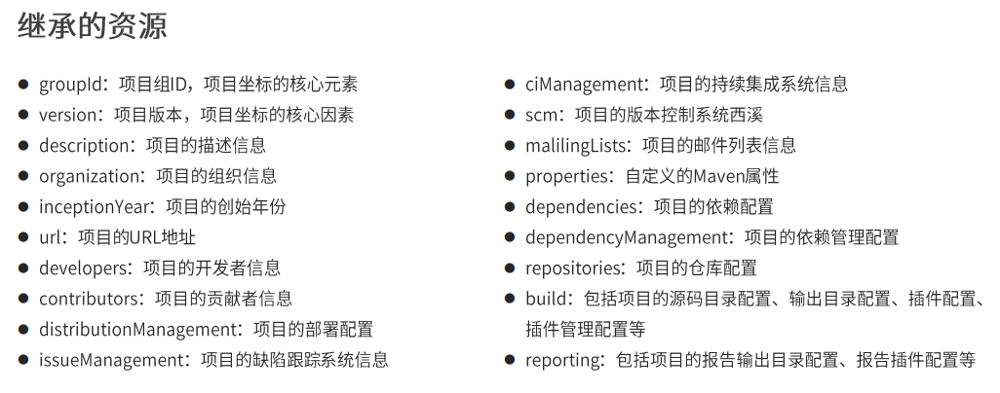
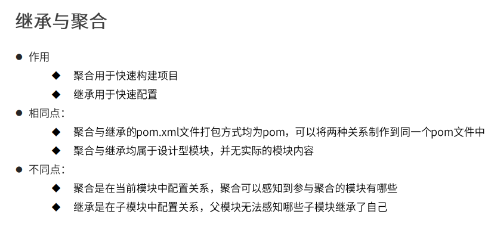
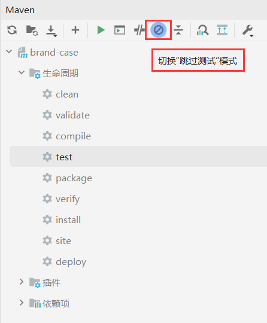
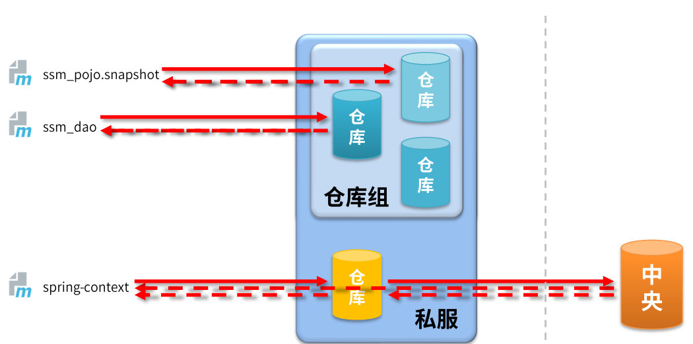
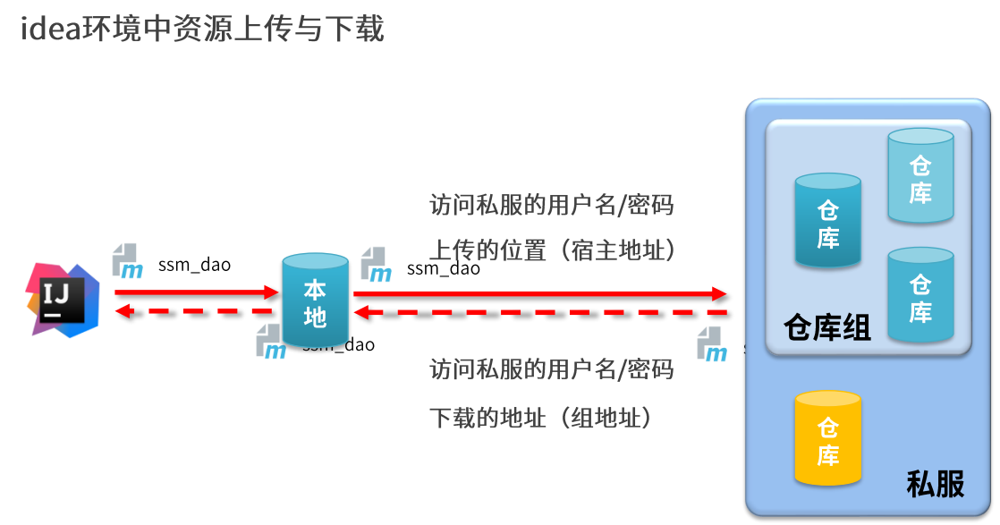

# 可选依赖

```xml
<dependency>
    <groupId>junit</groupId>
    <artifactId>junit</artifactId>
    <version>4.12</version>
    <!--true对别人透明-->
    <optional>true</optional>
</dependency>
```

# 排除依赖

```xml
<dependency>
    <groupId>junit</groupId>
    <artifactId>junit</artifactId>
    <version>4.12</version>
    <exclusions>
        <exclusion>
            <!--写不需要的依赖的坐标-->
            <groupId>org.hamcrest</groupId>
            <artifactId>hamcrest-core</artifactId>
        </exclusion>
    </exclusions>
</dependency>
```

# 聚合

作用:聚合用于快速构建maven工程，一次性构建多个项目/模块。（只要一个pom.xml文件）

制作方式:

- 创建一个空模块，打包类型定义为pom

  ```xml
  <packaging>pom</packaging>
  ```

- 定义当前模块进行构建操作时关联的其他模块名称

  ```xml
  <modules>
      <module>../ssm_controller</module>
      <module>../ssm_service</module>
      <module>../ssm_dao</module>
      <module>../ssm_pojo</module>
  </modules>
  ```

> 注意事项:参与聚合操作的模块最终执行顺序与模块间的依赖关系有关，与配置顺序无关

> 要让自己的项目成为依赖，要将其install打包到maven仓库中

# 继承

- 作用:通过继承可以实现在子工程中沿用父工程中的配置（只要一个pom.xml文件）

  - maven中的继承与java中的继承相似,在子工程中配置继承关系

- 制作方式:

  - 在子工程中声明其父工程坐标与对应的位置

    ```xml
    <!--定义该工程的父工程-->
    <parent>
        <groupId>com.itheima</groupId>
        <artifactId>ssm</artifactId>
        <version>1.0-SNAPSHOT</version>
        <!--填写父工程pom文件-->
        <relativePath>../ssm/pom.xml</relativePath>
    </parent>
    ```

- 继承依赖定义

  - 在父工程中定义依赖管理

    ```xml
    <!--声明此处进行依赖管理-->
    <dependencyManagement>
        <!--具体的依赖-->
        <dependencies>
            <!--spring环境-->
            <dependency>
                <groupId>org.springframework</groupId>
                <artifactId>spring-context</artifactId>
                <version>5.1.9.RELEASE</version>
            </dependency>
        <dependencies>
    <dependencyManagement>
    ```

  - 在父工程中定义插件管理

    ```xml
    <build>
        <pluginManagement>
            <!--设置插件-->
            <plugins>
                <!--具体的插件配置-->
                <plugin>
                    <groupId>org.apache.tomcat.maven</ groupId>
                    <artifactId>tomcat7-maven-plugin</ artifactId>
                    <version>2.1</ version>
                    <configuration>
                        <port>80</port>
                        <path>/</path>
                    </configuration>
                </plugin>
            </plugins>
        </pluginManagement>
    </build>
    ```

- 继承依赖使用

  - 在子工程中定义依赖关系，无需声明依赖版本，版本参照父工程中依赖的版本

    ```xml
    <dependencies>
        <!--spring环境-->
        <dependency>
            <groupId>org.springframework</groupId>
            <artifactId>spring-context</artifactId>
        </dependency>
    </dependencies>
    ```

  - 在子工程中定义插件关系，无需声明插件版本，版本参照父工程中插件的版本

    ```xml
    <build>
        <!--设置插件-->
        <plugins>
            <!--具体的插件配置-->
            <plugin>
                <groupId>org.apache.tomcat.maven</groupId>
                <artifactId>tomcat7-maven-plugin</artifactId>
                <configuration>
                    <port>80</port>
                    <path>/</path>
                </configuration>
            </plugin>
        </plugins>
    </build>
    ```

> 子工程可不写组织ID`<groupId>com.itheima</groupId>`
>
> 子工程版本号`<version>1.0-SNAPSHOT</version>`可不写

## 继承的资源



# 继承与聚合对比



# 属性

## 属性类别

1. 自定义属性
2. 内置属性
3. Setting属性
4. Java系统属性
5. 环境变量属性

### 自定义属性

- 作用

  - 等同于定义变量，方便统一维护

- 定义格式

  ```xml
  <!--定义自定义属性-->
  <properties>
      <spring.version>5.1.9.RELEASE</spring.version>
      <junit.version>4.12</junit.version>
  </properties>
  ```

- 调用格式

  ```xml
  <dependency>
      <groupId>org.springframework</groupId>
      <artifactId>spring-context</artifactId>
      <version>${spring.version}</version>
  </dependency>
  ```

> `junit.version`为变量名，调用语法为`${变量名}`，以下属性类似
>
> 规范命名便于管理

### 内置属性

- 作用
  - 使用maven内置属性，快速配置

- 调用格式

  ```xml
  ${basedir}
  ${version}
  ```

### Setting属性

- 作用

  - 使用maven配置文件setting.xml中的标签属性，用于动态配置

- 格式调用

  ```xml
  ${settings.localRepository}
  ```

### Java系统属性

- 作用

  - 读取Java系统属性

- 调用格式

  ```xml
  ${user.home}
  ```

- 系统属性查询方式

  ```
  mvn help:system
  ```

### 环境变量属性

- 作用

  - 使用maven配置文件setting.xml中的标签属性，用于动态配置

- 调用格式

  ```xml
  ${env.JAVA_HOME}
  ```

- 环境变量属性查询方式

  ```
  mvn help:system
  ```

# 版本管理

## 工程版本

- SNAPSHOT(快照版本)
  - 项目开发过程中，为方便团队成员合作，解决模块间相互依赖和时时更新的问题，开发者对每个模块进行构建的时候，输出的临时性版本叫快照版本（测试阶段版本)
  - 快照版本会随着开发的进展不断更新
- RELEASE(发布版本)
  - 项目开发到进入阶段里程碑后，向团队外部发布较为稳定的版本，这种版本所对应的构件文件
  - 是稳定的，即便进行功能的后续开发，也不会改变当前发布版本内容，这种版本称为发布版本

## 工程版本号约定

- 约定规范:
  - <主版本>.<次版本>.<增量版本>.<里程碑版本>
  - 主版本:表示项目重大架构的变更，如: spring5相较于spring4的迭代
  - 次版本:表示有较大的功能增加和变化，或者全面系统地修复漏洞
  - 增量版本:表示有重大漏洞的修复
  - 里程碑版本:表明一个版本的里程碑（版本内部)。这样的版本同下一个正式版本相比，相对来说不是很稳定，有待更多的测试
- 范例:
  - 5.1.9.RELEASE

# 资源配置

- 作用

  - 在任意文件中加载pom文件中定义的属性

- 调用格式

  ```xml
  ${jdbc.url}
  ```

- 定义自定义属性名

  ```xml
  <!--定义自定义属性-->
  <properties>
      <jdbc.url>jdbc:mysql://localhost:3306/wsleli</jdbc.url>
  </properties>
  ```

- 开启配置文件加载pom属性

  ```xml
  <!--配置资源文件对应的信息-->
  <resources>
      <resource>
          <!--设定配置文件对应的位置目录，支持使用属性动态设定路径-->
          <!--统配格式-->
          <directory>${project.basedir}/src/main/resources</directory>
          <!--
  			限定格式，在模块目录出退一级目录
  			<directory>../模块名/src/main/resources</directory>
  		-->
          
          <!--开启对配置文件的资源加载过滤-->
          <filtering>true</filtering>
      </resource>
  </resources>
  
  <!--配置测试资源文件对应的信息-->
  <testResources>
      <testResource>
          <!--设定配置文件对应的位置目录，支持使用属性动态设定路径-->
          <!--统配格式-->
          <directory>${project.basedir}/src/main/resources</directory>
          <!--
  			限定格式，在模块目录出退一级目录
  			<directory>../模块名/src/main/resources</directory>
  		-->
          
          <!--开启对配置文件的资源加载过滤-->
          <filtering>true</filtering>
      </testResource>
  </testResources>
  ```

# 多环境开发配置

```xml
<!--创建多环境-->
<profiles>
    <!--定义具体的环境:生产环境-->
    <profile>
        <!--定义环境对应的唯—名称-->
        <id>pro_env</id>
        <!--定义环境中专用的属性值-->
        <properties>
            <jdbc.url>jdbc:mysql://127.1.1.1:3306/ssm_db</jdbc.url>
        </properties>
        <!--设置默认启动-->
        <activation>
            <activeByDefault>true</activeByDefault>
        </activation>
    </profile>
    <!--定义具体的环境:生产环境-->
    <profile>
        <id>dev_env</id>
        <!--定义环境中专用的属性值-->
        <properties>
            <jdbc.url>jdbc:mysql://127.2.2.2:3306/ssm_db</jdbc.url>
        </properties>
    </profile>
</profiles>
```

## 加载指定环境

- 作用

  - 加载指定环境配置

- 调用格式

  ```
  mvn 指令 –P 环境定义id
  ```

- 范例

  ```
  mvn install –P pro_env
  ```


# 跳过测试

## 使用命令跳过测试

- 命令

  > mvn  指令使mvn中任意的指令

  ```
  mvn 指令 -D skipTests
  ```

- 注意事项
  - 执行的指令生命周期必须包含测试环节（一般不允许跳过）

## 使用界面操作跳过测试



## 使用配置跳过测试

```xml
<plugin>
    <artifactId>maven-surefire-plugin</artifactId>
    <version>2.22.1</version>
    <configuration>
        <skipTests>true</skipTests><!--设置跳过测试-->
        <includes> <!--包含指定的测试用例-->
            <include>**/User*Test.java</include>
        </includes>
        <excludes><!--排除指定的测试用例-->
            <exclude>**/User*TestCase.java</exclude>
        </excludes>
    </configuration>
</plugin>
```

> `**/`指任意文件下
>
> `User*Test`.java指User开头，Test结尾的文件

# 私服

## Nexus

Nexus是Sonatype公司的一款maven私服产品

下载地址: https://help.sonatype.com/repomanager3/download

## Nexus安装、启动与配置

- 启动服务器(命令行启动)

  ```
  nexus.exe /run nexus
  ```

> `.exe`可省略
>
> 在bin目录下运行

- 访问服务器（默认端口:8081)

  ```
  http://localhost:8081
  ```

- 修改基础配置信息

  - 安装路径下etc目录中nexus-default.properties文件保存有nexus基础配置信息，例如默认访问端口

- 修改服务器运行配置信息

  - 安装路径下bin目录中nexus.vmoptions文件保存有nexus服务器启动对应的配置信息，例如默认占用内存空间

## 私服资源获取



## 仓库分类

- 宿主仓库hosted
  - 保存无法从中央仓库获取的资源
    - 自主研发
    - 第三方非开源项目
- 代理仓库proxy
  - 代理远程仓库，通过nexus访问其他公共仓库，例如中央仓库
- 仓库组group
  - 将若干个仓库组成一个群组，简化配置仓库组不能保存资源，属于设计型仓库

## 资源上传

- 上传资源时提供对应的信息
  - 保存的位置(宿主仓库)
  - 资源文件
  - 对应坐标

## idea环境中资源上传与下载



### 访问私服配置（本地仓库访问私服)

- 配置本地仓库访问私服的权限(setting.xml)

  ```xml
  <servers>
      <server>
      <id>wsleli-release</id>
          <username>admin</username>
          <password>zhenyouquhh213</password>
      </server>
      <server>
      <id>wsleli-snapshots</id>
          <username>admin</username>
          <password>zhenyouquhh213</password>
      </server>
  </servers>
  ```

- 配置本地仓库资源来源(setting.xml)

  ```xml
  <mirrors>
      <mirror>
          <id>nexus-wsleli</id>
          <mirrorOf>*</mirrorOf>
          <url>http://localhost:8081/repository/maven-public/</url>
      </mirror>
  </mirrors>
  ```

### 访问私服配置(项目工程访问私服)

- 配置当前项目访问私服上传资源的保存位置(pom.xml)

  ```xml
  <!--发布配置管理-->
  <distributionManagement>
      <repository>
          <id>wsleli-release</id>
          <ur1>http://localhost:8081/repository/wsleli-release/</url></repository>
      <snapshotRepository>
          <id>wsleli-snapshots</id>
          <url>http://localhost:8081/repository/wsleli-snapshots/</url>
      </snapshotRepository>
  </distributionManagenent>
  ```

  > `id`找账号和密码
  >
  > `url`找资源路径

- 发布资源到私服指令

  ```
  mvn deploy
  ```

